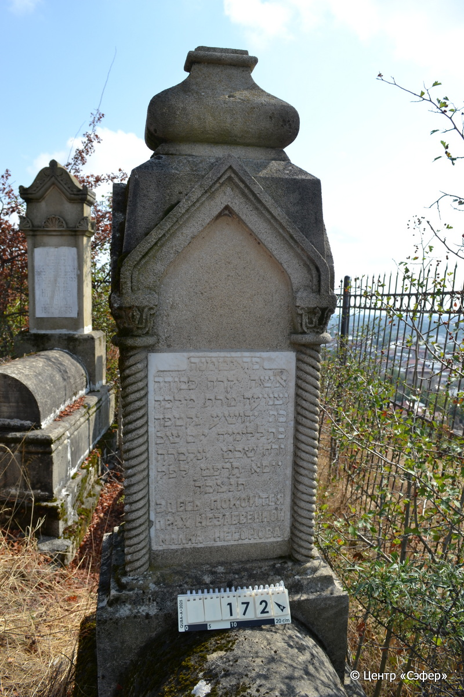
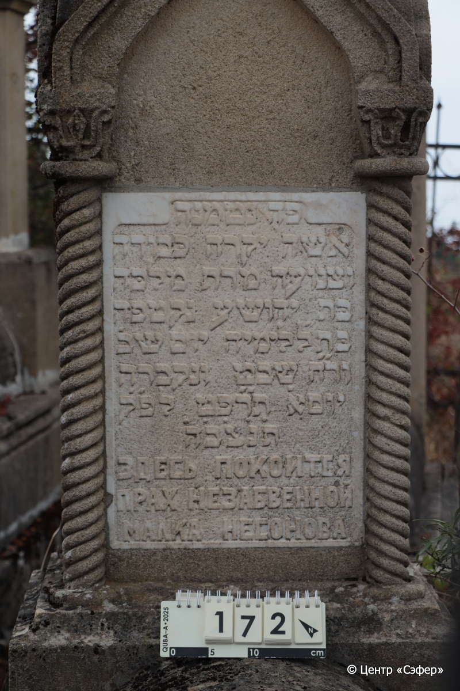
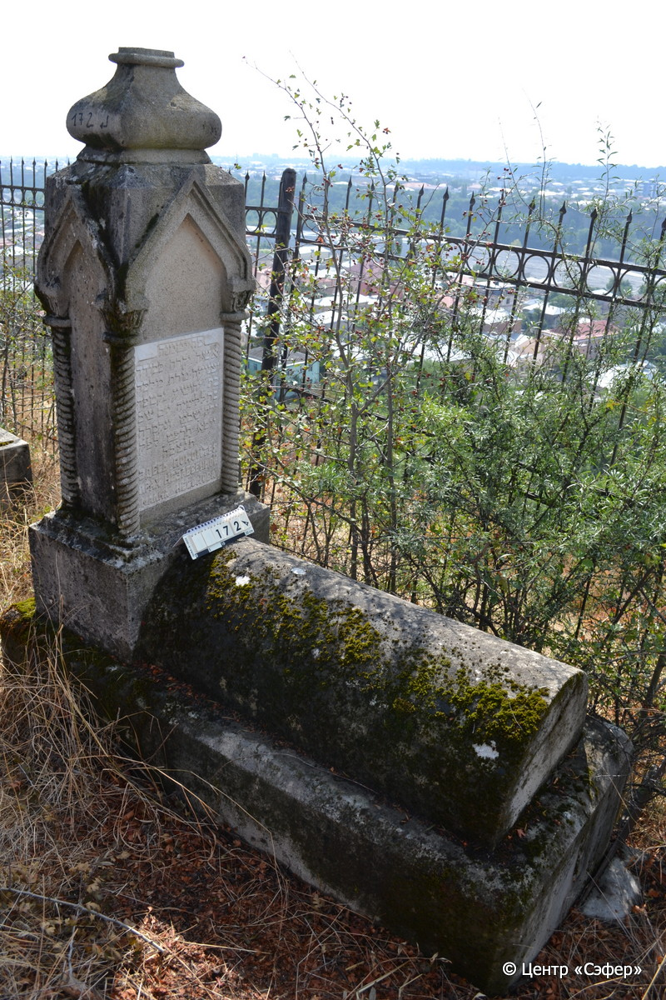

::: {style="font-size: 1em; margin-bottom: 1.2em"}
[Куба (центральное)](../cemeteries/QBA.html) > QBA0172
:::

```{r}
suppressPackageStartupMessages(library(tidyverse))
```


:::: {.columns}

::: {.column width="20%"}

```{r}
#| lightbox:
#|   group: photos





```
:::

::: {.column width="5%"}
:::

::: {.column width="74%"}

::: {.name-style}
НИСОНОВА (НЕСОНОВА) Малка, дочь Йехоше
:::

::: {style="font-size: 1.2em;"}
מלכה בת יהושע
:::

:::: {.columns}
::: {.column width="5%"}
{width=1.3em}
:::

::: {.column style="width: 40%; padding-left: 0.2em;"}
  /  
:::

::: {.column width="5%"}
{width=1.3em}
:::

::: {.column style="width: 50%; padding-left: 0.2em;"}
12.01.1929* / 1.Sh.5689
:::

::::


::: {.panel-tabset}

#### Эпитафия

```{r}
tibble(`Оригинал` = "פה נטמנה
אשה יקרה כּבודה
וצנועה מרת מלכּה
בּת יחושע נקטפה
בּת ל֗ לימיה יום שב׳
ור״ח שבט ונקברה
יום א׳ ת״רפט לפ״ק
ת֗נ֗צ֗ב֗ה֗
ЗДЕСЬ ПОКОИТСЯ
ПРАХ НЕЗАБВЕННОЙ
МАЛКА НЕСОНОВА",
       `Перевод` = "Здесь покоится
женщина дорогая и уважаемая,
скромная госпожа Малка,
дочь Йехоше. Оборвалась <её жизнь>
в 30 лет, в понедельник,
новомесячье швата, и похоронена
в воскресенье 689 <года> по малому исчислению.
Да будет душа его завязана в узле жизни.
Здесь покоится
прах незабвенной
Малки Несоновой") |>
  mutate(`Оригинал` = str_split(`Оригинал`, "
"),
         `Перевод` = str_split(`Перевод`, "
")) |>
  unnest_longer(c(`Оригинал`, `Перевод`)) |> 
  mutate(id = 1:n()) |> 
  relocate(id, .before = Перевод) |> 
  rename(` ` = id) |> 
  knitr::kable(align = c("r", "c", "l"))
```

|||
|-|---|
|**Примечания**| |
|**Язык**      |иврит, русский    |
|**Метки**     |преждевременная смерть    |
: {tbl-colwidths="[25,75]"}

#### Памятник

|||
|-|---|
|**Тип памятника**   |L-образный                                                                         |
|**Материал**        |известняк, мрамор (мраморная вставка для текста, следы эрозии)                                                     |
|**Размеры**         |164×61×45  --- стела; 31×55×113  --- Саркофаг; 42×77×178  --- основание                                                                        |
|**Тип декора**      |архитектурно-орнаментальный, растительный                                                                        |
|**Элементы декора** |куполообразное навершие, стороны стелы оформлены в виде стрельчатых арок, стоящих на витых полуколоннах с растительным мотивом на капителях                                                                          |
|**Координаты**      |[41.36972865, 48.50673681](https://www.google.com/maps/place/41.36972865, 48.50673681)                    |
: {tbl-colwidths="[25,75]"}

#### Источник

|||
|-|---|
|**Место хранения**        |Архив полевых исследований Центра «Сэфер»     |
|**Контакты**              |students@sefer.ru    |
|**Ссылка**                |https://sfira.org        |
|**Исходный ID**           |  |
|**Условия использования** |[CC BY-NC 4.0](https://creativecommons.org/licenses/by-nc/4.0/deed.ru)     |
: {tbl-colwidths="[25,75]"}

:::

:::

::::

