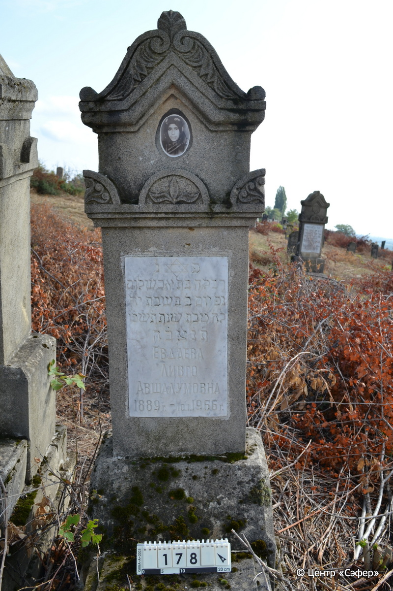
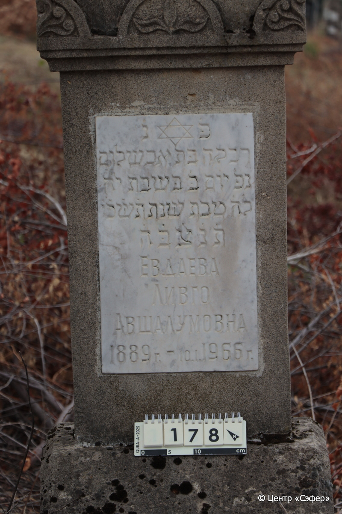
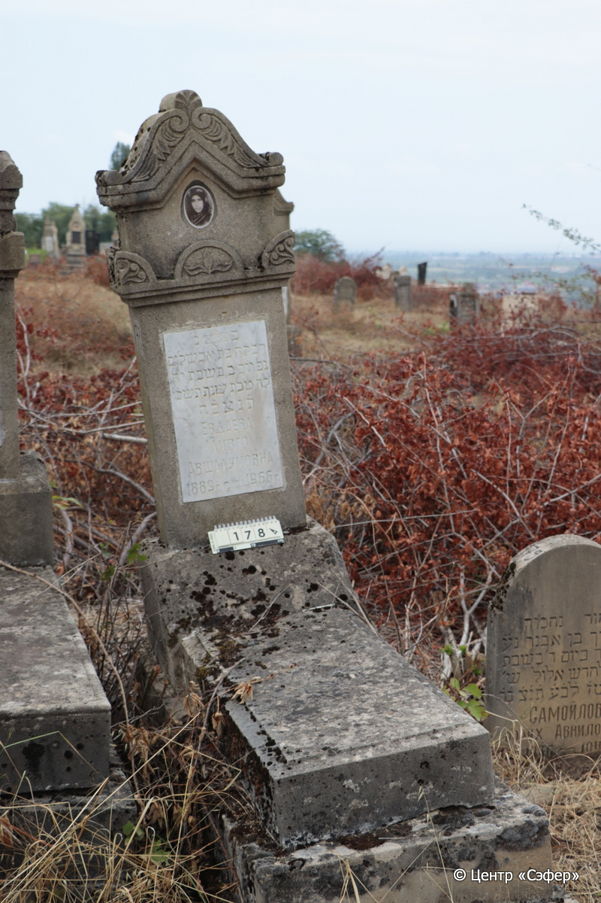
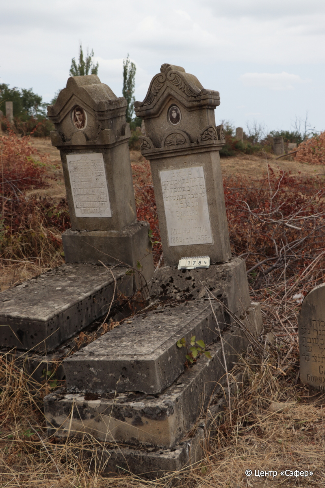

::: {style="font-size: 1em; margin-bottom: 1.2em"}
[Куба (центральное)](../cemeteries/QBA.html) > QBA0178
:::

```{r}
suppressPackageStartupMessages(library(tidyverse))
```


:::: {.columns}

::: {.column width="20%"}

```{r}
#| lightbox:
#|   group: photos






```
:::

::: {.column width="5%"}
:::

::: {.column width="74%"}

::: {.name-style}
ЕВДАЕВА Ривка, дочь Авшалома (Ливго Авшалумовна)
:::

::: {style="font-size: 1.2em;"}
רבקה בת אבשלום
:::

:::: {.columns}
::: {.column width="5%"}
{width=1.3em}
:::

::: {.column style="width: 40%; padding-left: 0.2em;"}
-.-.1889 /  
:::

::: {.column width="5%"}
{width=1.3em}
:::

::: {.column style="width: 50%; padding-left: 0.2em;"}
10.01.1966 / 18.Te.5726
:::

::::


::: {.panel-tabset}

#### Эпитафия

```{r}
tibble(`Оригинал` = "פ׳ נ׳
רבקה בּת אבשלום
נפ׳ יום בּ֗ בּשבּת י״ח
לח֗ טבת שנת ת֗ש֗כ֗ו֗
ת֗נ֗צ֗בּ֗ה֗
ЕВДАЕВА
ЛИВГО
АВШАЛУМОВНА
1889 г. – 10.I.1966 г.",
       `Перевод` = "Здесь покоится
Ривка, дочь Авшалома.
Скончалась в понедельник, 18 <числа>
месяца тевет, год {5}726.
Да будет душа её завязана в узле жизни.
Евдаева
Ливго
Авшалумовна
1889 г. – 10.01.1966") |>
  mutate(`Оригинал` = str_split(`Оригинал`, "
"),
         `Перевод` = str_split(`Перевод`, "
")) |>
  unnest_longer(c(`Оригинал`, `Перевод`)) |> 
  mutate(id = 1:n()) |> 
  relocate(id, .before = Перевод) |> 
  rename(` ` = id) |> 
  knitr::kable(align = c("r", "c", "l"))
```

|||
|-|---|
|**Примечания**| |
|**Язык**      |иврит, русский    |
|**Метки**     |     |
: {tbl-colwidths="[25,75]"}

#### Памятник

|||
|-|---|
|**Тип памятника**   |L-образный                                                                         |
|**Материал**        |известняк, мрамор (мраморная вставка для текста, керамические медальон с портретом, следы эрозии)                                                     |
|**Размеры**         |160×55×47  --- стела; 103×49×21  --- плита; 36×74×180  --- основание                                                                        |
|**Тип декора**      |архитектурно-орнаментальный, растительный, традиционная символика                                                                        |
|**Элементы декора** |треугольное завершение с с волютами и растительными узорами, орнаментальный пояс с пальметками, звезда Давида на вставке, фотопортрет на медальоне                                                                          |
|**Координаты**      |[41.37032619, 48.50668429](https://www.google.com/maps/place/41.37032619, 48.50668429)                    |
: {tbl-colwidths="[25,75]"}

#### Источник

|||
|-|---|
|**Место хранения**        |Архив полевых исследований Центра «Сэфер»     |
|**Контакты**              |students@sefer.ru    |
|**Ссылка**                |https://sfira.org        |
|**Исходный ID**           |  |
|**Условия использования** |[CC BY-NC 4.0](https://creativecommons.org/licenses/by-nc/4.0/deed.ru)     |
: {tbl-colwidths="[25,75]"}

:::

:::

::::

