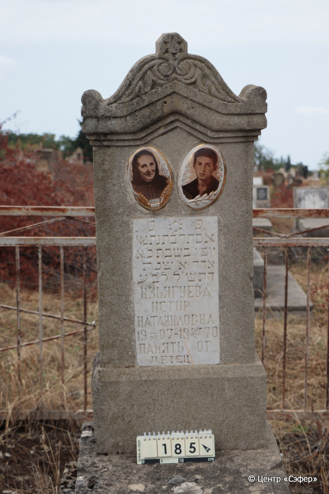
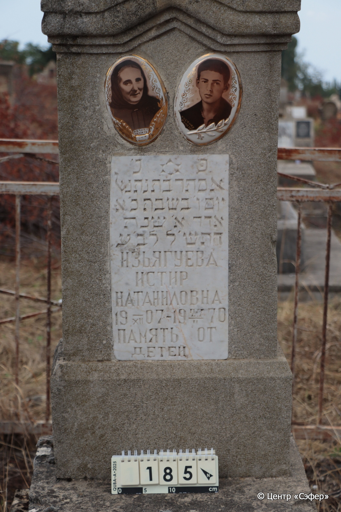
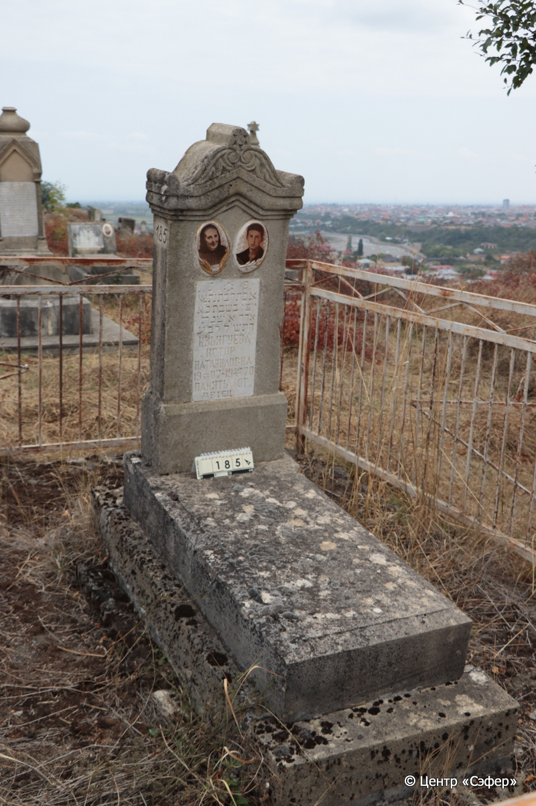

::: {style="font-size: 1em; margin-bottom: 1.2em"}
[Куба (центральное)](../cemeteries/QBA.html) > QBA0185
:::

```{r}
suppressPackageStartupMessages(library(tidyverse))
```


:::: {.columns}

::: {.column width="20%"}

```{r}
#| lightbox:
#|   group: photos





```
:::

::: {.column width="5%"}
:::

::: {.column width="74%"}

::: {.name-style}
ИЗЬЯГУЕВА Эстер, дочь Натанэля (Истир Натаниловна)
:::

::: {style="font-size: 1.2em;"}
אסתר בת נתנאל
:::

:::: {.columns}
::: {.column width="5%"}
{width=1.3em}
:::

::: {.column style="width: 40%; padding-left: 0.2em;"}
-.12.1907 /  
:::

::: {.column width="5%"}
{width=1.3em}
:::

::: {.column style="width: 50%; padding-left: 0.2em;"}
27.02.1970 / 21.Ad1.5730
:::

::::


::: {.panel-tabset}

#### Эпитафия

```{r}
tibble(`Оригинал` = "פ׳ נ׳
אסתר בת נתנאל
יום ו׳ בשבת כ׳א
אדר א׳ שנת 
התש׳ל לב׳ע
Изьягуева
Истир
Натаниловна
/XII 1907 – 27/II 1970
Память от
детей",
       `Перевод` = "Здесь покоится
Эстер, дочь Натанэля
<Скончалась> в пятницу, 21
адара I, год 
{5}730 от сотворения мира.
Изьягуева
Истир
Натаниловна
12.1907 –27.02.1970
Память от
детей") |>
  mutate(`Оригинал` = str_split(`Оригинал`, "
"),
         `Перевод` = str_split(`Перевод`, "
")) |>
  unnest_longer(c(`Оригинал`, `Перевод`)) |> 
  mutate(id = 1:n()) |> 
  relocate(id, .before = Перевод) |> 
  rename(` ` = id) |> 
  knitr::kable(align = c("r", "c", "l"))
```

|||
|-|---|
|**Примечания**|Число в дате рождения не указано|
|**Язык**      |иврит, русский    |
|**Метки**     |     |
: {tbl-colwidths="[25,75]"}

#### Памятник

|||
|-|---|
|**Тип памятника**   |L-образный                                                                         |
|**Материал**        |известняк, мрамор (мраморная вставка для текста, два керамических медальона с портретами, цементный раствор, следы эрозии)                                                     |
|**Размеры**         |114×42×15  --- стела; 20×57×128  --- плита; 40×91×172  --- основание                                                                        |
|**Тип декора**      |архитектурно-орнаментальный, растительный, традиционная символика                                                                        |
|**Элементы декора** |треугольное завершение с волютами, растительным мотивом, увенчанное звездой Давида, два фотопортрета с золотой окантовкой и рельефными растительными узорами на медальонах, звезда Давида на мраморной вставке                                                                          |
|**Координаты**      |[41.37018085, 48.50671696](https://www.google.com/maps/place/41.37018085, 48.50671696)                    |
: {tbl-colwidths="[25,75]"}

#### Источник

|||
|-|---|
|**Место хранения**        |Архив полевых исследований Центра «Сэфер»     |
|**Контакты**              |students@sefer.ru    |
|**Ссылка**                |https://sfira.org        |
|**Исходный ID**           |  |
|**Условия использования** |[CC BY-NC 4.0](https://creativecommons.org/licenses/by-nc/4.0/deed.ru)     |
: {tbl-colwidths="[25,75]"}

:::

:::

::::

