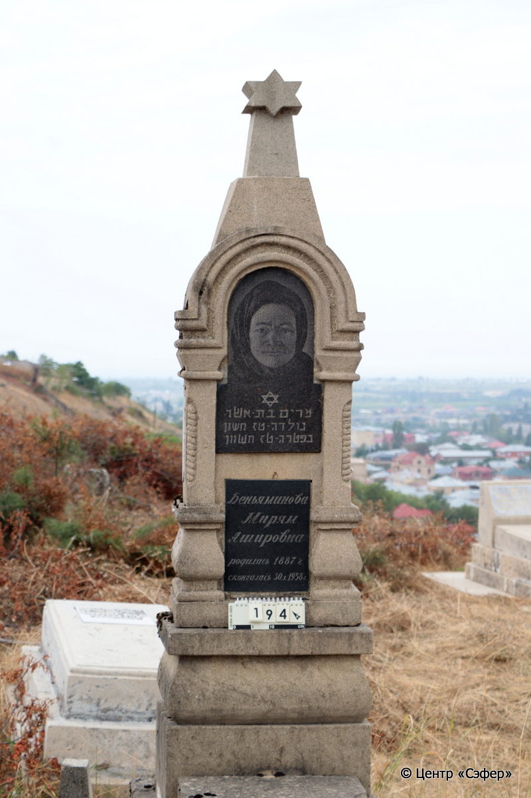
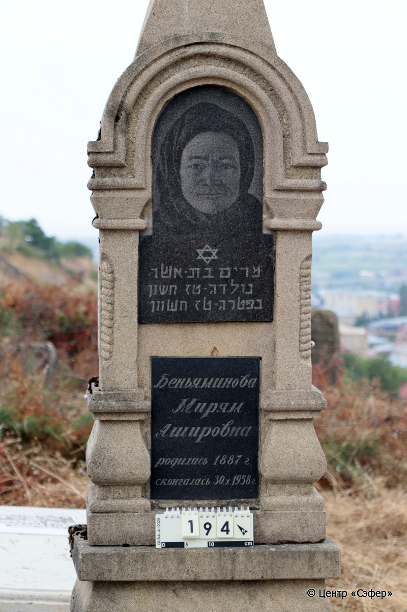
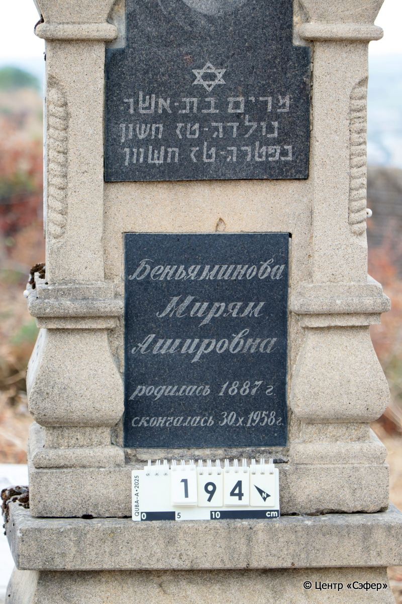
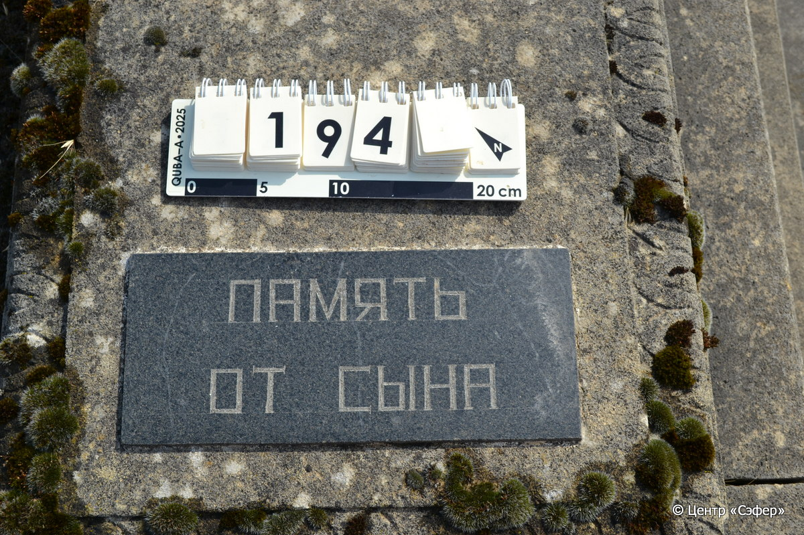
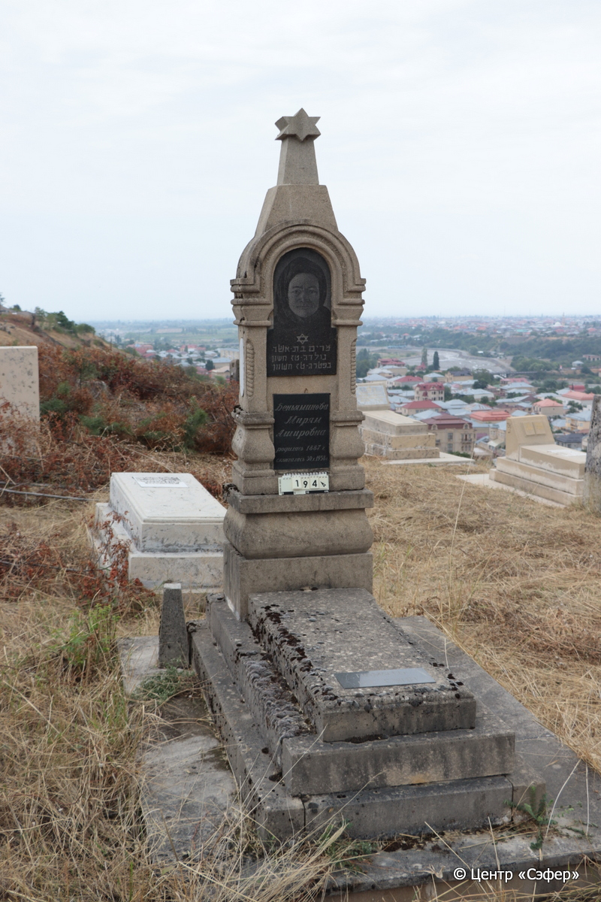
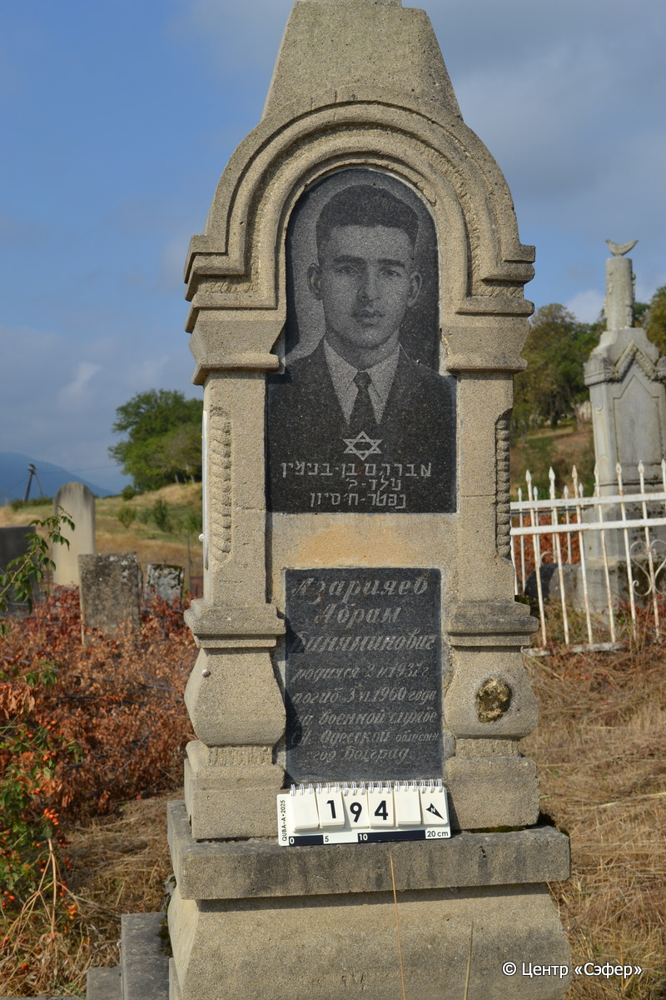
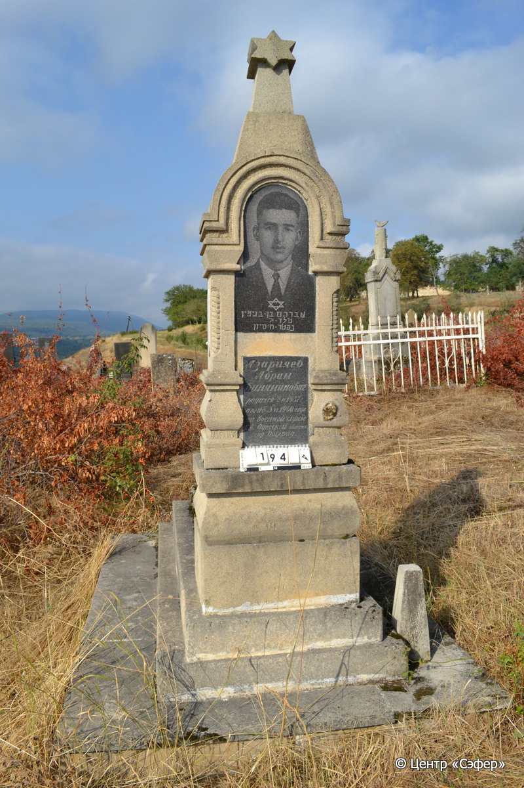

::: {style="font-size: 1em; margin-bottom: 1.2em"}
[Куба (центральное)](../cemeteries/QBA.html) > QBA0194
:::

```{r}
suppressPackageStartupMessages(library(tidyverse))
```


:::: {.columns}

::: {.column width="20%"}

```{r}
#| lightbox:
#|   group: photos









```
:::

::: {.column width="5%"}
:::

::: {.column width="74%"}

::: {.name-style}
БЕНЬЯМИНОВА Мирьям, дочь Ашера (Мирям Ашировна)
:::

::: {style="font-size: 1.2em;"}
מירים בת אשר
:::

:::: {.columns}
::: {.column width="5%"}
{width=1.3em}
:::

::: {.column style="width: 40%; padding-left: 0.2em;"}
-.-.1887 / 16.Ch.-
:::

::: {.column width="5%"}
{width=1.3em}
:::

::: {.column style="width: 50%; padding-left: 0.2em;"}
30.10.1958 / 16.Ch.-
:::

::::

---

::: {.name-style}
АЗАРИЯЕВ Авраам, сын Беньямина (Абрам Биняминович)
:::

::: {style="font-size: 1.2em;"}
אברהם בן בנימין
:::

:::: {.columns}
::: {.column width="5%"}
{width=1.3em}
:::

::: {.column style="width: 40%; padding-left: 0.2em;"}
02.02.1937 / 20.Si.-
:::

::: {.column width="5%"}
{width=1.3em}
:::

::: {.column style="width: 50%; padding-left: 0.2em;"}
03.06.1960 / 08.Si.-
:::

::::


::: {.panel-tabset}

#### Эпитафия

```{r}
tibble(`Оригинал` = "лицевая сторона
сверху
מירים בת-אשר
נולדה-טז חשון
נפטרה-טז חשוון

Беньяминова
Мирям
Ашировна
родилась 1887 г.
скончалась 30.X.1958 г.

снизу
Память
от сына

обратная сторона
אברהם בו-בנימין
נולד - [ך]׳
נפטר-ח׳ סיון

Азарияев
Абрам
Биняминович
родился 2.II.1937 г.
погиб 3.VI.1960 года
на военной службе
СА. Одесской области
гор. Болград",
       `Перевод` = "
 
Мирьям, дочь Ашера
Родилась 16 хешвана,
скончалась 16 хешвана.

Беньяминова
Мирям
Ашировна
родилась <в> 1887 г.,
скончалась 30.10.1958.

 
Память
от сына

 
Авраам, сын Беньямина
Родился 20,
скончался 8 сивана.

Азарияев
Абрам
Биняминович
Родился 2.02.1937,
погиб 3.06.1960
на военной службе
С[оветской] А[рмии]. Одесской области
гор. Болград") |>
  mutate(`Оригинал` = str_split(`Оригинал`, "
"),
         `Перевод` = str_split(`Перевод`, "
")) |>
  unnest_longer(c(`Оригинал`, `Перевод`)) |> 
  mutate(id = 1:n()) |> 
  relocate(id, .before = Перевод) |> 
  rename(` ` = id) |> 
  knitr::kable(align = c("r", "c", "l"))
```

|||
|-|---|
|**Примечания**| |
|**Язык**      |иврит, русский    |
|**Метки**     |%география%, военный, случай    |
: {tbl-colwidths="[25,75]"}

#### Памятник

|||
|-|---|
|**Тип памятника**   |L-образный                                                                         |
|**Материал**        |известняк, гранит, мрамор (пять темных гранитных вставок для текста и портретов, две светлые мраморные вставки по бокам стелы, цементный раствор, следы эрозии, стоит на бетонной площадке)                                                     |
|**Размеры**         |205×57×39  --- стела; 12×49×120  --- плита; 30×88×180  --- основание                                                                        |
|**Тип декора**      |архитектурно-орнаментальный, растительный, традиционная символика                                                                        |
|**Элементы декора** |навершие со звездой Давида, фотопортреты на темных вставках с двух сторон, размещенные в порталах, образованных фрагментами витых полуколонн и полуциркульным сводом, края плиты украшены полосой орнамента с листьями                                                                          |
|**Координаты**      |[41.36983747, 48.50680466](https://www.google.com/maps/place/41.36983747, 48.50680466)                    |
: {tbl-colwidths="[25,75]"}

#### Источник

|||
|-|---|
|**Место хранения**        |Архив полевых исследований Центра «Сэфер»     |
|**Контакты**              |students@sefer.ru    |
|**Ссылка**                |https://sfira.org        |
|**Исходный ID**           |  |
|**Условия использования** |[CC BY-NC 4.0](https://creativecommons.org/licenses/by-nc/4.0/deed.ru)     |
: {tbl-colwidths="[25,75]"}

:::

:::

::::

