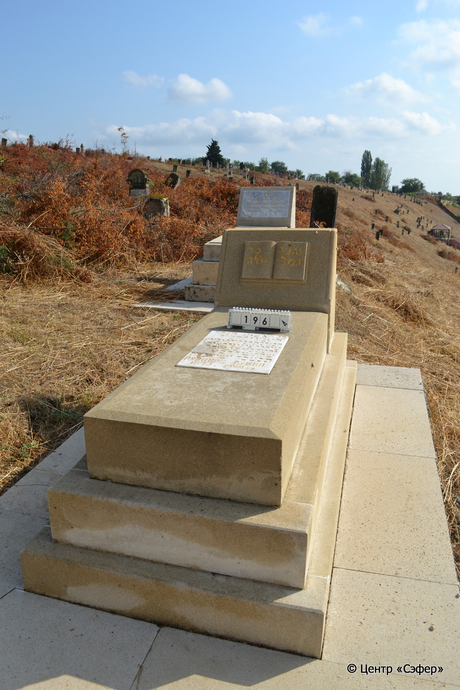
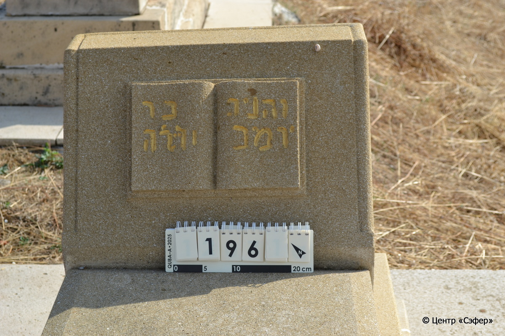
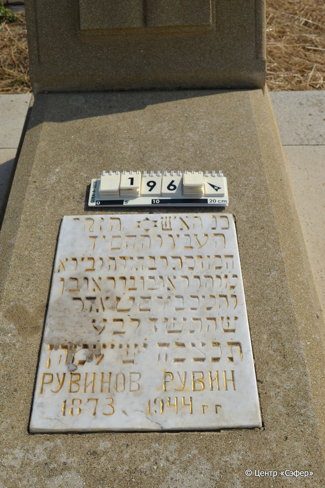

::: {style="font-size: 1em; margin-bottom: 1.2em"}
[Куба (центральное)](../cemeteries/QBA.html) > QBA0196
:::

```{r}
suppressPackageStartupMessages(library(tidyverse))
```


:::: {.columns}

::: {.column width="20%"}

```{r}
#| lightbox:
#|   group: photos





```
:::

::: {.column width="5%"}
:::

::: {.column width="74%"}

::: {.name-style}
РУВИНОВ Реувен, сын Реувена (Рувин)
:::

::: {style="font-size: 1.2em;"}
ראובן בן ראובן
:::

:::: {.columns}
::: {.column width="5%"}
{width=1.3em}
:::

::: {.column style="width: 40%; padding-left: 0.2em;"}
-.-.1873 /  
:::

::: {.column width="5%"}
{width=1.3em}
:::

::: {.column style="width: 50%; padding-left: 0.2em;"}
-.-.1944 / 09.Ad.5704
:::

::::


::: {.panel-tabset}

#### Эпитафия

```{r}
tibble(`Оригинал` = "сверху
[והניג בר 
יומב ...ה]

снизу
[פ]נ האיש הזקן
הע[נ]יו והחסיד
המוכתר בתורה ו֗ב֗י֗ר֗א֗
מ֗ו֗ה֗ר֗ ראובן ב֗ר֗ ראובן
ו֗ה֗מ֗כ֗ ביום ט֗ אדר
ש׳ ה֗ת֗ש֗ד֗ ל֗בע
ת֗נ֗צ֗ב֗ה֗ י֗ש֗י֗ע֗מ֗ה֗ן
Рувинов Рувин
1873  1944 г г",
       `Перевод` = "
[похронен
...]

 
Здесь покоится человек пожилой,
скромный и благочестивый,
увенчанный Торой и богобоязненный,
наш учитель, р. Реувен, сын р. Реувена,
да будет благословен его покой. Скончался на 9 день адара,
год 5704 от сотворения мира.
Да будет душа его завязана в узле жизни.
Рувинов Рувин
1873 – 1944 гг.") |>
  mutate(`Оригинал` = str_split(`Оригинал`, "
"),
         `Перевод` = str_split(`Перевод`, "
")) |>
  unnest_longer(c(`Оригинал`, `Перевод`)) |> 
  mutate(id = 1:n()) |> 
  relocate(id, .before = Перевод) |> 
  rename(` ` = id) |> 
  knitr::kable(align = c("r", "c", "l"))
```

|||
|-|---|
|**Примечания**|Значение текста на табличке неясно из-за искаженного написания букв.|
|**Язык**      |иврит, русский    |
|**Метки**     |пожилой(-ая), знаток Писания    |
: {tbl-colwidths="[25,75]"}

#### Памятник

|||
|-|---|
|**Тип памятника**   |L-образный                                                                         |
|**Материал**        |известняк, мрамор (мраморная вставка с текстом на плите, цементный раствор, стоит на площадке из плит, на которых есть трещины)                                                     |
|**Размеры**         |51×54×31  --- стела; 20×52×121  --- плита; 30×80×180  --- основание                                                                        |
|**Тип декора**      |традиционная символика                                                                        |
|**Элементы декора** |книга с золотыми буквами на стеле, звезда Давида на вставке                                                                          |
|**Координаты**      |[41.36982638, 48.50691198](https://www.google.com/maps/place/41.36982638, 48.50691198)                    |
: {tbl-colwidths="[25,75]"}

#### Источник

|||
|-|---|
|**Место хранения**        |Архив полевых исследований Центра «Сэфер»     |
|**Контакты**              |students@sefer.ru    |
|**Ссылка**                |https://sfira.org        |
|**Исходный ID**           |  |
|**Условия использования** |[CC BY-NC 4.0](https://creativecommons.org/licenses/by-nc/4.0/deed.ru)     |
: {tbl-colwidths="[25,75]"}

:::

:::

::::

