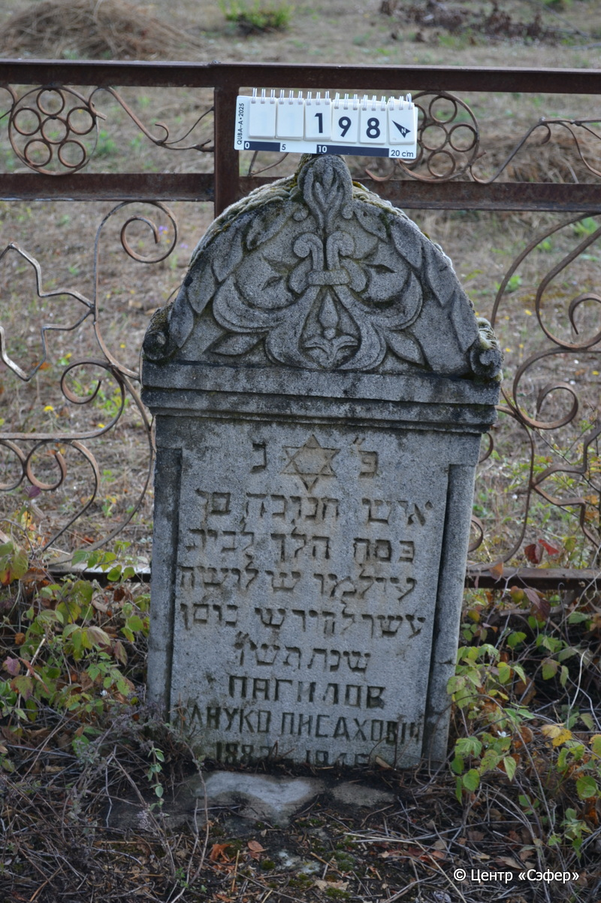
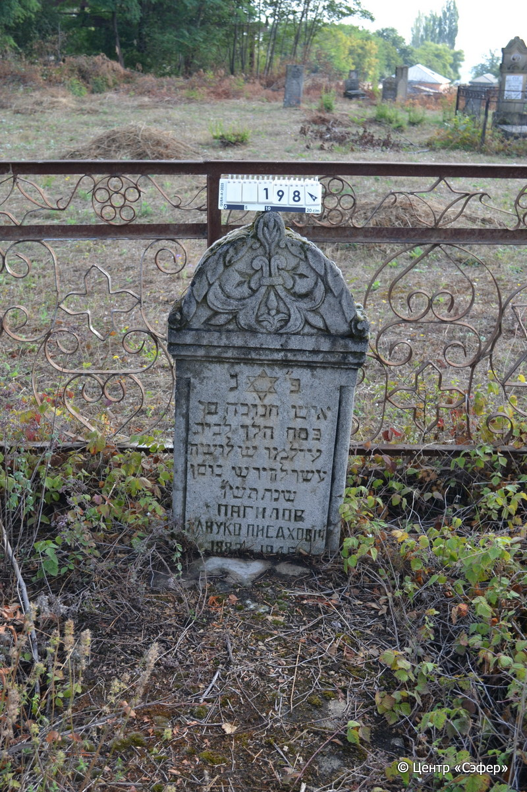

::: {style="font-size: 1em; margin-bottom: 1.2em"}
[Куба (центральное)](../cemeteries/QBA.html) > QBA0198
:::

```{r}
suppressPackageStartupMessages(library(tidyverse))
```


:::: {.columns}

::: {.column width="20%"}

```{r}
#| lightbox:
#|   group: photos




```
:::

::: {.column width="5%"}
:::

::: {.column width="74%"}

::: {.name-style}
ПАГИЛОВ Ханука, сын Песаха (Хануко Писахович)
:::

::: {style="font-size: 1.2em;"}
חנוכה בן פסח
:::

:::: {.columns}
::: {.column width="5%"}
{width=1.3em}
:::

::: {.column style="width: 40%; padding-left: 0.2em;"}
-.-.1887 /  
:::

::: {.column width="5%"}
{width=1.3em}
:::

::: {.column style="width: 50%; padding-left: 0.2em;"}
-.-.1946 / 13.Ni.5706
:::

::::


::: {.panel-tabset}

#### Эпитафия

```{r}
tibble(`Оригинал` = "פ״ נ
איש חנוכה בן
פסח הלך לבית
עולמו שלושה 
עשר לחודש ניסן
שנת תש״ו
 Пагилов
Хануко Писаховiч
1946 – 1887",
       `Перевод` = "Здесь покоится
мужчина, Ханука, сын
Песаха, ушедший в дом
вечности, тринад-
цатого {числа} месяца нисан,
год {5}706.
Пагилов
Хануко Писахович
1887 – 1946") |>
  mutate(`Оригинал` = str_split(`Оригинал`, "
"),
         `Перевод` = str_split(`Перевод`, "
")) |>
  unnest_longer(c(`Оригинал`, `Перевод`)) |> 
  mutate(id = 1:n()) |> 
  relocate(id, .before = Перевод) |> 
  rename(` ` = id) |> 
  knitr::kable(align = c("r", "c", "l"))
```

|||
|-|---|
|**Примечания**| |
|**Язык**      |иврит, русский    |
|**Метки**     |     |
: {tbl-colwidths="[25,75]"}

#### Памятник

|||
|-|---|
|**Тип памятника**   |стела                                                                         |
|**Материал**        |известняк, бетон (стела из известняка со следами эрозии, основание бетонное с трещиной)                                                     |
|**Размеры**         |94×50×18  --- стела; 6×75×200  --- основание                                                                        |
|**Тип декора**      |архитектурно-орнаментальный, растительный, традиционная символика                                                                        |
|**Элементы декора** |фигурное завершение с растительными мотивами, текст между двух полуколонн, там же звезда Давида                                                                          |
|**Координаты**      |[41.3709249, 48.5064716](https://www.google.com/maps/place/41.3709249, 48.5064716)                    |
: {tbl-colwidths="[25,75]"}

#### Источник

|||
|-|---|
|**Место хранения**        |Архив полевых исследований Центра «Сэфер»     |
|**Контакты**              |students@sefer.ru    |
|**Ссылка**                |https://sfira.org        |
|**Исходный ID**           |  |
|**Условия использования** |[CC BY-NC 4.0](https://creativecommons.org/licenses/by-nc/4.0/deed.ru)     |
: {tbl-colwidths="[25,75]"}

:::

:::

::::

