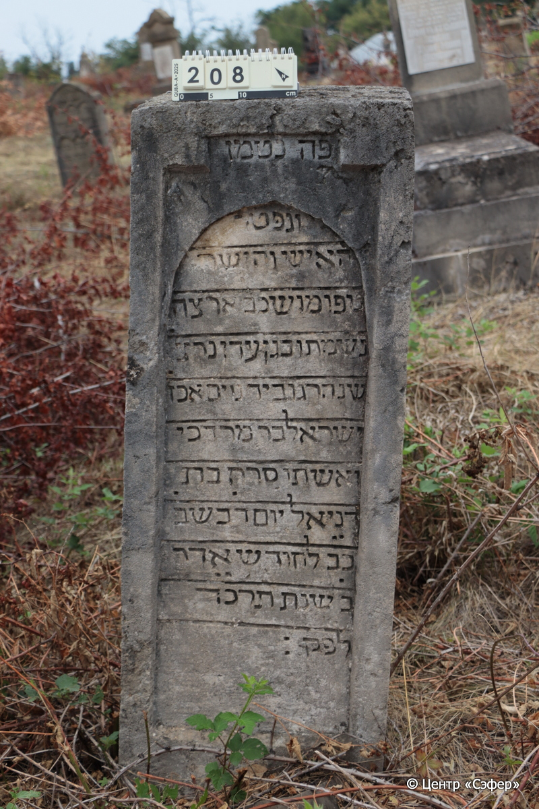
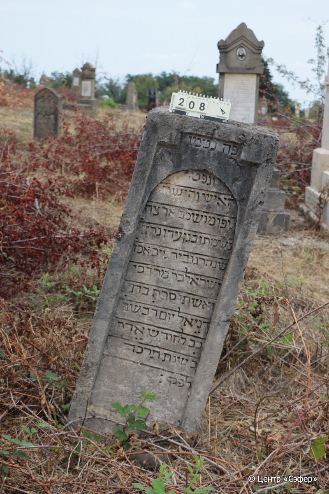

::: {style="font-size: 1em; margin-bottom: 1.2em"}
[Куба (центральное)](../cemeteries/QBA.html) > QBA0208
:::

```{r}
suppressPackageStartupMessages(library(tidyverse))
```


:::: {.columns}

::: {.column width="20%"}

```{r}
#| lightbox:
#|   group: photos




```
:::

::: {.column width="5%"}
:::

::: {.column width="74%"}

::: {.name-style}
Исраэль, сын Мордехая
:::

::: {style="font-size: 1.2em;"}
ישראל בן מרדכי
:::

:::: {.columns}
::: {.column width="5%"}
{width=1.3em}
:::

::: {.column style="width: 40%; padding-left: 0.2em;"}
  /  
:::

::: {.column width="5%"}
{width=1.3em}
:::

::: {.column style="width: 50%; padding-left: 0.2em;"}
  / 22.Ad2.5624
:::

::::

---

::: {.name-style}
Сарах, дочь Даниэля
:::

::: {style="font-size: 1.2em;"}
סרח בת דניאל
:::

:::: {.columns}
::: {.column width="5%"}
{width=1.3em}
:::

::: {.column style="width: 40%; padding-left: 0.2em;"}
  /  
:::

::: {.column width="5%"}
{width=1.3em}
:::

::: {.column style="width: 50%; padding-left: 0.2em;"}
  / 22.Ad2.5624
:::

::::


::: {.panel-tabset}

#### Эпитафия

```{r}
tibble(`Оригинал` = "פה נטמן
ונפטר
האיש והישר
גופו מושכב ארצה
נשמתו בגן עדן נרצ֗
שנהרג וביד גוים אכז֗
ישראל בר מרדכי
ואשתו סרח בת 
דניאל יום ד֗ בשב֗ 
כ֗ב֗ לחודש אדר
ב֗ שנת תרכ֗ד֗
לפק:",
       `Перевод` = "Здесь покоится
и скончался
человек прямодушный,
тело его покоится в земле,
а душа призвана в райский сад,
убитый жестокими иноверцами,
Исраэль, сын Мордехая,
и его жена Сарах, дочь
Даниэля. Среда,
22 число месяца адар-II 
года 624
по малому летоисчислению.") |>
  mutate(`Оригинал` = str_split(`Оригинал`, "
"),
         `Перевод` = str_split(`Перевод`, "
")) |>
  unnest_longer(c(`Оригинал`, `Перевод`)) |> 
  mutate(id = 1:n()) |> 
  relocate(id, .before = Перевод) |> 
  rename(` ` = id) |> 
  knitr::kable(align = c("r", "c", "l"))
```

|||
|-|---|
|**Примечания**| |
|**Язык**      |иврит    |
|**Метки**     |насильственная смерть    |
: {tbl-colwidths="[25,75]"}

#### Памятник

|||
|-|---|
|**Тип памятника**   |стела                                                                         |
|**Материал**        |песчаник (следы ремонта, следы эрозии, сколы)                                                     |
|**Размеры**         |125×48×21  --- стела                                                                        |
|**Тип декора**      |архитектурно-орнаментальный                                                                        |
|**Элементы декора** |фигурная ниша для текста два уровня                                                                          |
|**Координаты**      |[41.37029093, 48.50675248](https://www.google.com/maps/place/41.37029093, 48.50675248)                    |
: {tbl-colwidths="[25,75]"}

#### Источник

|||
|-|---|
|**Место хранения**        |Архив полевых исследований Центра «Сэфер»     |
|**Контакты**              |students@sefer.ru    |
|**Ссылка**                |https://sfira.org        |
|**Исходный ID**           |  |
|**Условия использования** |[CC BY-NC 4.0](https://creativecommons.org/licenses/by-nc/4.0/deed.ru)     |
: {tbl-colwidths="[25,75]"}

:::

:::

::::

