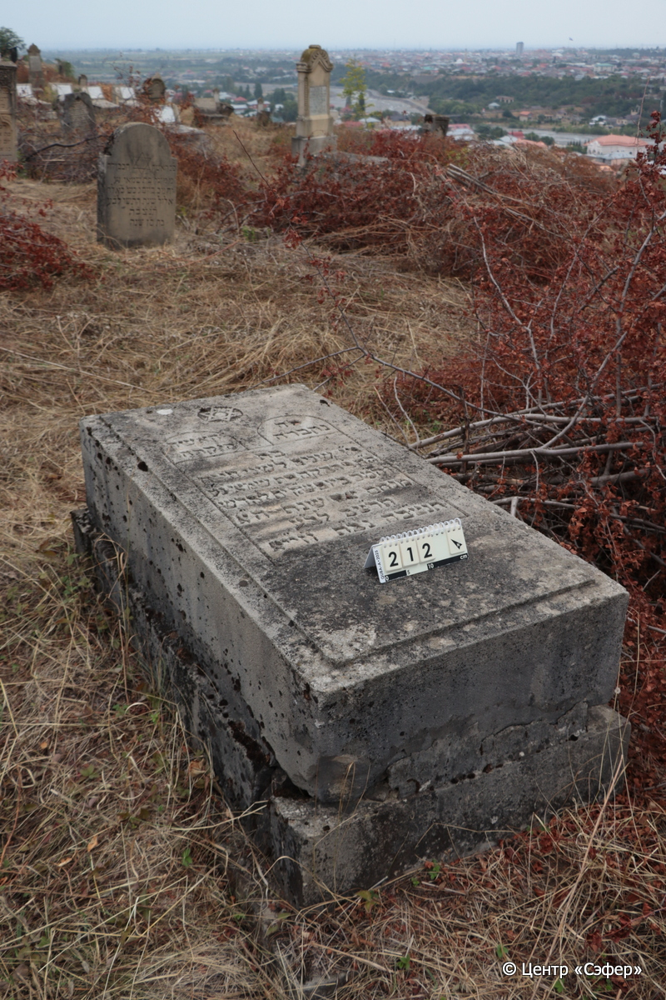
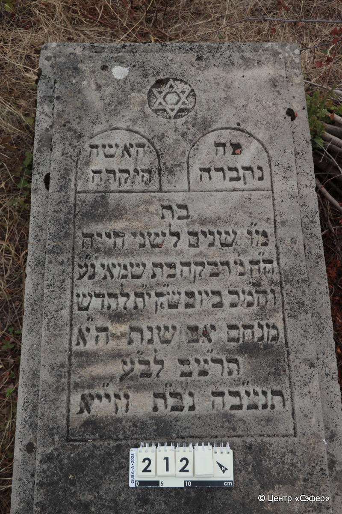
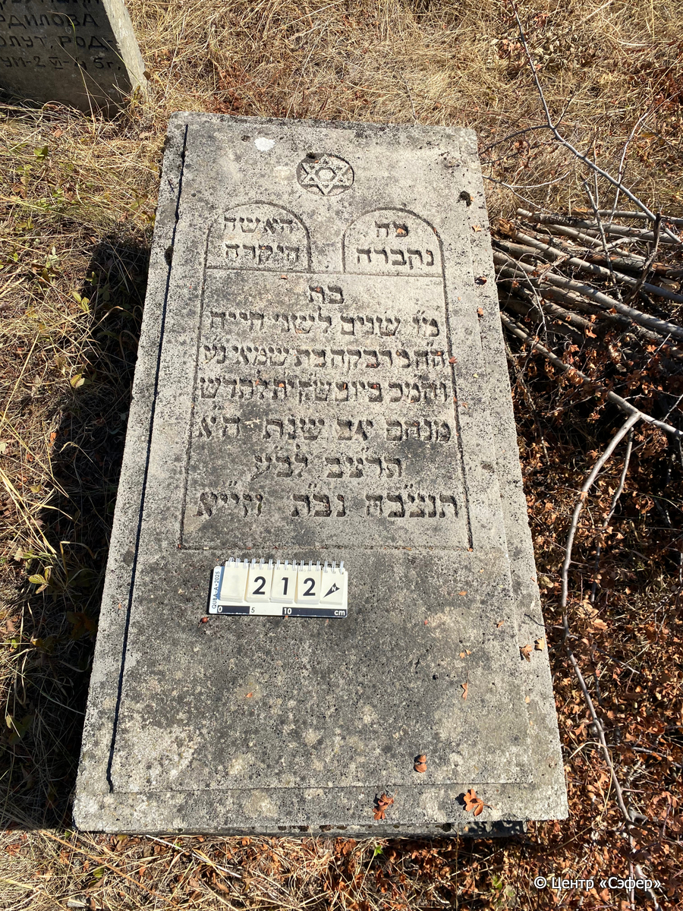

::: {style="font-size: 1em; margin-bottom: 1.2em"}
[Куба (центральное)](../cemeteries/QBA.html) > QBA0212
:::

```{r}
suppressPackageStartupMessages(library(tidyverse))
```


:::: {.columns}

::: {.column width="20%"}

```{r}
#| lightbox:
#|   group: photos





```
:::

::: {.column width="5%"}
:::

::: {.column width="74%"}

::: {.name-style}
Ривка, дочь Шамая
:::

::: {style="font-size: 1.2em;"}
רבקה בת שמאי
:::

:::: {.columns}
::: {.column width="5%"}
{width=1.3em}
:::

::: {.column style="width: 40%; padding-left: 0.2em;"}
  /  
:::

::: {.column width="5%"}
{width=1.3em}
:::

::: {.column style="width: 50%; padding-left: 0.2em;"}
20.08.1932* / 18.Av.5692
:::

::::


::: {.panel-tabset}

#### Эпитафия

```{r}
tibble(`Оригинал` = "справа
פה
נקברה

слева
האשה
היקרה

по центру
בת
מ״ו שנים לשני חייה
ה״ה מ׳ רבקה בת שמאי נ״ע
וה״מכ ביום ש״ק י״[ח] ל[ח]דש
מנחם אב שנת ה״א
תרצ״ב לב״ע
תנצ״בה נב״ת וזי״יא",
       `Перевод` = "
Здесь
покоится

 
женщина
дорогая,

 
в возрасте
46 лет жизни
г-жа Ривка, дочь Шаммая, душа ее в раю
и благословен ее покой. В день святой субблты, 1[8] числа месяца
менахем ав года
5692 от сотворения мира.
Да будет душа ее завязана в узле жизни, упокоится душа ее в раю, и род ее унаследует землю.*") |>
  mutate(`Оригинал` = str_split(`Оригинал`, "
"),
         `Перевод` = str_split(`Перевод`, "
")) |>
  unnest_longer(c(`Оригинал`, `Перевод`)) |> 
  mutate(id = 1:n()) |> 
  relocate(id, .before = Перевод) |> 
  rename(` ` = id) |> 
  knitr::kable(align = c("r", "c", "l"))
```

|||
|-|---|
|**Примечания**|* Псалмы 25:13|
|**Язык**      |иврит    |
|**Метки**     |     |
: {tbl-colwidths="[25,75]"}

#### Памятник

|||
|-|---|
|**Тип памятника**   |плита/саркофаг                                                                         |
|**Материал**        |известняк (цементный раствор, следы эрозии, сколы)                                                     |
|**Размеры**         |29×70×143  --- плита; 26×90×164  --- основание                                                                        |
|**Тип декора**      |архитектурно-орнаментальный, традиционная символика                                                                        |
|**Элементы декора** |звезда Давида в круглой нише, фигурная рамка для текста                                                                          |
|**Координаты**      |[41.3702612, 48.50679107](https://www.google.com/maps/place/41.3702612, 48.50679107)                    |
: {tbl-colwidths="[25,75]"}

#### Источник

|||
|-|---|
|**Место хранения**        |Архив полевых исследований Центра «Сэфер»     |
|**Контакты**              |students@sefer.ru    |
|**Ссылка**                |https://sfira.org        |
|**Исходный ID**           |  |
|**Условия использования** |[CC BY-NC 4.0](https://creativecommons.org/licenses/by-nc/4.0/deed.ru)     |
: {tbl-colwidths="[25,75]"}

:::

:::

::::

