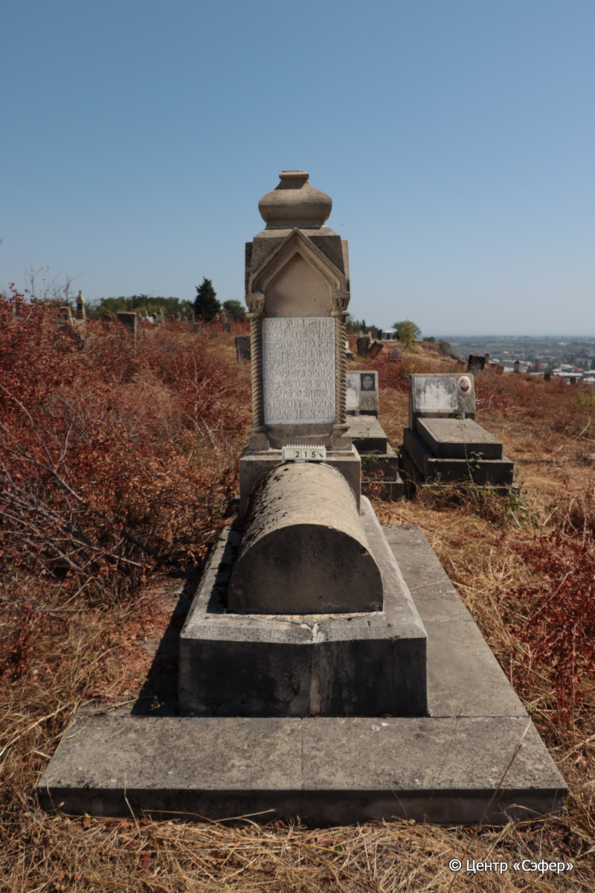
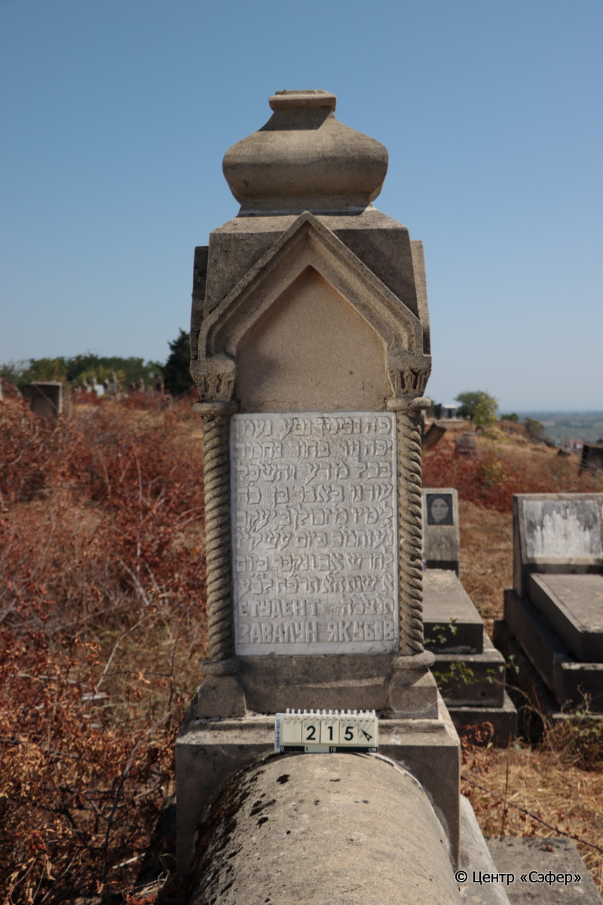
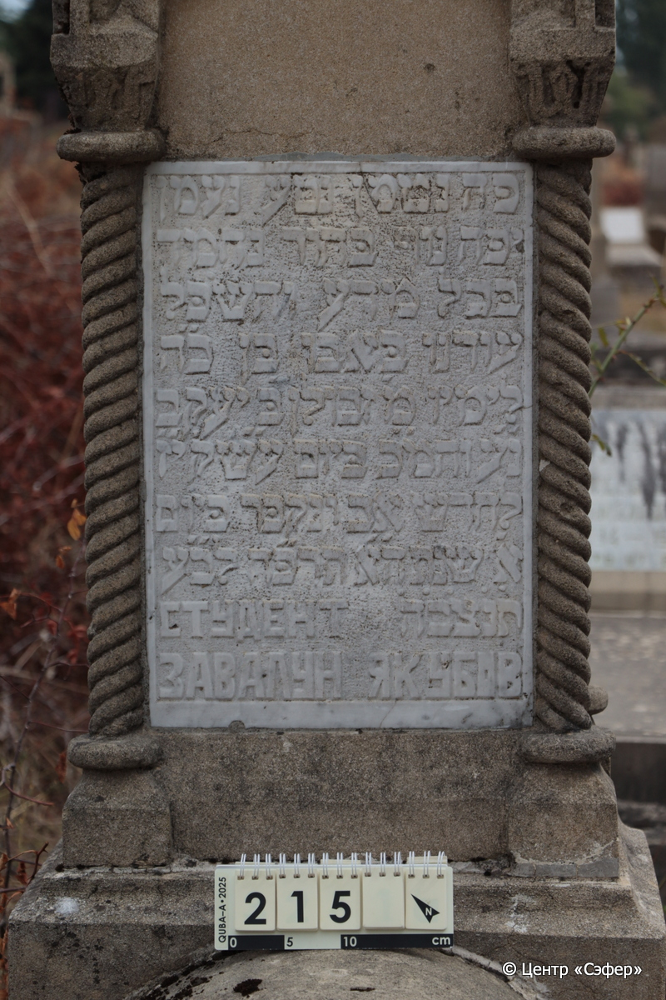

::: {style="font-size: 1em; margin-bottom: 1.2em"}
[Куба (центральное)](../cemeteries/QBA.html) > QBA0215
:::

```{r}
suppressPackageStartupMessages(library(tidyverse))
```


:::: {.columns}

::: {.column width="20%"}

```{r}
#| lightbox:
#|   group: photos





```
:::

::: {.column width="5%"}
:::

::: {.column width="74%"}

::: {.name-style}
Звулун, сын Яакова (Завалун Якубов)
:::

::: {style="font-size: 1.2em;"}
זבולן בן יעקב
:::

:::: {.columns}
::: {.column width="5%"}
{width=1.3em}
:::

::: {.column style="width: 40%; padding-left: 0.2em;"}
  /  
:::

::: {.column width="5%"}
{width=1.3em}
:::

::: {.column style="width: 50%; padding-left: 0.2em;"}
03.08.1928* / 17.Av.5688
:::

::::


::: {.panel-tabset}

#### Эпитафия

```{r}
tibble(`Оригинал` = "פה נטמן נטע נעמן
יפה נוף בּחור נחמד
בּכל מדע והשכּל
עודנו בּאבו בּן כ״ה
לימיו מ׳ זבולן בּ׳ יעקב
נ״ע והמ״כ בּיום ע״שק י״ז
לחדש אב ונקבּר בּיום
א׳ שנת ה״א תרפ״ח לב״ע
ת֗נ֗צ֗ב֗ה֗ студент
Завалун Якубов",
       `Перевод` = "Здесь покоится прекрасный саженец,
прекрасный и приятный юноша
во всяком знании и разумении,
еще в расцвете, в возрасте 25
лет жизни, Завулон, сын Яакова,
душа его в раю и благословен его покой. В канун святой субботы, 17
числа месяца ав, и похоронен в
воскресенье, года 5688 от сотворения мира. 
Да будет душа его завязана в узле жизни. Студент
Завалун Якубов.") |>
  mutate(`Оригинал` = str_split(`Оригинал`, "
"),
         `Перевод` = str_split(`Перевод`, "
")) |>
  unnest_longer(c(`Оригинал`, `Перевод`)) |> 
  mutate(id = 1:n()) |> 
  relocate(id, .before = Перевод) |> 
  rename(` ` = id) |> 
  knitr::kable(align = c("r", "c", "l"))
```

|||
|-|---|
|**Примечания**| |
|**Язык**      |иврит, русский    |
|**Метки**     |     |
: {tbl-colwidths="[25,75]"}

#### Памятник

|||
|-|---|
|**Тип памятника**   |L-образный                                                                         |
|**Материал**        |известняк, мрамор (мраморная вставка для текста, цементный раствор,стоит на платформе из плит, следы эрозии, трещины)                                                     |
|**Размеры**         |171×59×44  --- стела; 32×53×112  --- саркофаг; 30×81×182  --- основание                                                                        |
|**Тип декора**      |архитектурно-орнаментальный, растительный                                                                        |
|**Элементы декора** |архитектурное навершие, стрельчатые арки на витых полуколоннах с растительным орнаментом на капителях                                                                          |
|**Координаты**      |[41.37020838, 48.50678549](https://www.google.com/maps/place/41.37020838, 48.50678549)                    |
: {tbl-colwidths="[25,75]"}

#### Источник

|||
|-|---|
|**Место хранения**        |Архив полевых исследований Центра «Сэфер»     |
|**Контакты**              |students@sefer.ru    |
|**Ссылка**                |https://sfira.org        |
|**Исходный ID**           |  |
|**Условия использования** |[CC BY-NC 4.0](https://creativecommons.org/licenses/by-nc/4.0/deed.ru)     |
: {tbl-colwidths="[25,75]"}

:::

:::

::::

