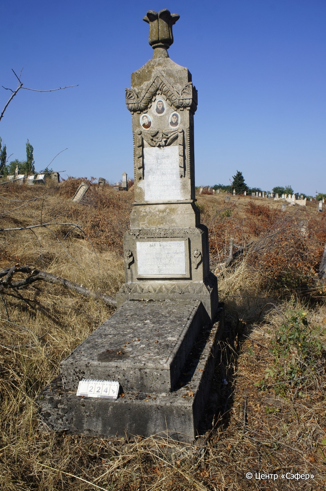
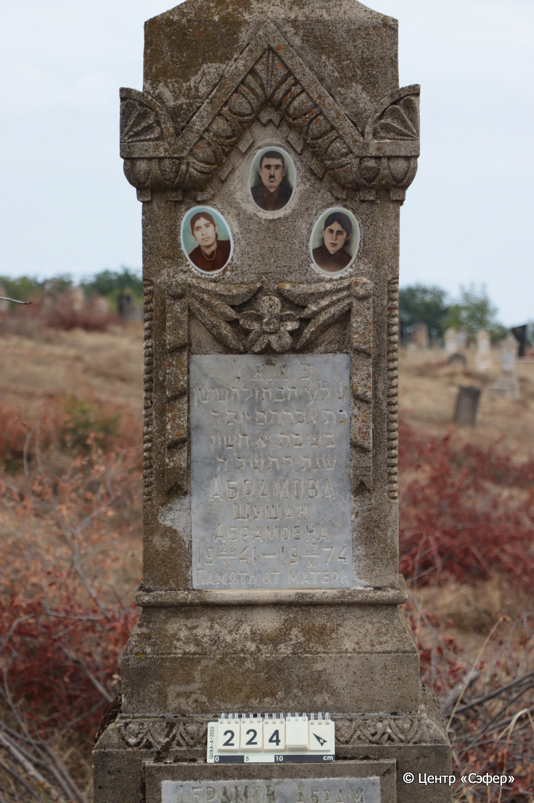
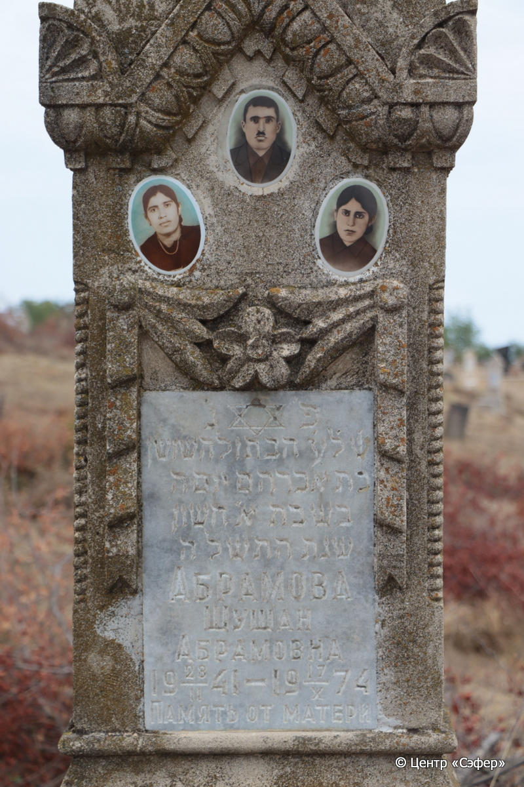
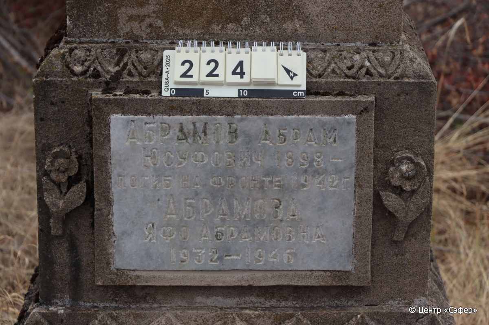

::: {style="font-size: 1em; margin-bottom: 1.2em"}
[Куба (центральное)](../cemeteries/QBA.html) > QBA0224
:::

```{r}
suppressPackageStartupMessages(library(tidyverse))
```


:::: {.columns}

::: {.column width="20%"}

```{r}
#| lightbox:
#|   group: photos






```
:::

::: {.column width="5%"}
:::

::: {.column width="74%"}

::: {.name-style}
АБРАМОВА Шушан, дочь Авраама (Абрамовна)
:::

::: {style="font-size: 1.2em;"}
שושן בת אברהם
:::

:::: {.columns}
::: {.column width="5%"}
{width=1.3em}
:::

::: {.column style="width: 40%; padding-left: 0.2em;"}
23.02.1941 /  
:::

::: {.column width="5%"}
{width=1.3em}
:::

::: {.column style="width: 50%; padding-left: 0.2em;"}
17.10.1974 / 01.Ch.5735
:::

::::

---

::: {.name-style}
АБРАМОВ Абрам Юсуфович
:::

::: {style="font-size: 1.2em;"}

:::

:::: {.columns}
::: {.column width="5%"}
{width=1.3em}
:::

::: {.column style="width: 40%; padding-left: 0.2em;"}
-.-.1898 /  
:::

::: {.column width="5%"}
{width=1.3em}
:::

::: {.column style="width: 50%; padding-left: 0.2em;"}
-.-.1942 /  
:::

::::

---

::: {.name-style}
АБРАМОВА Яфо Абрамовна
:::

::: {style="font-size: 1.2em;"}

:::

:::: {.columns}
::: {.column width="5%"}
{width=1.3em}
:::

::: {.column style="width: 40%; padding-left: 0.2em;"}
-.-.1932 /  
:::

::: {.column width="5%"}
{width=1.3em}
:::

::: {.column style="width: 50%; padding-left: 0.2em;"}
-.-.1946 /  
:::

::::


::: {.panel-tabset}

#### Эпитафия

```{r}
tibble(`Оригинал` = "сверху
פ׳ נ׳
ש֗ל֗ע֗ הבתולה שושן
בת אברהם יום ה׳
בשבת א׳ חשון
שנת התשלה
Абрамова
Шушан
Абрамовна
23/II 1941 – 17/X 1974
Память от матери

снизу
Абрамов Абрам
Юсуфович 1898 –
Погиб на фронте 1942 г.

Абрамова
Яфо Абрамовна
1932 – 1946",
       `Перевод` = "
Здесь покоится
та, что ушла навеки, девушка Шушан,
дочь Авраама. Четверг,
1 хешвана
года 5735.
Абрамова
Шушан
Абрамовна
23.02.1941 – 17.10.1974
Память от матери

 
Абрамов Абрам
Юсуфович 1898 –
Погиб на фронте 1942 г.

Абрамова
Яфо Абрамовна
1932 – 1946") |>
  mutate(`Оригинал` = str_split(`Оригинал`, "
"),
         `Перевод` = str_split(`Перевод`, "
")) |>
  unnest_longer(c(`Оригинал`, `Перевод`)) |> 
  mutate(id = 1:n()) |> 
  relocate(id, .before = Перевод) |> 
  rename(` ` = id) |> 
  knitr::kable(align = c("r", "c", "l"))
```

|||
|-|---|
|**Примечания**| |
|**Язык**      |иврит, русский    |
|**Метки**     |     |
: {tbl-colwidths="[25,75]"}

#### Памятник

|||
|-|---|
|**Тип памятника**   |L-образный                                                                         |
|**Материал**        |известняк, мрамор (цементный раствор, две мраморные вставки для текста, три керамических медальона для портрета, следы эрозии)                                                     |
|**Размеры**         |230×71×56  --- стела; 17×57×113  --- плита; 31×89×19  --- основание                                                                        |
|**Тип декора**      |архитектурно-орнаментальный, растительный, традиционная символика                                                                        |
|**Элементы декора** |архитектурное навершие увенчанное бутоном, орнаментальный пояс с пальметками и мотивом листьев, три портрета на медальонах, цветочные гирлянды с лентами, звезда Давида на вставке, витые грани у лицевой стороны стелы, у нижнего текста с двух сторон рельефы цветов, над этой вставкой орнаментальный пояс с мотивом листьев, под вставкой орнаментальный пояс с треугольными мотивами                                                                          |
|**Координаты**      |[41.37007952, 48.50699315](https://www.google.com/maps/place/41.37007952, 48.50699315)                    |
: {tbl-colwidths="[25,75]"}

#### Источник

|||
|-|---|
|**Место хранения**        |Архив полевых исследований Центра «Сэфер»     |
|**Контакты**              |students@sefer.ru    |
|**Ссылка**                |https://sfira.org        |
|**Исходный ID**           |  |
|**Условия использования** |[CC BY-NC 4.0](https://creativecommons.org/licenses/by-nc/4.0/deed.ru)     |
: {tbl-colwidths="[25,75]"}

:::

:::

::::

