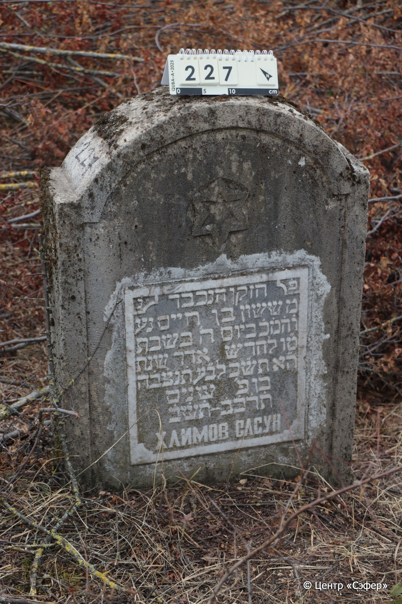

::: {style="font-size: 1em; margin-bottom: 1.2em"}
[Куба (центральное)](../cemeteries/QBA.html) > QBA0227
:::

```{r}
suppressPackageStartupMessages(library(tidyverse))
```


:::: {.columns}

::: {.column width="20%"}

```{r}
#| lightbox:
#|   group: photos



```
:::

::: {.column width="5%"}
:::

::: {.column width="74%"}

::: {.name-style}
Сасон, сын Хаима
:::

::: {style="font-size: 1.2em;"}
ששון בן חיים
:::

:::: {.columns}
::: {.column width="5%"}
{width=1.3em}
:::

::: {.column style="width: 40%; padding-left: 0.2em;"}
  /  
:::

::: {.column width="5%"}
{width=1.3em}
:::

::: {.column style="width: 50%; padding-left: 0.2em;"}
04.03.1942* / 15.Ad.5702
:::

::::


::: {.panel-tabset}

#### Эпитафия

```{r}
tibble(`Оригинал` = "פ׳ נ׳
הזקן הנכבד
מ ששון בן חיים נע
ו֗ה֗מ֗כ֗ ביום ה׳ בשבת
ט״ו לחדש אדר שנת
ה״א תש״ב לב״ע ת֗נ֗צ֗ב֗ה֗
בן פ׳ שנים
ת֗ר֗כ֗ב֗ - ת֗ש֗ב֗
ХАИМОВ САСУН",
       `Перевод` = "Здесь покоится
пожилой и уважаемый
г-н Сасон, сын Хаима, душа его в раю,
и благословен его покой. Четверг,
15 число месяца адар года
5702 от сотворения мира. Да будет душа его завязана в узле жизни.
В возрасте 80 лет.
622 - 702.
Хаимов Сасун.") |>
  mutate(`Оригинал` = str_split(`Оригинал`, "
"),
         `Перевод` = str_split(`Перевод`, "
")) |>
  unnest_longer(c(`Оригинал`, `Перевод`)) |> 
  mutate(id = 1:n()) |> 
  relocate(id, .before = Перевод) |> 
  rename(` ` = id) |> 
  knitr::kable(align = c("r", "c", "l"))
```

|||
|-|---|
|**Примечания**| |
|**Язык**      |иврит, русский    |
|**Метки**     |     |
: {tbl-colwidths="[25,75]"}

#### Памятник

|||
|-|---|
|**Тип памятника**   |стела                                                                         |
|**Материал**        |известняк, мрамор (мраморная вставка для текста, следы эрозии, цементный раствор)                                                     |
|**Размеры**         |95×62×19  --- стела                                                                        |
|**Тип декора**      |архитектурно-орнаментальный, традиционная символика                                                                        |
|**Элементы декора** |звезда Давида в круглой нише, полукруглое завершение, рамка                                                                          |
|**Координаты**      |[41.36991564, 48.50696373](https://www.google.com/maps/place/41.36991564, 48.50696373)                    |
: {tbl-colwidths="[25,75]"}

#### Источник

|||
|-|---|
|**Место хранения**        |Архив полевых исследований Центра «Сэфер»     |
|**Контакты**              |students@sefer.ru    |
|**Ссылка**                |https://sfira.org        |
|**Исходный ID**           |  |
|**Условия использования** |[CC BY-NC 4.0](https://creativecommons.org/licenses/by-nc/4.0/deed.ru)     |
: {tbl-colwidths="[25,75]"}

:::

:::

::::

