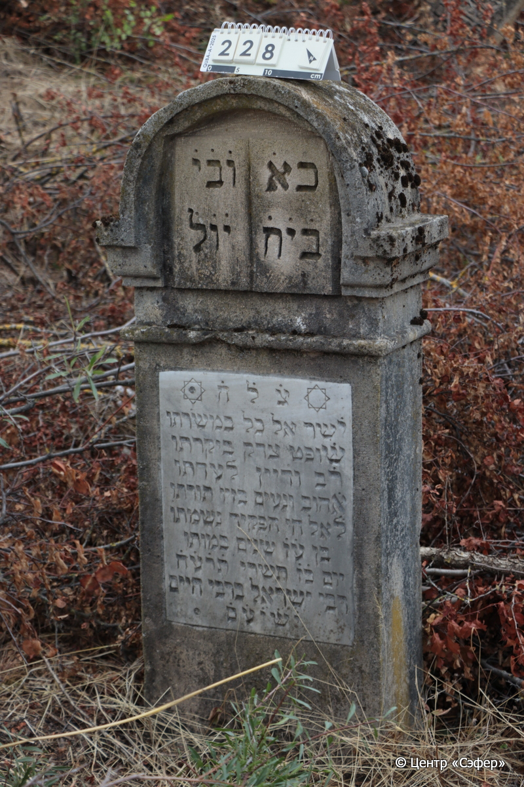
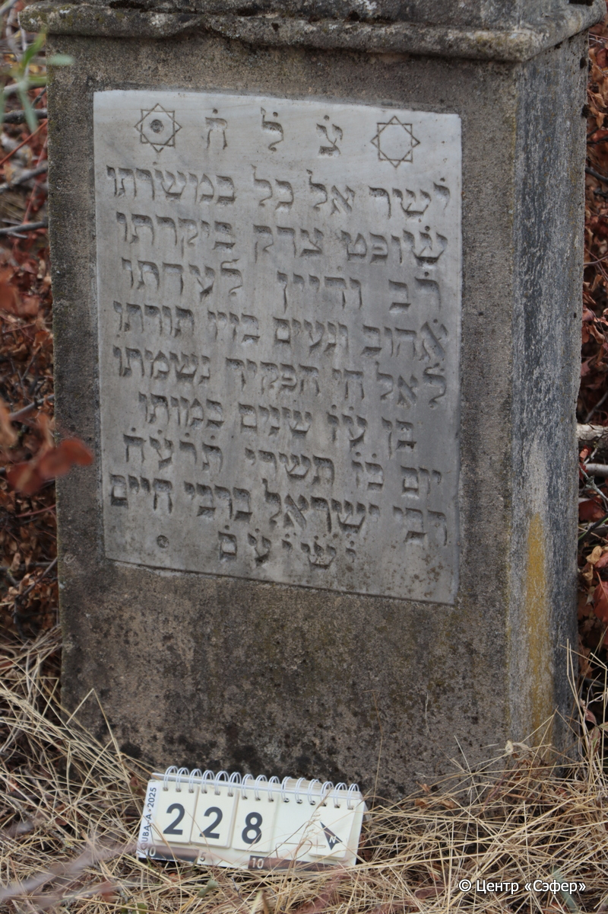

::: {style="font-size: 1em; margin-bottom: 1.2em"}
[Куба (центральное)](../cemeteries/QBA.html) > QBA0228
:::

```{r}
suppressPackageStartupMessages(library(tidyverse))
```


:::: {.columns}

::: {.column width="20%"}

```{r}
#| lightbox:
#|   group: photos




```
:::

::: {.column width="5%"}
:::

::: {.column width="74%"}

::: {.name-style}
Исраэль, сын Хаима
:::

::: {style="font-size: 1.2em;"}
ישראל בן חיים
:::

:::: {.columns}
::: {.column width="5%"}
{width=1.3em}
:::

::: {.column style="width: 40%; padding-left: 0.2em;"}
  /  
:::

::: {.column width="5%"}
{width=1.3em}
:::

::: {.column style="width: 50%; padding-left: 0.2em;"}
13.10.1917* / 27.Ti.5678
:::

::::


::: {.panel-tabset}

#### Эпитафия

```{r}
tibble(`Оригинал` = "כ֗א֗ | ו֗ב֗י֗
בי֗ח֗| י֗ו֗ל֗
צ֗ל֗ח֗
י֗שר אל כל במשׂרתו
ש֗ופט צדק ביקרתו
ר֗ב וד֗יין לעדתו 
א֗הוב ונעים בזיו תורתו
ל֗אל חי הפקיד נשמתו 
בן ע֗ז֗ שנים במותו
יום כ֗ז֗ תשרי ת֗ר֗ע֗ח֗
רבי ישראל ברבי חיים
י֗ש֗י֗ע֗ם֗",
       `Перевод` = "…
…
Знак живой душе.
Прямодушен со всеми на своей службе,
справедливый судья, 
раввин и судья общине своей,
любящий и приятный в сиянии своего учения,
душу свою посвятил Господу живому,
в возрасте 77 лет скончался
27 тишрея 678 года.
Рабби Исраэль, сын рабби Хаима.
Он обретёт покой, возляжет и отдохнет.") |>
  mutate(`Оригинал` = str_split(`Оригинал`, "
"),
         `Перевод` = str_split(`Перевод`, "
")) |>
  unnest_longer(c(`Оригинал`, `Перевод`)) |> 
  mutate(id = 1:n()) |> 
  relocate(id, .before = Перевод) |> 
  rename(` ` = id) |> 
  knitr::kable(align = c("r", "c", "l"))
```

|||
|-|---|
|**Примечания**| |
|**Язык**      |иврит    |
|**Метки**     |     |
: {tbl-colwidths="[25,75]"}

#### Памятник

|||
|-|---|
|**Тип памятника**   |стела                                                                         |
|**Материал**        |известняк, мрамор (мраморная вставка для текста, следы эрозии, сколы)                                                     |
|**Размеры**         |118×53×23  --- стела                                                                        |
|**Тип декора**      |архитектурно-орнаментальный, традиционная символика                                                                        |
|**Элементы декора** |в полукруглом портале рельеф книги, две звезды Давида на вставке, одна из которых с круглым углублением                                                                          |
|**Координаты**      |[41.36991032, 48.5069779](https://www.google.com/maps/place/41.36991032, 48.5069779)                    |
: {tbl-colwidths="[25,75]"}

#### Источник

|||
|-|---|
|**Место хранения**        |Архив полевых исследований Центра «Сэфер»     |
|**Контакты**              |students@sefer.ru    |
|**Ссылка**                |https://sfira.org        |
|**Исходный ID**           |  |
|**Условия использования** |[CC BY-NC 4.0](https://creativecommons.org/licenses/by-nc/4.0/deed.ru)     |
: {tbl-colwidths="[25,75]"}

:::

:::

::::

