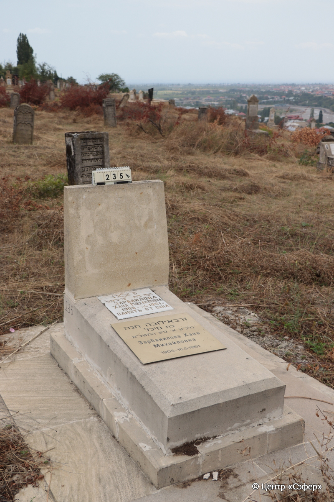
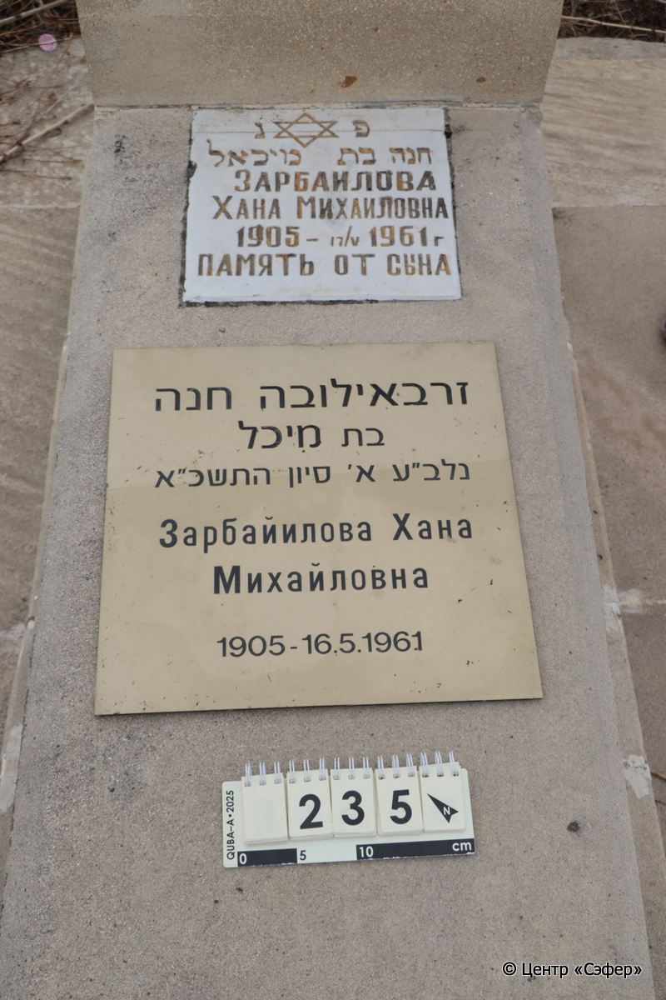
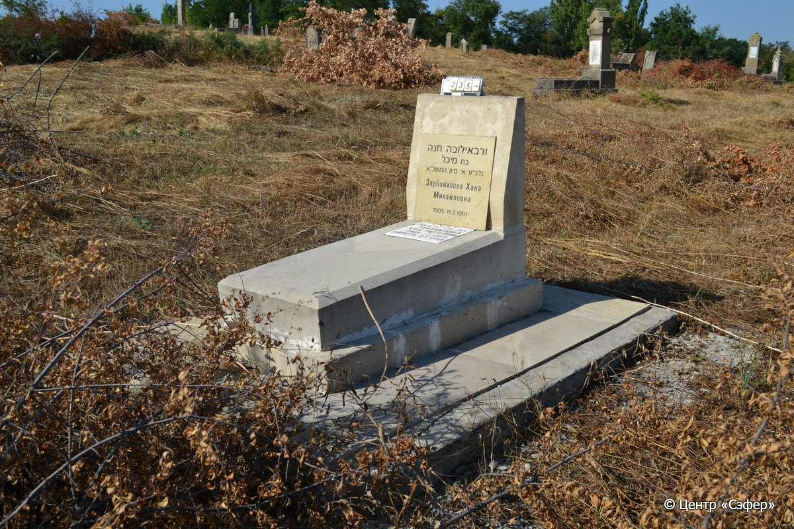

::: {style="font-size: 1em; margin-bottom: 1.2em"}
[Куба (центральное)](../cemeteries/QBA.html) > QBA0235
:::

```{r}
suppressPackageStartupMessages(library(tidyverse))
```


:::: {.columns}

::: {.column width="20%"}

```{r}
#| lightbox:
#|   group: photos





```
:::

::: {.column width="5%"}
:::

::: {.column width="74%"}

::: {.custom-frame}
::: {.name-style}
**ЗАРБАИЛОВА Хана, дочь Михаэля (Михайловна)**
:::

::: {style="font-size: 1.2em; color: #929292;"}
זרבאילובה חנה בת מיכאל
:::

:::: {.columns .date-panel .align-items-center}
::: {.column width="1.5em" .text-center}
{width=1.3em .nolightbox}
:::

::: {.column style="width: fit-content; padding-left: 0.4em; padding-right: 4em;"}
-.-.1905 

[--]{style="color: #929292"}
:::

::: {.column width="1.5em" .text-center}
{width=1.3em .nolightbox}
:::

::: {.column style="width: fit-content; padding-left: 0.4em;"}
16.05.1961 

[01.Si.5721]{style="color: #929292"}
:::

::::

:::

::: {.panel-tabset}

#### Эпитафия

```{r}
tibble(`Оригинал` = "פ נ 
חנה בת מיכאל
Зарбаилова
Хана Михайловна
1905 – 17/V 1961 г.
память от сына

табличка
זרבאילובה חנה
בת מיכל
נלב״ע א׳ סיון התשכ״א
Зарбайилова Хана
Михайловна
1905 – 16.5.1961",
       `Перевод` = "Здесь покоится
Хана, дочь Михаэля.
Зарбаилова
Хана Михайловна
1905 – 17/V 1961 г.
память от сына.

_TB_
Зарбаилова Хана
дочь Михаэля.
Ушла в дом вечности 1 сивана 5721 года.
Зарбайилова Хана
Михайловна
1905 – 16.5.1961") |>
  mutate(`Оригинал` = str_split(`Оригинал`, "
"),
         `Перевод` = str_split(`Перевод`, "
")) |>
  unnest_longer(c(`Оригинал`, `Перевод`)) |> 
  mutate(id = 1:n()) |> 
  relocate(id, .before = Перевод) |> 
  rename(` ` = id) |> 
  knitr::kable(align = c("r", "c", "l"))
```

|||
|-|---|
|Примечания| |
|Язык      |иврит, русский    |
|Метки     |     |
: {.striped .custom-table tbl-colwidths="[25,75]"}

#### Памятник

|||
|-|---|
|Тип памятника   |L-образный                                                                         |
|Материал        |известняк, мрамор (мраморная вставка для текста в плите, бетона, цементный раствор. к стеле, судя по следам клея, была приклеена пластиковая табличка с текстом, теперь стоит прислоненная)                                                     |
|Размеры         |56×54×16  --- стела; 25×56×125  --- плита; 13×69×135  --- основание                                                                        |
|Тип декора      |традиционная символика                                                                        |
|Элементы декора |звезда Давида на мраморной вставке                                                                          |
|Координаты      |[41.37035028, 48.50690467](https://www.google.com/maps/place/41.37035028, 48.50690467)                    |
: {.striped .custom-table tbl-colwidths="[25,75]"}

#### Источник

|                          |                 |
|--------------------------|-----------------|
|Место хранения        |Архив полевых исследований Центра «Сэфер»        |
|Контакты              |students@sefer.ru       |
|Ссылка                |[https://sfira.org](https://sfira.org) |
|Исходный ID           |     |
|Условия использования |[CC BY-NC 4.0](https://creativecommons.org/licenses/by-nc/4.0/deed.ru)        |
: {.striped .custom-table tbl-colwidths="[25,75]"}

:::

:::

::::

