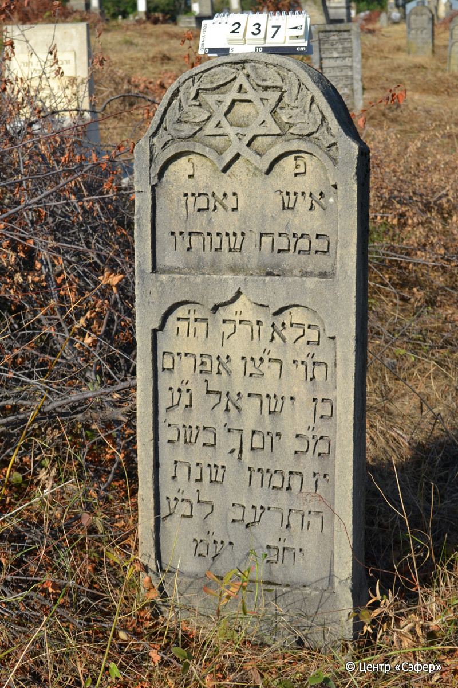
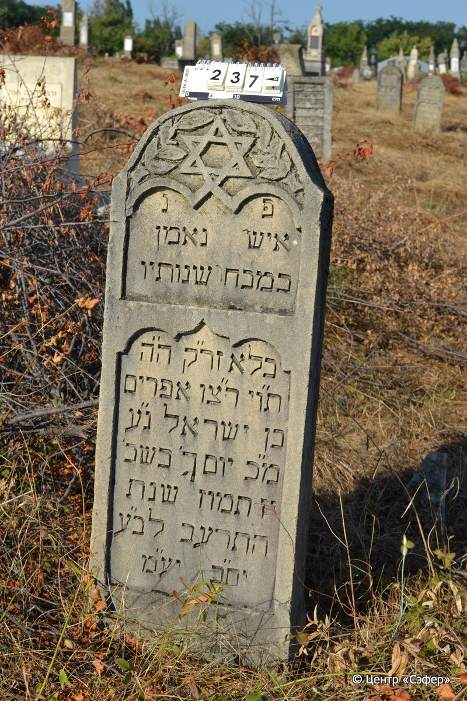

::: {style="font-size: 1em; margin-bottom: 1.2em"}
[Куба (центральное)](../cemeteries/QBA.html) > QBA0237
:::

```{r}
suppressPackageStartupMessages(library(tidyverse))
```


:::: {.columns}

::: {.column width="20%"}

```{r}
#| lightbox:
#|   group: photos




```
:::

::: {.column width="5%"}
:::

::: {.column width="74%"}

::: {.name-style}
Эфраим, сын Исраэля
:::

::: {style="font-size: 1.2em;"}
אפרים בן ישראל
:::

:::: {.columns}
::: {.column width="5%"}
{width=1.3em}
:::

::: {.column style="width: 40%; padding-left: 0.2em;"}
  /  
:::

::: {.column width="5%"}
{width=1.3em}
:::

::: {.column style="width: 50%; padding-left: 0.2em;"}
02.07.1912* / 17.Ta.5672
:::

::::


::: {.panel-tabset}

#### Эпитафия

```{r}
tibble(`Оригинал` = "פ נ
איש נאמן
במבח[ר] שנותיו
בלא זר״ק ה״ה
ת״וי ר״צו אפרים
בן ישראל נ״ע
מ״כ יום [ך׳ / ג׳] בשב׳
יז תמוז שנת
התרעב לב״ע
יח״ב יע״מ",
       `Перевод` = "Здесь покоится
человек верный,
в свои лучшие годы
не оставив потомства,
честный и прямодушный, стремящийся к праведности Эфраим,
сын Исраэля, душа его в раю.
Благословен его покой. Вторник,
17 таммуза года
5672 от сотворения мира.
Пусть торжествуют праведники во славе и радуются на ложах своих.") |>
  mutate(`Оригинал` = str_split(`Оригинал`, "
"),
         `Перевод` = str_split(`Перевод`, "
")) |>
  unnest_longer(c(`Оригинал`, `Перевод`)) |> 
  mutate(id = 1:n()) |> 
  relocate(id, .before = Перевод) |> 
  rename(` ` = id) |> 
  knitr::kable(align = c("r", "c", "l"))
```

|||
|-|---|
|**Примечания**| |
|**Язык**      |иврит    |
|**Метки**     |     |
: {tbl-colwidths="[25,75]"}

#### Памятник

|||
|-|---|
|**Тип памятника**   |стела                                                                         |
|**Материал**        |известняк (следы эрозии, царапины)                                                     |
|**Размеры**         |112×43×18  --- стела                                                                        |
|**Тип декора**      |архитектурно-орнаментальный, растительный, традиционная символика                                                                        |
|**Элементы декора** |полукруглое завершение со звездой Давида и листьями с двух сторон, две фигурные ниши для текста                                                                          |
|**Координаты**      |[41.3703044, 48.50687418](https://www.google.com/maps/place/41.3703044, 48.50687418)                    |
: {tbl-colwidths="[25,75]"}

#### Источник

|||
|-|---|
|**Место хранения**        |Архив полевых исследований Центра «Сэфер»     |
|**Контакты**              |students@sefer.ru    |
|**Ссылка**                |https://sfira.org        |
|**Исходный ID**           |  |
|**Условия использования** |[CC BY-NC 4.0](https://creativecommons.org/licenses/by-nc/4.0/deed.ru)     |
: {tbl-colwidths="[25,75]"}

:::

:::

::::

