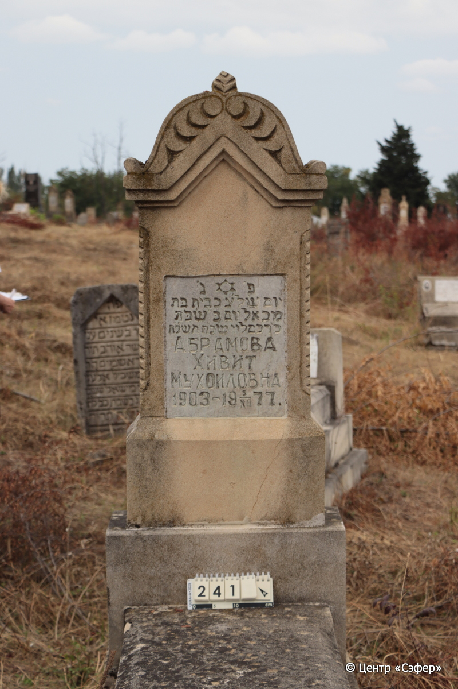
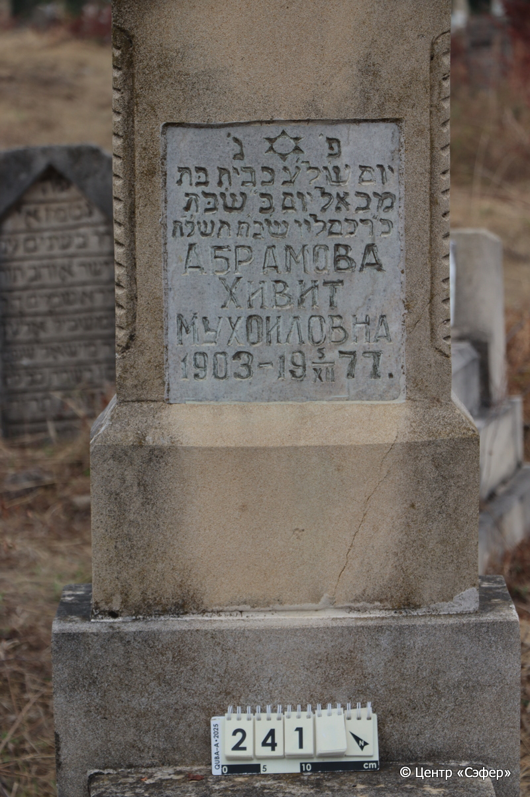
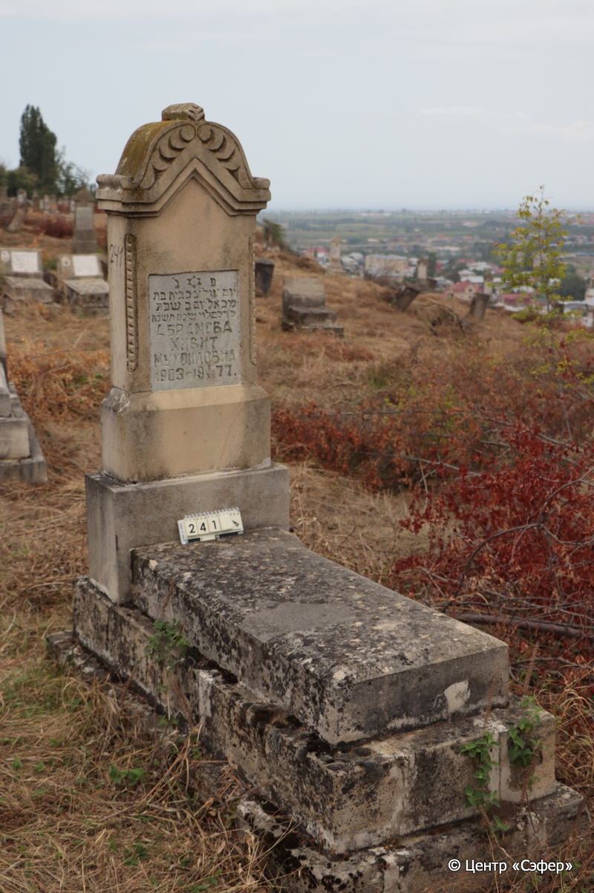

::: {style="font-size: 1em; margin-bottom: 1.2em"}
[Куба (центральное)](../cemeteries/QBA.html) > QBA0241
:::

```{r}
suppressPackageStartupMessages(library(tidyverse))
```


:::: {.columns}

::: {.column width="20%"}

```{r}
#| lightbox:
#|   group: photos





```
:::

::: {.column width="5%"}
:::

::: {.column width="74%"}

::: {.name-style}
АБРАМОВА Хивит, дочь Михаэля (Мухоиловна)
:::

::: {style="font-size: 1.2em;"}
כבית בת מכאל
:::

:::: {.columns}
::: {.column width="5%"}
{width=1.3em}
:::

::: {.column style="width: 40%; padding-left: 0.2em;"}
-.-.1903 /  
:::

::: {.column width="5%"}
{width=1.3em}
:::

::: {.column style="width: 50%; padding-left: 0.2em;"}
05.12.1977 / 24.Ki.5738
:::

::::


::: {.panel-tabset}

#### Эпитафия

```{r}
tibble(`Оригинал` = "פ׳ נ׳
יום ש֗ל׳ע כבית בּת
מכאל יום בּ״ שׂבּת
כ״ד כסליו שנ״ת תש״לח
АБРАМОВА
ХИВИТ
МУХОИЛОВНА
1903 – 5/XII 1977.",
       `Перевод` = "Здесь покоится.
День, когда скончалась Хивит, дочь
Михаэля, понедельник,
24 кислева года 738.
АБРАМОВА
ХИВИТ
МУХОИЛОВНА
1903 – 05.12.1977") |>
  mutate(`Оригинал` = str_split(`Оригинал`, "
"),
         `Перевод` = str_split(`Перевод`, "
")) |>
  unnest_longer(c(`Оригинал`, `Перевод`)) |> 
  mutate(id = 1:n()) |> 
  relocate(id, .before = Перевод) |> 
  rename(` ` = id) |> 
  knitr::kable(align = c("r", "c", "l"))
```

|||
|-|---|
|**Примечания**| |
|**Язык**      |иврит, русский    |
|**Метки**     |     |
: {tbl-colwidths="[25,75]"}

#### Памятник

|||
|-|---|
|**Тип памятника**   |L-образный                                                                         |
|**Материал**        |известняк, мрамор (мраморная вставка с текстом, цементный раствор, следы эрозии, трещины)                                                     |
|**Размеры**         |148×60×27  --- стела; 17×61×120  --- плита; 35×76×182  --- основание                                                                        |
|**Тип декора**      |архитектурно-орнаментальный, растительный, традиционная символика                                                                        |
|**Элементы декора** |треугольное завершение с волютами и растительным мотивом, витые фрагменты по двум сторонам от надписи, звезда Давида на вставке                                                                          |
|**Координаты**      |[41.37026752, 48.50692934](https://www.google.com/maps/place/41.37026752, 48.50692934)                    |
: {tbl-colwidths="[25,75]"}

#### Источник

|||
|-|---|
|**Место хранения**        |Архив полевых исследований Центра «Сэфер»     |
|**Контакты**              |students@sefer.ru    |
|**Ссылка**                |https://sfira.org        |
|**Исходный ID**           |  |
|**Условия использования** |[CC BY-NC 4.0](https://creativecommons.org/licenses/by-nc/4.0/deed.ru)     |
: {tbl-colwidths="[25,75]"}

:::

:::

::::

