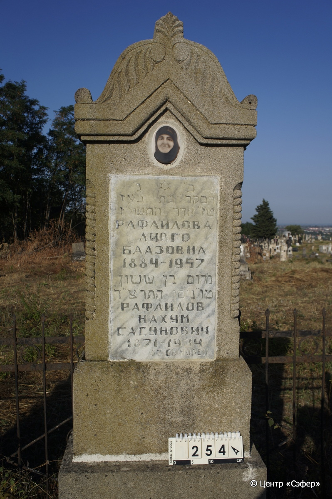
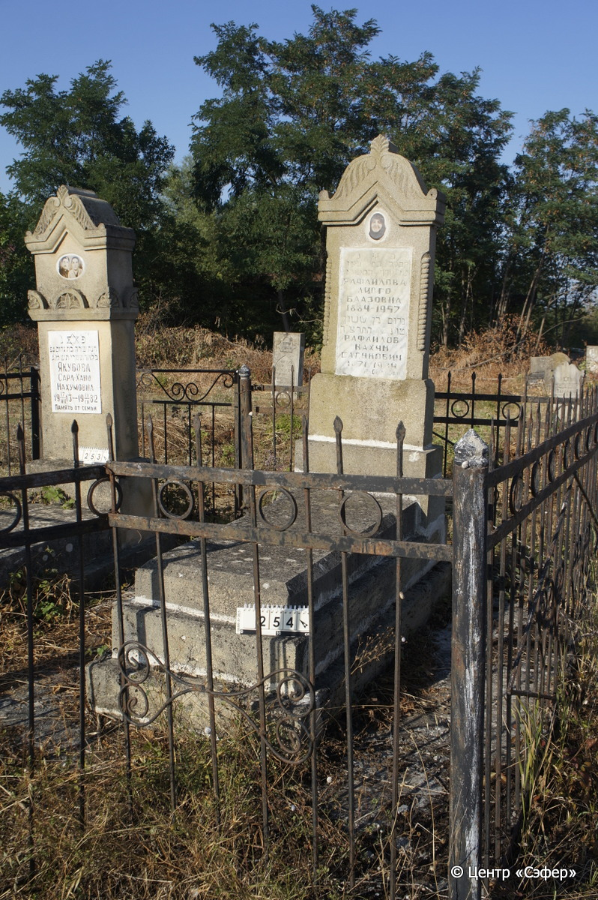

::: {style="font-size: 1em; margin-bottom: 1.2em"}
[Куба (центральное)](../cemeteries/QBA.html) > QBA0254
:::

```{r}
suppressPackageStartupMessages(library(tidyverse))
```


:::: {.columns}

::: {.column width="20%"}

```{r}
#| lightbox:
#|   group: photos



knitr::include_graphics("../images/QBA0254_2.JPG")

```
:::

::: {.column width="5%"}
:::

::: {.column width="74%"}

::: {.name-style}
Ривка, дочь Боаза
:::

::: {style="font-size: 1.2em;"}
רבקה בת בעז
:::

:::: {.columns}
::: {.column width="5%"}
{width=1.3em}
:::

::: {.column style="width: 40%; padding-left: 0.2em;"}
-.-.1884 /  
:::

::: {.column width="5%"}
{width=1.3em}
:::

::: {.column style="width: 50%; padding-left: 0.2em;"}
-.-.1957 / 16.Ad.5717
:::

::::

---

::: {.name-style}
Нахум, сын Сасона
:::

::: {style="font-size: 1.2em;"}
נחום בן ששון
:::

:::: {.columns}
::: {.column width="5%"}
{width=1.3em}
:::

::: {.column style="width: 40%; padding-left: 0.2em;"}
-.-.1871 /  
:::

::: {.column width="5%"}
{width=1.3em}
:::

::: {.column style="width: 50%; padding-left: 0.2em;"}
-.-.1934 / 15.Ni.5694
:::

::::


::: {.panel-tabset}

#### Эпитафия

```{r}
tibble(`Оригинал` = "פ״ נ״
רבקה בת בעז
טז״ אדר התשי״ז
Рафаилова
Ливго
Баазовна
1884 – 1957
נחום בן שושן
טו״ ניסן התרצ״ד
Рафаилов
Нахум
Сасунович
1871 – 1934
От сыновей",
       `Перевод` = "Здесь покоится
Ривка, дочь Боаза.
16 адара 5717 года.
Рафаилова
Ливго
Баазовна
1884 – 1957.
Нахум, сын Сасона.
15 нисана 5694.
Рафаилов
Нахум
Сасунович
1871 – 1934
От сыновей") |>
  mutate(`Оригинал` = str_split(`Оригинал`, "
"),
         `Перевод` = str_split(`Перевод`, "
")) |>
  unnest_longer(c(`Оригинал`, `Перевод`)) |> 
  mutate(id = 1:n()) |> 
  relocate(id, .before = Перевод) |> 
  rename(` ` = id) |> 
  knitr::kable(align = c("r", "c", "l"))
```

|||
|-|---|
|**Примечания**| |
|**Язык**      |иврит, русский    |
|**Метки**     |     |
: {tbl-colwidths="[25,75]"}

#### Памятник

|||
|-|---|
|**Тип памятника**   |L-образный                                                                         |
|**Материал**        |песчаник, известняк, мрамор (керамический медальон; следы цементного раствора; следы эрозии; стоит на бетонном основании)                                                     |
|**Размеры**         |162×61×28  --- стела; 13×52×117  --- плита; 30×70×169  --- основание                                                                        |
|**Тип декора**      |архитектурно-орнаментальный, растительный, традиционная символика                                                                        |
|**Элементы декора** |фигурное навершие с растительным орнаментом и волютами; фотопортрет женщины в медальоне; две витые полуколонны с двух сторон стелы                                                                          |
|**Координаты**      |[41.37093525, 48.5066809](https://www.google.com/maps/place/41.37093525, 48.5066809)                    |
: {tbl-colwidths="[25,75]"}

#### Источник

|||
|-|---|
|**Место хранения**        |Архив полевых исследований Центра «Сэфер»     |
|**Контакты**              |students@sefer.ru    |
|**Ссылка**                |https://sfira.org        |
|**Исходный ID**           |  |
|**Условия использования** |[CC BY-NC 4.0](https://creativecommons.org/licenses/by-nc/4.0/deed.ru)     |
: {tbl-colwidths="[25,75]"}

:::

:::

::::

