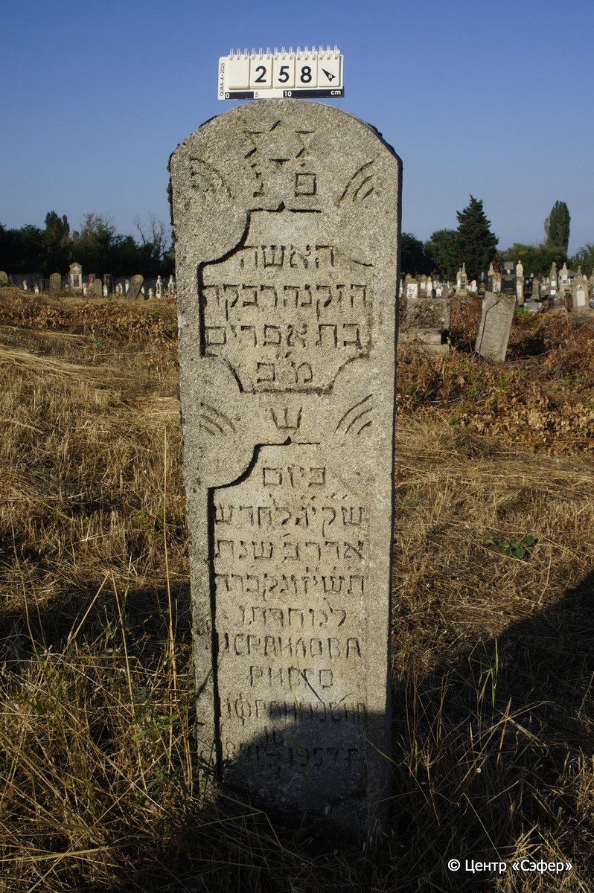
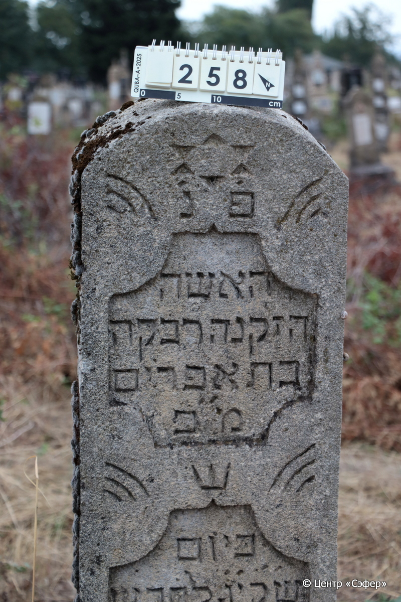
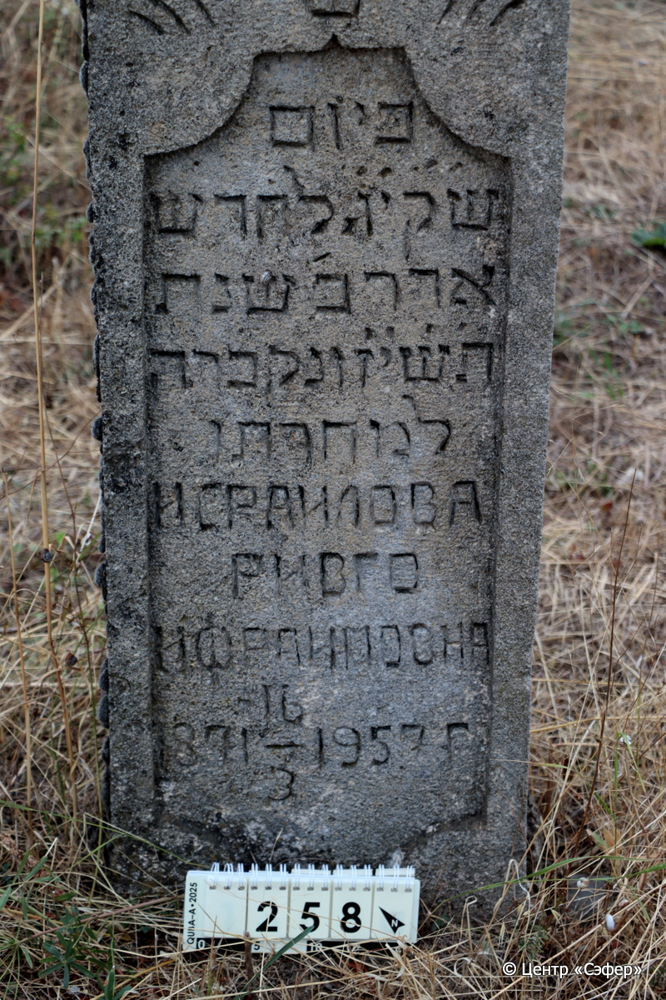
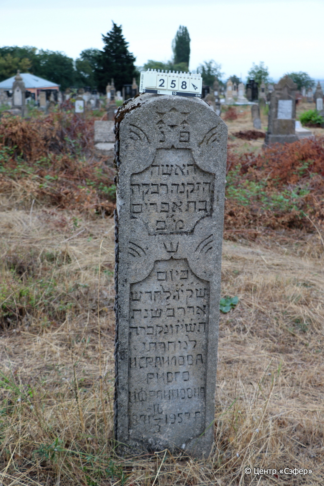

::: {style="font-size: 1em; margin-bottom: 1.2em"}
[Куба (центральное)](../cemeteries/QBA.html) > QBA0258
:::

```{r}
suppressPackageStartupMessages(library(tidyverse))
```


:::: {.columns}

::: {.column width="20%"}

```{r}
#| lightbox:
#|   group: photos






```
:::

::: {.column width="5%"}
:::

::: {.column width="74%"}

::: {.name-style}
Ривка, дочь Эфраима
:::

::: {style="font-size: 1.2em;"}
רבקה בת אפרים
:::

:::: {.columns}
::: {.column width="5%"}
{width=1.3em}
:::

::: {.column style="width: 40%; padding-left: 0.2em;"}
-.-.1871 /  
:::

::: {.column width="5%"}
{width=1.3em}
:::

::: {.column style="width: 50%; padding-left: 0.2em;"}
16.03.1957 / 13.Ad2.5717
:::

::::


::: {.panel-tabset}

#### Эпитафия

```{r}
tibble(`Оригинал` = "פ׳נ׳
האשה
הזקנה רבקה
בת אפרים
מ״כ
ש
ביום
ש״ק י״ג לחדש
אדר ב׳ שנת
ת֗ש֗י֗ז֗ ונקברה
למחרתו
ИСРАИЛОВА
РИВГО
ИФРАИМОВНА
1871 16/3 1957 Г.",
       `Перевод` = "Здесь покоится
женщина
пожилая, Ривка,
дочь Эфраима,
благословен ее покой,
которая  <скончалась>
в день
святой субботы, 13 числа месяца
адар-II года
717 и была похоронена
на следующий день.
ИСРАИЛОВА
РИВГО
ИФРАИМОВНА
1871 16/3 1957 Г.") |>
  mutate(`Оригинал` = str_split(`Оригинал`, "
"),
         `Перевод` = str_split(`Перевод`, "
")) |>
  unnest_longer(c(`Оригинал`, `Перевод`)) |> 
  mutate(id = 1:n()) |> 
  relocate(id, .before = Перевод) |> 
  rename(` ` = id) |> 
  knitr::kable(align = c("r", "c", "l"))
```

|||
|-|---|
|**Примечания**| |
|**Язык**      |иврит, русский    |
|**Метки**     |     |
: {tbl-colwidths="[25,75]"}

#### Памятник

|||
|-|---|
|**Тип памятника**   |стела                                                                         |
|**Материал**        |известняк (следы эрозии)                                                     |
|**Размеры**         |152×38×19                                                                        |
|**Тип декора**      |архитектурно-орнаментальный, традиционная символика                                                                        |
|**Элементы декора** |две фигурных ниши для текста, над которыми справа и лева дугообразный орнамент; наверху звезда; между нишами корона (?); округлое завершение                                                                          |
|**Координаты**      |[41.37053891, 48.50693304](https://www.google.com/maps/place/41.37053891, 48.50693304)                    |
: {tbl-colwidths="[25,75]"}

#### Источник

|||
|-|---|
|**Место хранения**        |Архив полевых исследований Центра «Сэфер»     |
|**Контакты**              |students@sefer.ru    |
|**Ссылка**                |https://sfira.org        |
|**Исходный ID**           |  |
|**Условия использования** |[CC BY-NC 4.0](https://creativecommons.org/licenses/by-nc/4.0/deed.ru)     |
: {tbl-colwidths="[25,75]"}

:::

:::

::::

