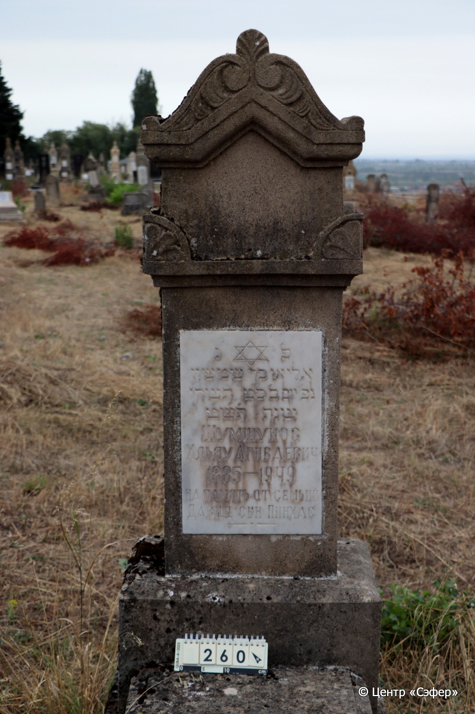
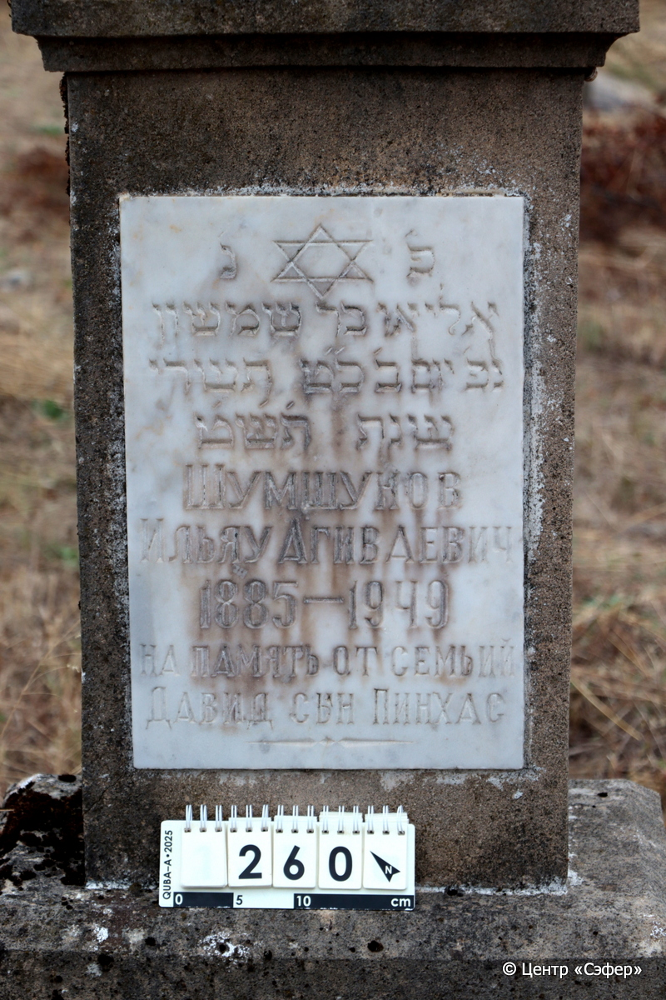
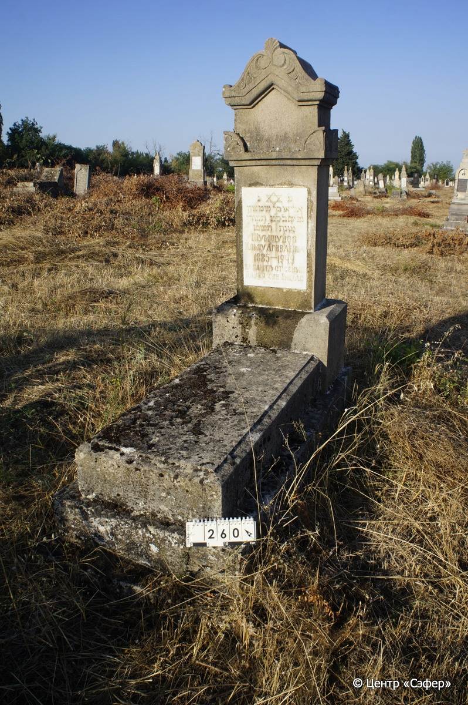

::: {style="font-size: 1em; margin-bottom: 1.2em"}
[Куба (центральное)](../cemeteries/QBA.html) > QBA0260
:::

```{r}
suppressPackageStartupMessages(library(tidyverse))
```


:::: {.columns}

::: {.column width="20%"}

```{r}
#| lightbox:
#|   group: photos





```
:::

::: {.column width="5%"}
:::

::: {.column width="74%"}

::: {.name-style}
Элияху, сын Шимшона
:::

::: {style="font-size: 1.2em;"}
אליהו בן שמשון
:::

:::: {.columns}
::: {.column width="5%"}
{width=1.3em}
:::

::: {.column style="width: 40%; padding-left: 0.2em;"}
-.-.1885 /  
:::

::: {.column width="5%"}
{width=1.3em}
:::

::: {.column style="width: 50%; padding-left: 0.2em;"}
-.-.1949 / 29.Ti.5709
:::

::::


::: {.panel-tabset}

#### Эпитафия

```{r}
tibble(`Оригинал` = "פ׳ נ׳
אליאו בר שמשון
נפ׳ יום ב׳ כ״ט תשרי
שנת ת֗ש֗ט֗
Шумшунов
Ильяу Агиваевич
1885 – 1949
На память от семьий
Давид сын Пинхас",
       `Перевод` = "Здесь покоится
Элияху, сын Шимшона.
Скончался в понедельник, 29 тишрея
года 709.
Шумшунов
Ильяу Агиваевич
1885 – 1949
На память от семьи.
Давид, сын Пинхас.") |>
  mutate(`Оригинал` = str_split(`Оригинал`, "
"),
         `Перевод` = str_split(`Перевод`, "
")) |>
  unnest_longer(c(`Оригинал`, `Перевод`)) |> 
  mutate(id = 1:n()) |> 
  relocate(id, .before = Перевод) |> 
  rename(` ` = id) |> 
  knitr::kable(align = c("r", "c", "l"))
```

|||
|-|---|
|**Примечания**|Нестандартное написание имени отца Элияху (через א вместо ה).|
|**Язык**      |иврит, русский    |
|**Метки**     |     |
: {tbl-colwidths="[25,75]"}

#### Памятник

|||
|-|---|
|**Тип памятника**   |L-образный                                                                         |
|**Материал**        |известняк, мрамор (следы эрозии; мраморная табличка для текста)                                                     |
|**Размеры**         |163×60×40  --- стела; 20×54×120  --- плита; 30×80×168  --- основание                                                                        |
|**Тип декора**      |архитектурно-орнаментальный, традиционная символика                                                                        |
|**Элементы декора** |фигурное навершие с волютами с растительным орнаментом; четыре пальметки по краям; звезда Давида в верхней части мраморной табличке                                                                          |
|**Координаты**      |[41.3704655, 48.50697383](https://www.google.com/maps/place/41.3704655, 48.50697383)                    |
: {tbl-colwidths="[25,75]"}

#### Источник

|||
|-|---|
|**Место хранения**        |Архив полевых исследований Центра «Сэфер»     |
|**Контакты**              |students@sefer.ru    |
|**Ссылка**                |https://sfira.org        |
|**Исходный ID**           |  |
|**Условия использования** |[CC BY-NC 4.0](https://creativecommons.org/licenses/by-nc/4.0/deed.ru)     |
: {tbl-colwidths="[25,75]"}

:::

:::

::::

