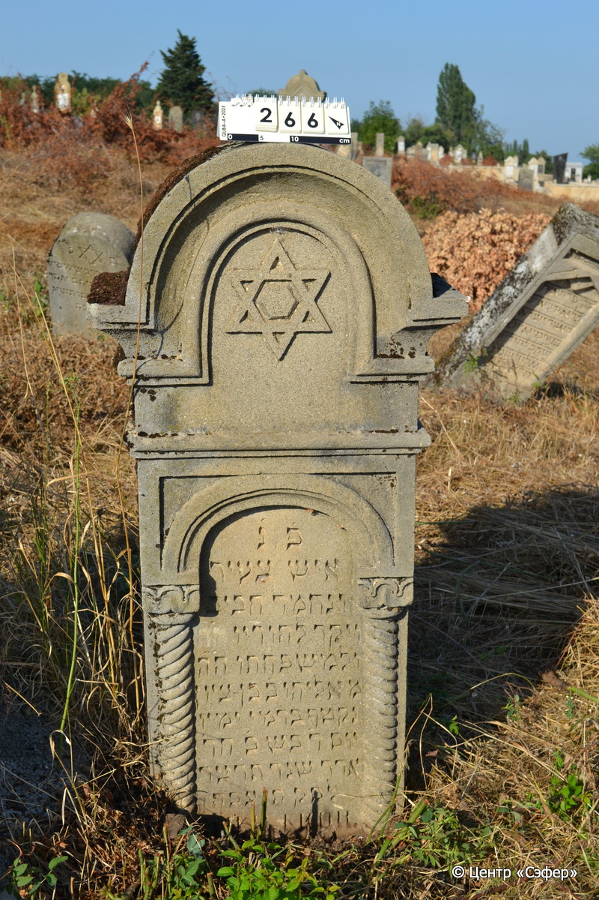

::: {style="font-size: 1em; margin-bottom: 1.2em"}
[Куба (центральное)](../cemeteries/QBA.html) > QBA0266
:::

```{r}
suppressPackageStartupMessages(library(tidyverse))
```


:::: {.columns}

::: {.column width="20%"}

```{r}
#| lightbox:
#|   group: photos



```
:::

::: {.column width="5%"}
:::

::: {.column width="74%"}

::: {.name-style}
Элияху, сын Бена Циона
:::

::: {style="font-size: 1.2em;"}
אליהו בן בן ציון
:::

:::: {.columns}
::: {.column width="5%"}
{width=1.3em}
:::

::: {.column style="width: 40%; padding-left: 0.2em;"}
  /  
:::

::: {.column width="5%"}
{width=1.3em}
:::

::: {.column style="width: 50%; padding-left: 0.2em;"}
07.03.1934* / 20.Ad.5694
:::

::::


::: {.panel-tabset}

#### Эпитафия

```{r}
tibble(`Оригинал` = "פ֗ נ֗
איש צעיר
ונחמד חביב
ויקר להוריו ה״ה
ולמשפחתו ה״ה
מ אליהו ב֗ בן-ציון
נקטף בדמי ימיו
יום ד׳ בש כ׳ חד׳
אדר שנת תרצד 
לפק תנצבה 
И. Ц. И. скон.
…",
       `Перевод` = "Здесь покоится
человек молодой 
и приятный, милый и
дорогой сердцу родителей
и семьи, г-н
Элияху, сын Бен Циона.
Сорван в расцвете дней
в среду, 20 числа месяца
адар года 694
по малому летоисчислению. Да будет душа его завязана в узле жизни.
И. Ц. И. скончался
…") |>
  mutate(`Оригинал` = str_split(`Оригинал`, "
"),
         `Перевод` = str_split(`Перевод`, "
")) |>
  unnest_longer(c(`Оригинал`, `Перевод`)) |> 
  mutate(id = 1:n()) |> 
  relocate(id, .before = Перевод) |> 
  rename(` ` = id) |> 
  knitr::kable(align = c("r", "c", "l"))
```

|||
|-|---|
|**Примечания**|В третьей строке корректура резчика – последние две буквы затёрты.|
|**Язык**      |иврит, русский    |
|**Метки**     |     |
: {tbl-colwidths="[25,75]"}

#### Памятник

|||
|-|---|
|**Тип памятника**   |стела                                                                         |
|**Материал**        |известняк (следы эрозии)                                                     |
|**Размеры**         |132×62×27                                                                        |
|**Тип декора**      |архитектурно-орнаментальный, традиционная символика                                                                        |
|**Элементы декора** |портал с текстом, по бокам витые полуколонны с капителями; полукруглое завершение; звезда Давида в портале                                                                          |
|**Координаты**      |[41.37031319, 48.50710082](https://www.google.com/maps/place/41.37031319, 48.50710082)                    |
: {tbl-colwidths="[25,75]"}

#### Источник

|||
|-|---|
|**Место хранения**        |Архив полевых исследований Центра «Сэфер»     |
|**Контакты**              |students@sefer.ru    |
|**Ссылка**                |https://sfira.org        |
|**Исходный ID**           |  |
|**Условия использования** |[CC BY-NC 4.0](https://creativecommons.org/licenses/by-nc/4.0/deed.ru)     |
: {tbl-colwidths="[25,75]"}

:::

:::

::::

