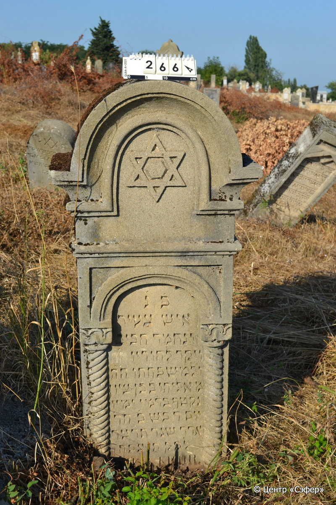

::: {style="font-size: 1em; margin-bottom: 1.2em"}
[Куба (центральное)](../cemeteries/QBA.html) > QBA0266
:::

```{r}
suppressPackageStartupMessages(library(tidyverse))
```


:::: {.columns}

::: {.column width="20%"}

```{r}
#| lightbox:
#|   group: photos



```
:::

::: {.column width="1.5em"}
:::

::: {.column width="74%"}

::: {.custom-frame}
::: {.name-ru-style}
**Элияху, сын Бенциона**
:::

::: {.name-he-style}
אליהו בן בן ציון
:::

:::: {.columns .date-panel style="display: flex; align-items: center; margin-top: 0.8em;"}
::: {.column .text-center style="width: fit-content; flex: 0 0 auto;"}
{width=1.5em .nolightbox}
:::

::: {.column style="flex: 0 0 auto; width: fit-content; padding-left: 0.8em; padding-right: 3.5em;"}
-- 

[--]{style="color: #929292"}
:::

::: {.column .text-center style="width: fit-content; flex: 0 0 auto;"}
{width=1.5em .nolightbox}
:::

::: {.column style="flex: 0 0 auto; width: fit-content; padding-left: 0.8em;"}
07.03.1934* 

[20.Ad.5694]{style="color: #929292"}
:::

::::

:::

::: {.panel-tabset}

#### Эпитафия

```{r}
tibble(`Оригинал` = "פ֗ נ֗
איש צעיר
ונחמד חביב
ויקר להוריו ה״ה
ולמשפחתו ה״ה
מ אליהו ב֗ בן-ציון
נקטף בדמי ימיו
יום ד׳ בש כ׳ חד׳
אדר שנת תרצד 
לפק תנצבה 
И. Ц. И. скон.
…",
       `Перевод` = "Здесь покоится
человек молодой 
и приятный, милый и
дорогой сердцу родителей
и семьи, г-н
Элияху, сын Бен-Циона.
Сорван в расцвете дней
в среду, 20 числа месяца
адар года 694
по малому летоисчислению. Да будет душа его завязана в узле жизни.
И. Ц. И. скончался
…") |>
  mutate(`Оригинал` = str_split(`Оригинал`, "
"),
         `Перевод` = str_split(`Перевод`, "
")) |>
  unnest_longer(c(`Оригинал`, `Перевод`)) |> 
  mutate(id = 1:n()) |> 
  relocate(id, .before = Перевод) |> 
  rename(` ` = id) |> 
  knitr::kable(align = c("r", "c", "l"))
```

---

::: {.list-table .striped .custom-table .borderless header-rows=0 aligns="l,l" tbl-colwidths="[21,79]"}
- - Примечания
  - В третьей строке корректура резчика – последние две буквы затёрты.

- - Язык
  - иврит, русский

- - Метки
  -  
:::

#### Памятник

::: {.list-table .striped .custom-table .borderless header-rows=0 aligns="l,l" tbl-colwidths="[21,79]"}
- - Тип памятника
  - стела

- - Материал
  - известняк (следы эрозии)

- - Размеры
  - 132×62×27

- - Тип декора
  - архитектурно-орнаментальный, традиционная символика

- - Элементы декора
  - портал с текстом, по бокам витые полуколонны с капителями; полукруглое завершение; звезда Давида в портале

- - Координаты
  - 41.37031319, 48.50710082 [[]{style="vertical-align: middle;"} Смотреть на карте](https://www.google.com/maps/place/41.37031319, 48.50710082){.btn .btn-outline-info role="button"}
:::

#### Источник

::: {.list-table .striped .custom-table .borderless header-rows=0 aligns="l,l" tbl-colwidths="[21,79]"}
- - Место хранения
  - Архив полевых исследований Центра «Сэфер»

- - Контакты
  - students@sefer.ru

- - Ссылка
  - [https://sfira.org](https://sfira.org)

- - Исходный ID
  -  

- - Условия использования
  - [CC BY-NC 4.0](https://creativecommons.org/licenses/by-nc/4.0/deed.ru)
:::

:::

:::

::::

