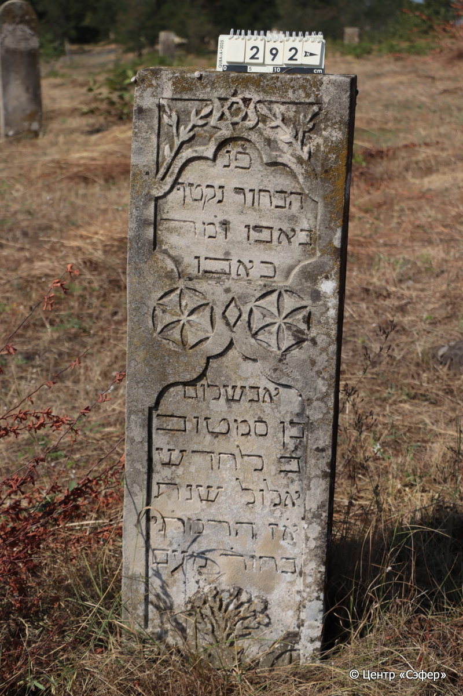
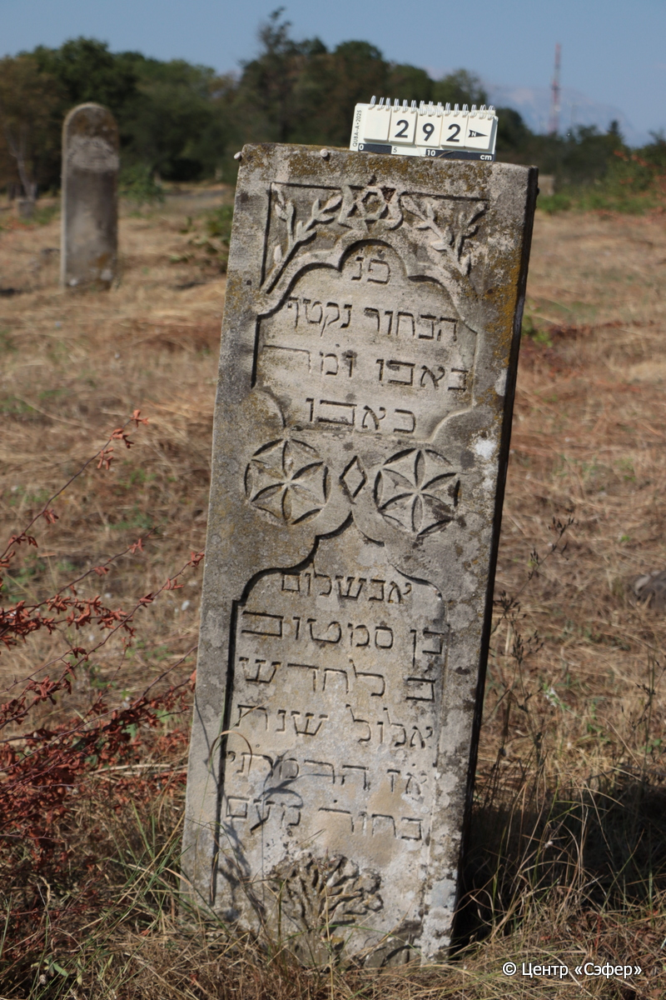

::: {style="font-size: 1em; margin-bottom: 1.2em"}
[Куба (центральное)](../cemeteries/QBA.html) > QBA0292
:::

```{r}
suppressPackageStartupMessages(library(tidyverse))
```


:::: {.columns}

::: {.column width="20%"}

```{r}
#| lightbox:
#|   group: photos




```
:::

::: {.column width="5%"}
:::

::: {.column width="74%"}

::: {.name-style}
Авшалом, сын Симантова
:::

::: {style="font-size: 1.2em;"}
אבשלום בן סמנטוב
:::

:::: {.columns}
::: {.column width="5%"}
{width=1.3em}
:::

::: {.column style="width: 40%; padding-left: 0.2em;"}
  /  
:::

::: {.column width="5%"}
{width=1.3em}
:::

::: {.column style="width: 50%; padding-left: 0.2em;"}
26.08.1911* / 02.El.5671
:::

::::


::: {.panel-tabset}

#### Эпитафия

```{r}
tibble(`Оригинал` = "פ֗נ֗
הבחור נקטף
באבו ומר
כאבו
אבשלום
בן סמטוב
ב֗ לחדש
אלול שנת
א֗ז הרמת֗י
בחור֗ מע֗ם*",
       `Перевод` = "Здесь покоится
юноша, сорванный
в расцвете, и велика
его боль,
Авшалом,
сын Симантова.
2 число месяца
элул года
Тогда я возвысил
избранного из народа (671).") |>
  mutate(`Оригинал` = str_split(`Оригинал`, "
"),
         `Перевод` = str_split(`Перевод`, "
")) |>
  unnest_longer(c(`Оригинал`, `Перевод`)) |> 
  mutate(id = 1:n()) |> 
  relocate(id, .before = Перевод) |> 
  rename(` ` = id) |> 
  knitr::kable(align = c("r", "c", "l"))
```

|||
|-|---|
|**Примечания**|*Год смерти записан в виде хронограммы, составленной из Пс 89:20.|
|**Язык**      |иврит    |
|**Метки**     |     |
: {tbl-colwidths="[25,75]"}

#### Памятник

|||
|-|---|
|**Тип памятника**   |стела                                                                         |
|**Материал**        |известняк (следы эрозии)                                                     |
|**Размеры**         |130×43×19                                                                        |
|**Тип декора**      |архитектурно-орнаментальный, растительный, традиционная символика                                                                        |
|**Элементы декора** |в верхней части звезда Давида с двумя примыкающими ветвями; две фигурные ниши для текста; между ними композиция с двумя медальонами с лепестками и ромбом между ними; в нижней части букет цветов и двумя розетками с факелами по краям                                                                          |
|**Координаты**      |[41.37080394, 48.50698988](https://www.google.com/maps/place/41.37080394, 48.50698988)                    |
: {tbl-colwidths="[25,75]"}

#### Источник

|||
|-|---|
|**Место хранения**        |Архив полевых исследований Центра «Сэфер»     |
|**Контакты**              |students@sefer.ru    |
|**Ссылка**                |https://sfira.org        |
|**Исходный ID**           |  |
|**Условия использования** |[CC BY-NC 4.0](https://creativecommons.org/licenses/by-nc/4.0/deed.ru)     |
: {tbl-colwidths="[25,75]"}

:::

:::

::::

