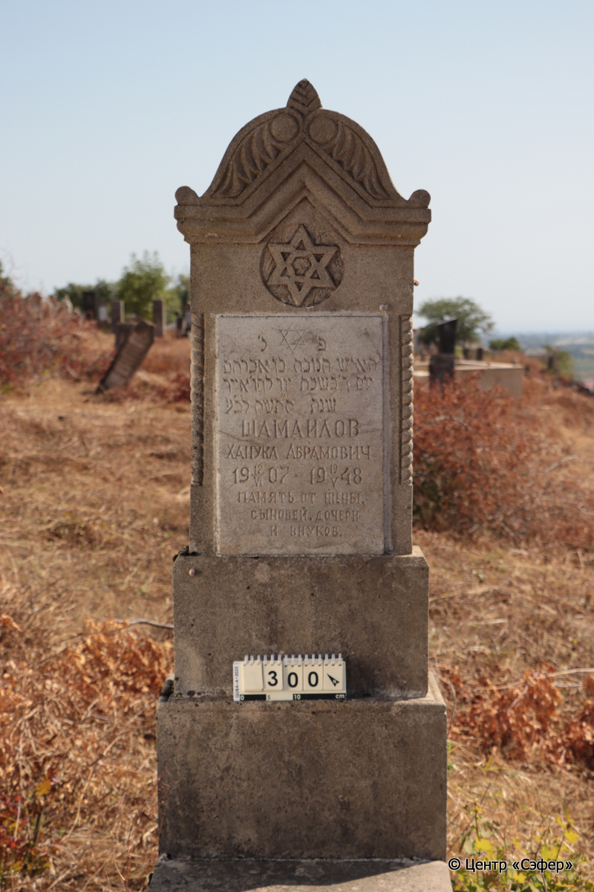
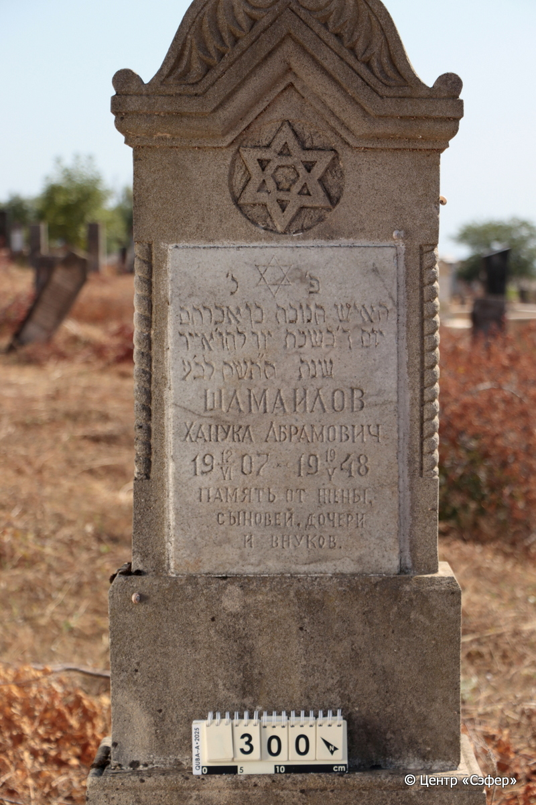
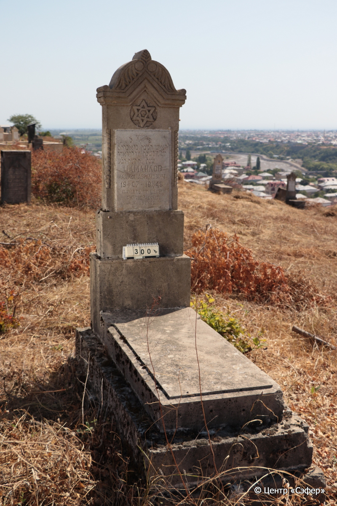

::: {style="font-size: 1em; margin-bottom: 1.2em"}
[Куба (центральное)](../cemeteries/QBA.html) > QBA0300
:::

```{r}
suppressPackageStartupMessages(library(tidyverse))
```


:::: {.columns}

::: {.column width="20%"}

```{r}
#| lightbox:
#|   group: photos





```
:::

::: {.column width="1.5em"}
:::

::: {.column width="74%"}

::: {.custom-frame}
::: {.name-ru-style}
**Ханука, сын Авраама**
:::

::: {.name-he-style}
חנוכה בן אברהם
:::

:::: {.columns .date-panel style="display: flex; align-items: top; margin-top: 0.8em;"}
::: {.column .text-center style="width: fit-content; flex: 0 0 auto;"}
{width=1.5em .nolightbox}
:::

::: {.column style="flex: 0 0 auto; width: fit-content; padding-left: 0.8em; padding-right: 3.5em;"}
12.06.1907 

[--]{style="color: #929292"}
:::

::: {.column .text-center style="width: fit-content; flex: 0 0 auto;"}
{width=1.5em .nolightbox}
:::

::: {.column style="flex: 0 0 auto; width: fit-content; padding-left: 0.8em;"}
19.05.1948 

[10.Iy.5708]{style="color: #929292"}
:::

::::

:::

::: {.panel-tabset}

#### Эпитафия

```{r}
tibble(`Оригинал` = "פ׳ נ׳
האיש חנוכה בן אברהם
יום ד׳ בשבת יו[ד] לחו׳ אייר
שנת ה״תשח לב׳ע
ШАМАИЛОВ
Ханука Абрамович
12/VI 1907 – 19/V 1948
Память от жены,
сыновей, дочери
и внуков.",
       `Перевод` = "Здесь покоится
человек Ханука, сын Авраама.
Среда, 10 число месяца ияр
года 5708 от сотворения мира.
ШАМАИЛОВ
Ханука Абрамович
12/VI 1907 – 19/V 1948
Память от жены,
сыновей, дочери
и внуков") |>
  mutate(`Оригинал` = str_split(`Оригинал`, "
"),
         `Перевод` = str_split(`Перевод`, "
")) |>
  unnest_longer(c(`Оригинал`, `Перевод`)) |> 
  mutate(id = 1:n()) |> 
  relocate(id, .before = Перевод) |> 
  rename(` ` = id) |> 
  knitr::kable(align = c("r", "c", "l"))
```

---

:::: {.custom-table-wrap}
::: {.list-table .borderless header-rows=0 aligns="l,l" tbl-colwidths="[21,79]"}
- - Примечания
  -  

- - Язык
  - иврит, русский

- - Метки
  -  

:::
::::

#### Памятник

:::: {.custom-table-wrap}
::: {.list-table .borderless header-rows=0 aligns="l,l" tbl-colwidths="[21,79]"}
- - Тип памятника
  - L-образный

- - Материал
  - известняк, мрамор (следы эрозии)

- - Размеры
  - 162×54×29  --- стела; 14×55×125  --- плита; 37×78×178  --- основание

- - Тип декора
  - архитектурно-орнаментальный, растительный, традиционная символика

- - Элементы декора
  - фигурное навершие с волютами и растительным мотивами,звезда Давида в круглой нише под навершием, звезда Давида наверху мраморной вставки,две витые полуколонны с лицевой стороны

- - Координаты
  - 41.37037031, 48.5072122 [Показать на карте](https://www.google.com/maps/place/41.37037031, 48.5072122){style="margin-left: 1em"}

:::
::::

#### Источник

:::: {.custom-table-wrap}
::: {.list-table .borderless header-rows=0 aligns="l,l" tbl-colwidths="[21,79]"}
- - Место хранения
  - Архив полевых исследований Центра «Сэфер»

- - Контакты
  - students@sefer.ru

- - Ссылка
  - [https://sfira.org](https://sfira.org)

- - Исходный ID
  -  

- - Условия использования
  - [CC BY-NC 4.0](https://creativecommons.org/licenses/by-nc/4.0/deed.ru)

:::
::::

:::

:::

:::

::::

