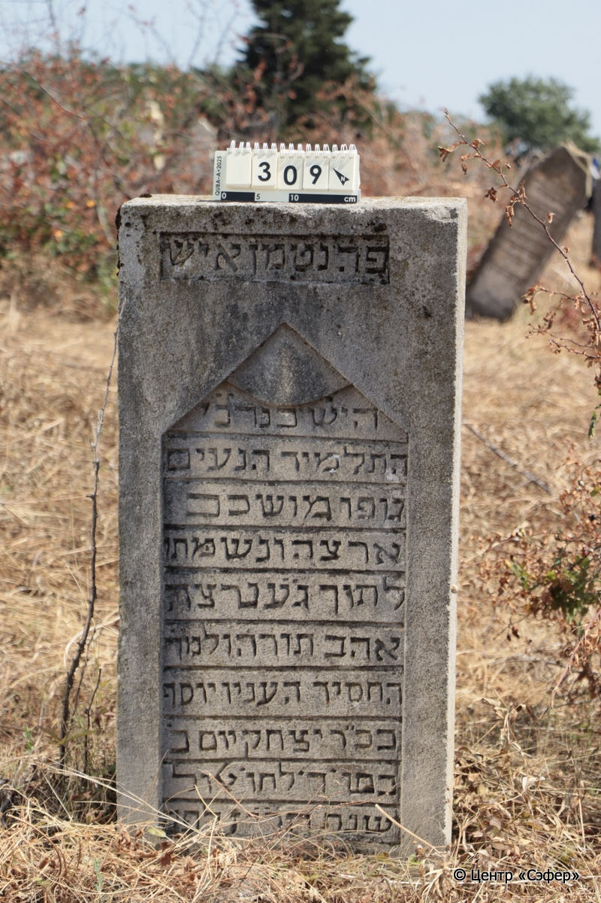
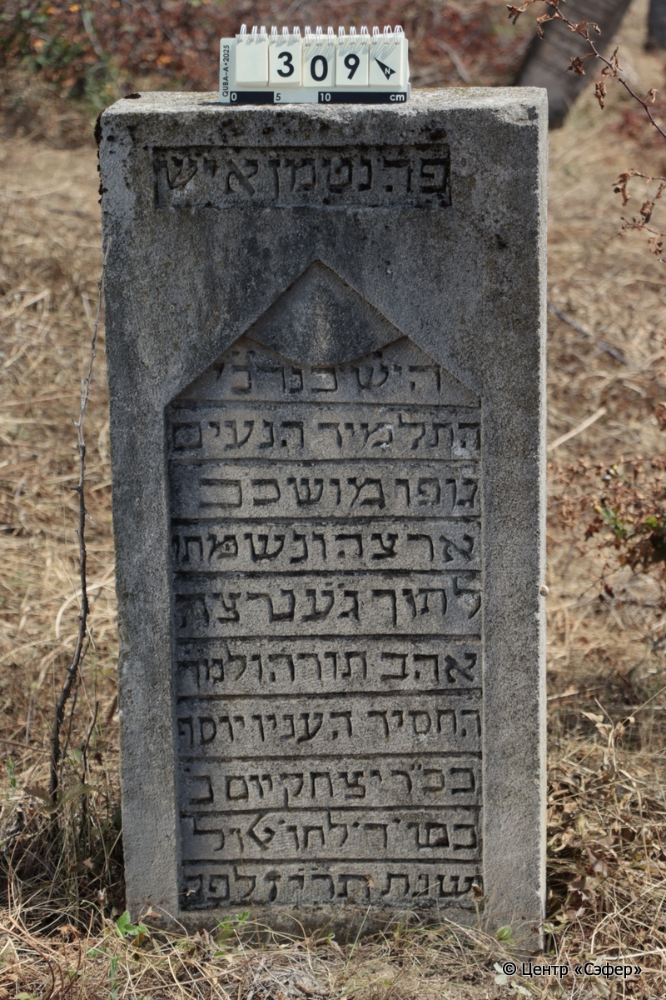

::: {style="font-size: 1em; margin-bottom: 1.2em"}
[Куба (центральное)](../cemeteries/QBA.html) > QBA0309
:::

```{r}
suppressPackageStartupMessages(library(tidyverse))
```


:::: {.columns}

::: {.column width="20%"}

```{r}
#| lightbox:
#|   group: photos




```
:::

::: {.column width="5%"}
:::

::: {.column width="74%"}

::: {.name-style}
Йосеф, сын Ицхака
:::

::: {style="font-size: 1.2em;"}
יוסף בן יצחק
:::

:::: {.columns}
::: {.column width="5%"}
{width=1.3em}
:::

::: {.column style="width: 40%; padding-left: 0.2em;"}
  /  
:::

::: {.column width="5%"}
{width=1.3em}
:::

::: {.column style="width: 50%; padding-left: 0.2em;"}
24.08.1857* / 04.El.5617
:::

::::


::: {.panel-tabset}

#### Эпитафия

```{r}
tibble(`Оригинал` = "פה נטמן איש
היש֗ בנדב֗י֗
התלמיד הנעים 
גופו מושכב 
ארצה ונשמתו 
לתוך ג֗ע֗ נרצה
אהב תורה ולמ֗ד֗
החסיד העניו יוסף
בכ״ר יצחק יום ב֗
בש׳ ד֗ לחו׳ אלול
שנת תר֗י֗ז לפק",
       `Перевод` = "Здесь похоронен человек
праведный cреди великодушных,
милый ученик,
тело его покоится
в земле, а душа его
в райский сад призвана,
любил Тору и учение,
благочестивый, скромный Йосеф
сын р. Ицхака, в воскресенье
4 <числа> месяца элула,
год 5617 по малому летоисчислению.") |>
  mutate(`Оригинал` = str_split(`Оригинал`, "
"),
         `Перевод` = str_split(`Перевод`, "
")) |>
  unnest_longer(c(`Оригинал`, `Перевод`)) |> 
  mutate(id = 1:n()) |> 
  relocate(id, .before = Перевод) |> 
  rename(` ` = id) |> 
  knitr::kable(align = c("r", "c", "l"))
```

|||
|-|---|
|**Примечания**| |
|**Язык**      |иврит    |
|**Метки**     |ученик, студент, знаток Писания    |
: {tbl-colwidths="[25,75]"}

#### Памятник

|||
|-|---|
|**Тип памятника**   |стела                                                                         |
|**Материал**        |известняк (следы эрозии)                                                     |
|**Размеры**         |100×50×19                                                                        |
|**Тип декора**      |архитектурно-орнаментальный                                                                        |
|**Элементы декора** |две ниши для текста; нижняя с выпуклым навершием                                                                          |
|**Координаты**      |[41.37040256, 48.50730206](https://www.google.com/maps/place/41.37040256, 48.50730206)                    |
: {tbl-colwidths="[25,75]"}

#### Источник

|||
|-|---|
|**Место хранения**        |Архив полевых исследований Центра «Сэфер»     |
|**Контакты**              |students@sefer.ru    |
|**Ссылка**                |https://sfira.org        |
|**Исходный ID**           |  |
|**Условия использования** |[CC BY-NC 4.0](https://creativecommons.org/licenses/by-nc/4.0/deed.ru)     |
: {tbl-colwidths="[25,75]"}

:::

:::

::::

