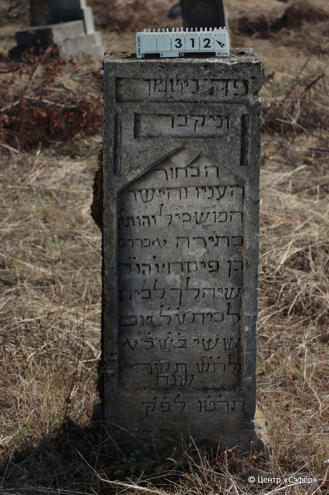
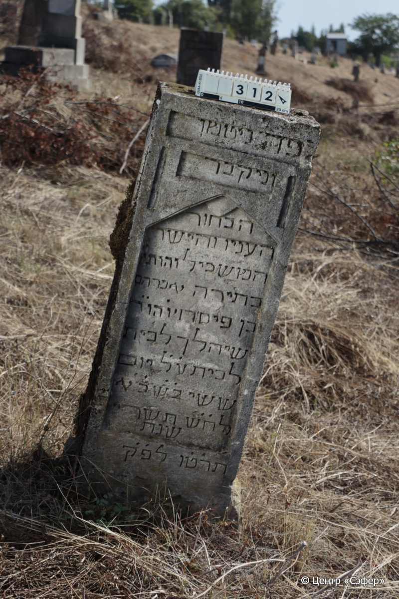

::: {style="font-size: 1em; margin-bottom: 1.2em"}
[Куба (центральное)](../cemeteries/QBA.html) > QBA0312
:::

```{r}
suppressPackageStartupMessages(library(tidyverse))
```


:::: {.columns}

::: {.column width="20%"}

```{r}
#| lightbox:
#|   group: photos




```
:::

::: {.column width="5%"}
:::

::: {.column width="74%"}

::: {.name-style}
Авраам, сын Песаха
:::

::: {style="font-size: 1.2em;"}
אברהם בן פסח
:::

:::: {.columns}
::: {.column width="5%"}
{width=1.3em}
:::

::: {.column style="width: 40%; padding-left: 0.2em;"}
  /  
:::

::: {.column width="5%"}
{width=1.3em}
:::

::: {.column style="width: 50%; padding-left: 0.2em;"}
13.10.1854* / 21.Ti.5615
:::

::::


::: {.panel-tabset}

#### Эпитафия

```{r}
tibble(`Оригинал` = "פה ניטמן
וניקבר 
הבחור
העניו והישר
המשכיל והותי׳
בתירה אברהם
בן פיסח יו֗ הו֗ ר֗
שיהלך לבית
לבית ע֗ל֗ יום
ששי ב֗ש֗ כ֗א֗
לח֗ש֗ תשרי 
שנת
ת֗ר֗ט֗ו֗ לפ״ק",
       `Перевод` = "Здесь похоронен
и покоится,
юноша 
скромный и прямодушный,
просвещённый знаток
Торы, Авраам
сын Песаха …
отошедший в дом
вечный, в пятницу,
21 <числа> 
месяца тишрея,
год
5615 по малому летоисчислению.") |>
  mutate(`Оригинал` = str_split(`Оригинал`, "
"),
         `Перевод` = str_split(`Перевод`, "
")) |>
  unnest_longer(c(`Оригинал`, `Перевод`)) |> 
  mutate(id = 1:n()) |> 
  relocate(id, .before = Перевод) |> 
  rename(` ` = id) |> 
  knitr::kable(align = c("r", "c", "l"))
```

|||
|-|---|
|**Примечания**| |
|**Язык**      |иврит    |
|**Метки**     |знаток Писания, юноша    |
: {tbl-colwidths="[25,75]"}

#### Памятник

|||
|-|---|
|**Тип памятника**   |стела                                                                         |
|**Материал**        |известняк (следы эрозии ; сколы)                                                     |
|**Размеры**         |125×42×30                                                                        |
|**Тип декора**      |архитектурно-орнаментальный                                                                        |
|**Элементы декора** |три фигурных ниши для текста                                                                          |
|**Координаты**      |[41.37024791, 48.50742395](https://www.google.com/maps/place/41.37024791, 48.50742395)                    |
: {tbl-colwidths="[25,75]"}

#### Источник

|||
|-|---|
|**Место хранения**        |Архив полевых исследований Центра «Сэфер»     |
|**Контакты**              |students@sefer.ru    |
|**Ссылка**                |https://sfira.org        |
|**Исходный ID**           |  |
|**Условия использования** |[CC BY-NC 4.0](https://creativecommons.org/licenses/by-nc/4.0/deed.ru)     |
: {tbl-colwidths="[25,75]"}

:::

:::

::::

