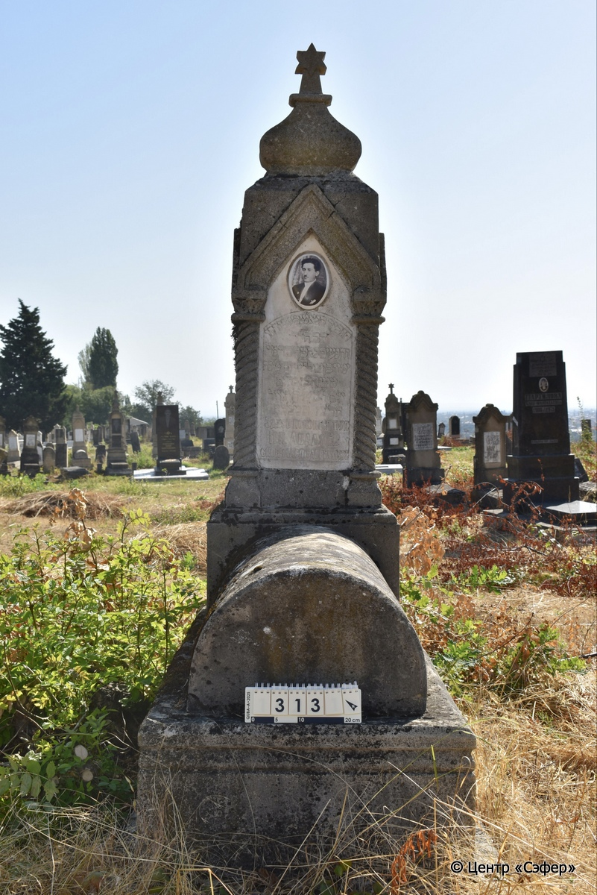
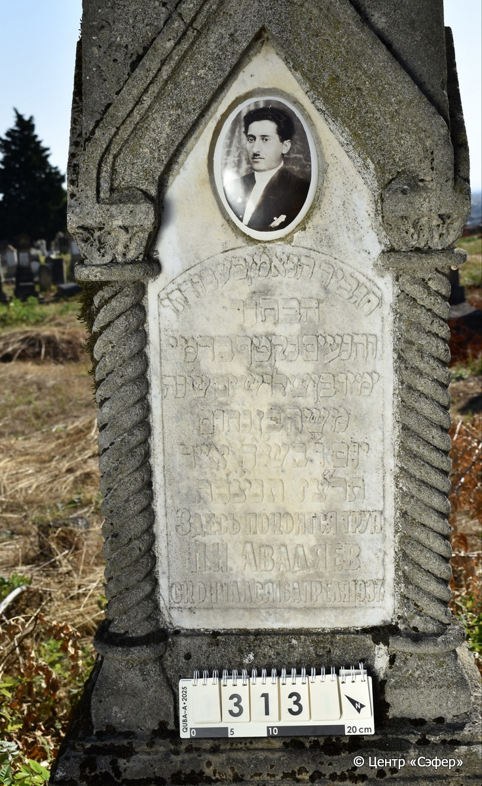

::: {style="font-size: 1em; margin-bottom: 1.2em"}
[Куба (центральное)](../cemeteries/QBA.html) > QBA0313
:::

```{r}
suppressPackageStartupMessages(library(tidyverse))
```


:::: {.columns}

::: {.column width="20%"}

```{r}
#| lightbox:
#|   group: photos




```
:::

::: {.column width="5%"}
:::

::: {.column width="74%"}

::: {.name-style}
АВАДЯЕВ Моше, сын Нахума
:::

::: {style="font-size: 1.2em;"}
משה בן נחום
:::

:::: {.columns}
::: {.column width="5%"}
{width=1.3em}
:::

::: {.column style="width: 40%; padding-left: 0.2em;"}
  /  
:::

::: {.column width="5%"}
{width=1.3em}
:::

::: {.column style="width: 50%; padding-left: 0.2em;"}
16.04.1937 / 6.Iy.5697
:::

::::


::: {.panel-tabset}

#### Эпитафия

```{r}
tibble(`Оригинал` = "הגביר הנאמן בעבודתו
הבחור
והנעים נקטף בדמי
ימיו בן שלושים שנה
משה בן נחום
יום ו׳ בש׳ ה׳ אייר
תרצ״ז תנצ׳בה
Здесь покоится труп
М. Н. Авадяев
скончался 16 апреля 1937 г.",
       `Перевод` = "Мужчина, преданный своей работе,
милый
юноша, сорванный в расцвете
дней в возрасте тридцати лет,
Моше, сын Нахума.
<Скочался> в пятницу, 6 ияра
5697 года. Да будет душа его завязана в узле жизни.
Здесь покоится труп
М. Н. Авадяева.
Скончался 16 апреля 1937 г") |>
  mutate(`Оригинал` = str_split(`Оригинал`, "
"),
         `Перевод` = str_split(`Перевод`, "
")) |>
  unnest_longer(c(`Оригинал`, `Перевод`)) |> 
  mutate(id = 1:n()) |> 
  relocate(id, .before = Перевод) |> 
  rename(` ` = id) |> 
  knitr::kable(align = c("r", "c", "l"))
```

|||
|-|---|
|**Примечания**| |
|**Язык**      |иврит, русский    |
|**Метки**     |     |
: {tbl-colwidths="[25,75]"}

#### Памятник

|||
|-|---|
|**Тип памятника**   |L-образный                                                                         |
|**Материал**        |известняк, мрамор (следы эрозии; следы цементного раствора; трещины; мраморная табличка с текстом; керамический медальон с фотопортретом мужчины)                                                     |
|**Размеры**         |193×60×45  --- стела; 33×50×109  --- плита; 50×90×189  --- основание                                                                        |
|**Тип декора**      |архитектурно-орнаментальный                                                                        |
|**Элементы декора** |фигурное навершие со звездой Давида; четыре витые полуколонны по граням с фигурными капителями; фотопортрет в керамическом медальоне                                                                          |
|**Координаты**      |[41.37069544, 48.50722321](https://www.google.com/maps/place/41.37069544, 48.50722321)                    |
: {tbl-colwidths="[25,75]"}

#### Источник

|||
|-|---|
|**Место хранения**        |Архив полевых исследований Центра «Сэфер»     |
|**Контакты**              |students@sefer.ru    |
|**Ссылка**                |https://sfira.org        |
|**Исходный ID**           |  |
|**Условия использования** |[CC BY-NC 4.0](https://creativecommons.org/licenses/by-nc/4.0/deed.ru)     |
: {tbl-colwidths="[25,75]"}

:::

:::

::::

