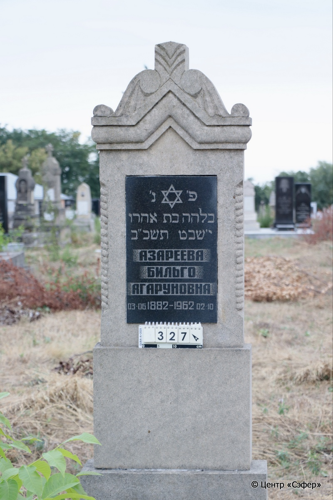
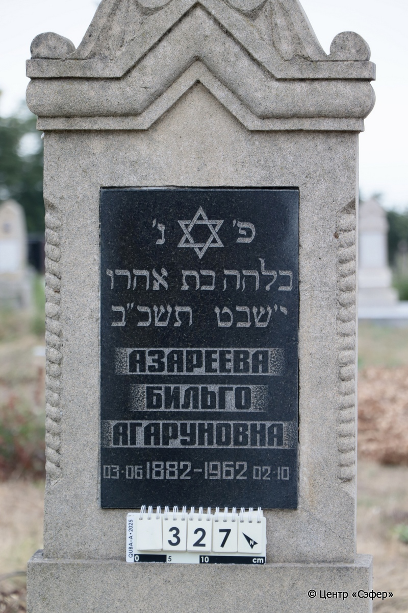
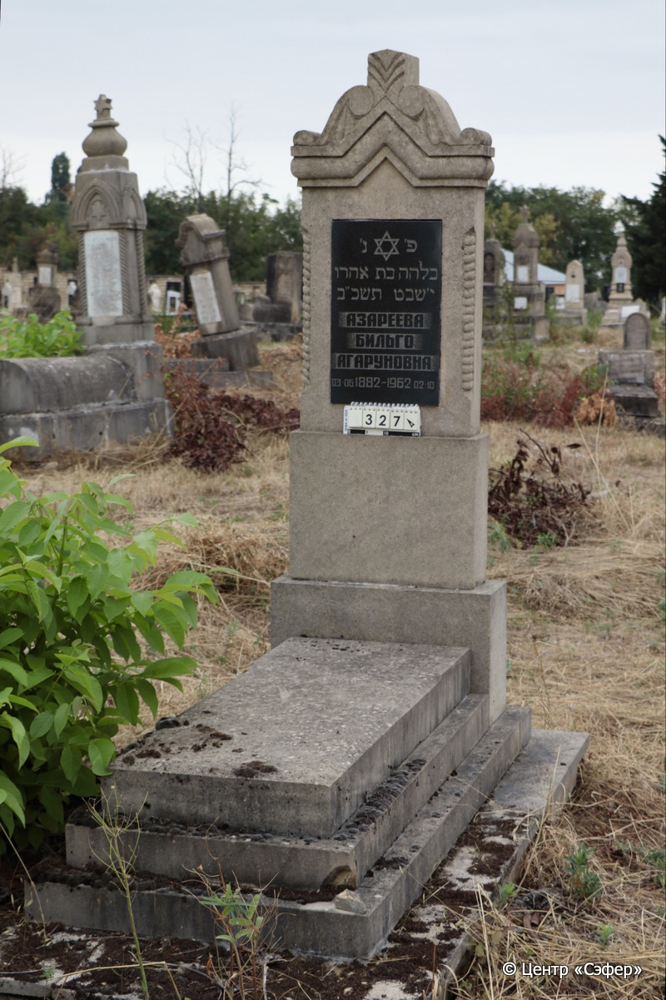

::: {style="font-size: 1em; margin-bottom: 1.2em"}
[Куба (центральное)](../cemeteries/QBA.html) > QBA0327
:::

```{r}
suppressPackageStartupMessages(library(tidyverse))
```


:::: {.columns}

::: {.column width="20%"}

```{r}
#| lightbox:
#|   group: photos





```
:::

::: {.column width="5%"}
:::

::: {.column width="74%"}

::: {.name-style}
АЗАРЕЕВА Бильго, дочь Аарона (Агарунова)
:::

::: {style="font-size: 1.2em;"}
בלהה בת אהרן
:::

:::: {.columns}
::: {.column width="5%"}
{width=1.3em}
:::

::: {.column style="width: 40%; padding-left: 0.2em;"}
03.06.1882 /  
:::

::: {.column width="5%"}
{width=1.3em}
:::

::: {.column style="width: 50%; padding-left: 0.2em;"}
02.10.1962 / 10.Sh.5722
:::

::::


::: {.panel-tabset}

#### Эпитафия

```{r}
tibble(`Оригинал` = "פ׳נ׳
בלהה בת אהרן
 י׳ שבט תשכ״ב
Азареева
Бильго
Агарунова
03.06.1882 - 1962 02.10",
       `Перевод` = "Здесь покоится
Бильго, дочь Аарона
<Скончался> 10 швата, 5722 год.
Азареева
Бильго
Агарунова
03.06.1882 – 02.10.1962") |>
  mutate(`Оригинал` = str_split(`Оригинал`, "
"),
         `Перевод` = str_split(`Перевод`, "
")) |>
  unnest_longer(c(`Оригинал`, `Перевод`)) |> 
  mutate(id = 1:n()) |> 
  relocate(id, .before = Перевод) |> 
  rename(` ` = id) |> 
  knitr::kable(align = c("r", "c", "l"))
```

|||
|-|---|
|**Примечания**| |
|**Язык**      |иврит, русский    |
|**Метки**     |     |
: {tbl-colwidths="[25,75]"}

#### Памятник

|||
|-|---|
|**Тип памятника**   |L-образный                                                                         |
|**Материал**        |известняк, гранит (следы эрозии; трещины; гранитная плита для текста)                                                     |
|**Размеры**         |178×53×14  --- стела; 13×50×120  --- плита; 28×103×200  --- основание                                                                        |
|**Тип декора**      |архитектурно-орнаментальный, растительный, традиционная символика                                                                        |
|**Элементы декора** |завершение с волютами и растительными орнаментами; витые полуколонны по лицевым граням; звезда Давида в верхней части гранитной плиты для текста                                                                          |
|**Координаты**      |[41.37055693, 48.50736729](https://www.google.com/maps/place/41.37055693, 48.50736729)                    |
: {tbl-colwidths="[25,75]"}

#### Источник

|||
|-|---|
|**Место хранения**        |Архив полевых исследований Центра «Сэфер»     |
|**Контакты**              |students@sefer.ru    |
|**Ссылка**                |https://sfira.org        |
|**Исходный ID**           |  |
|**Условия использования** |[CC BY-NC 4.0](https://creativecommons.org/licenses/by-nc/4.0/deed.ru)     |
: {tbl-colwidths="[25,75]"}

:::

:::

::::

