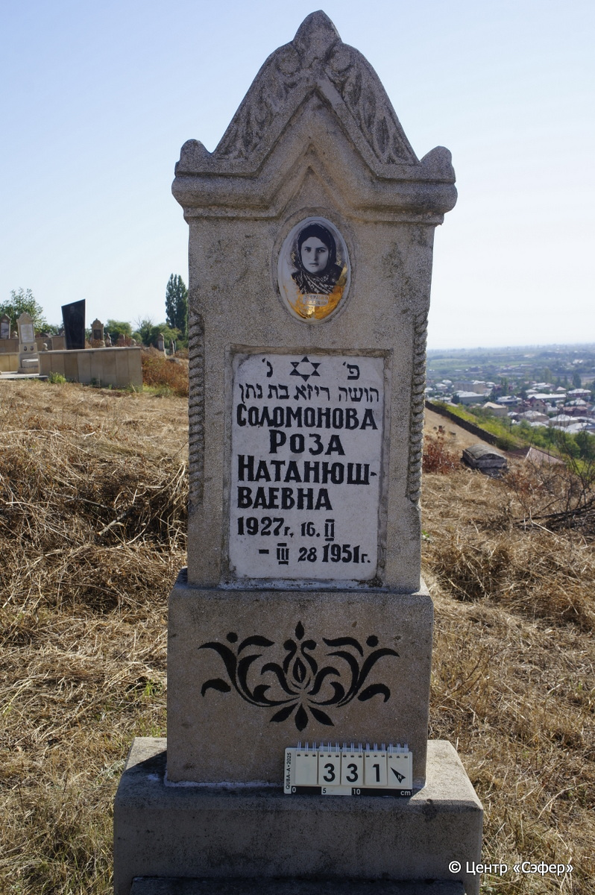
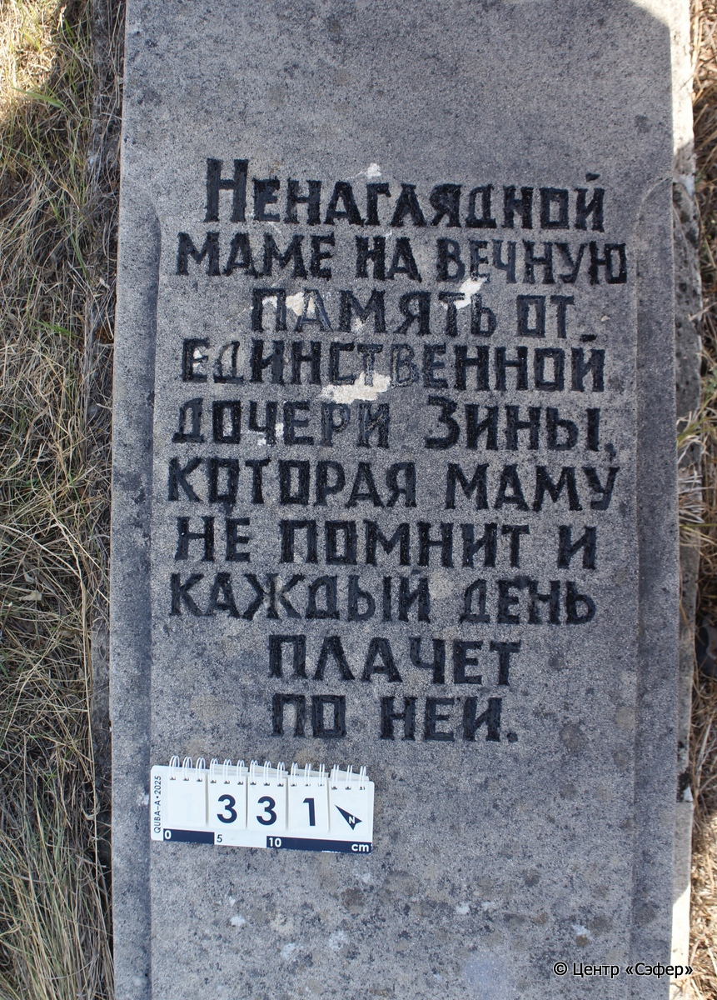
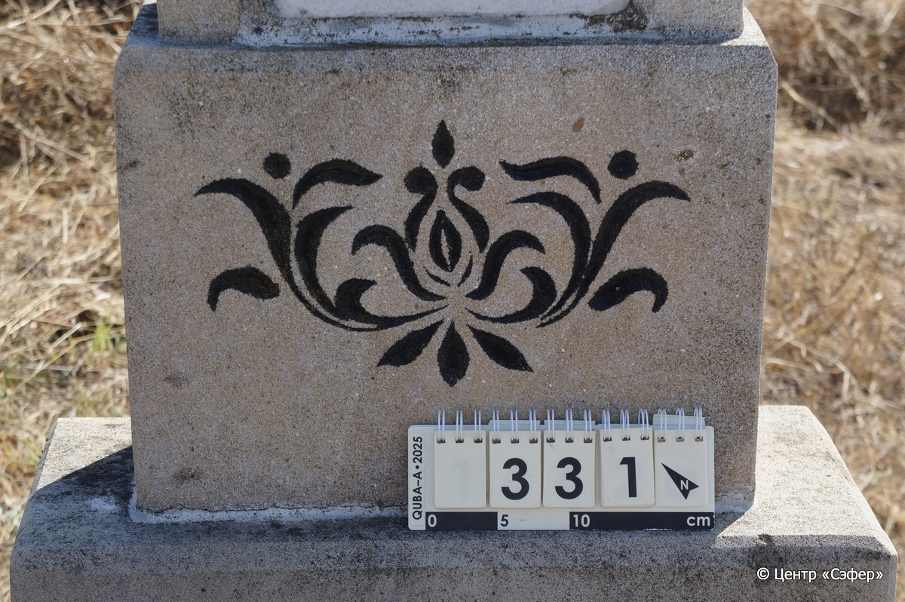
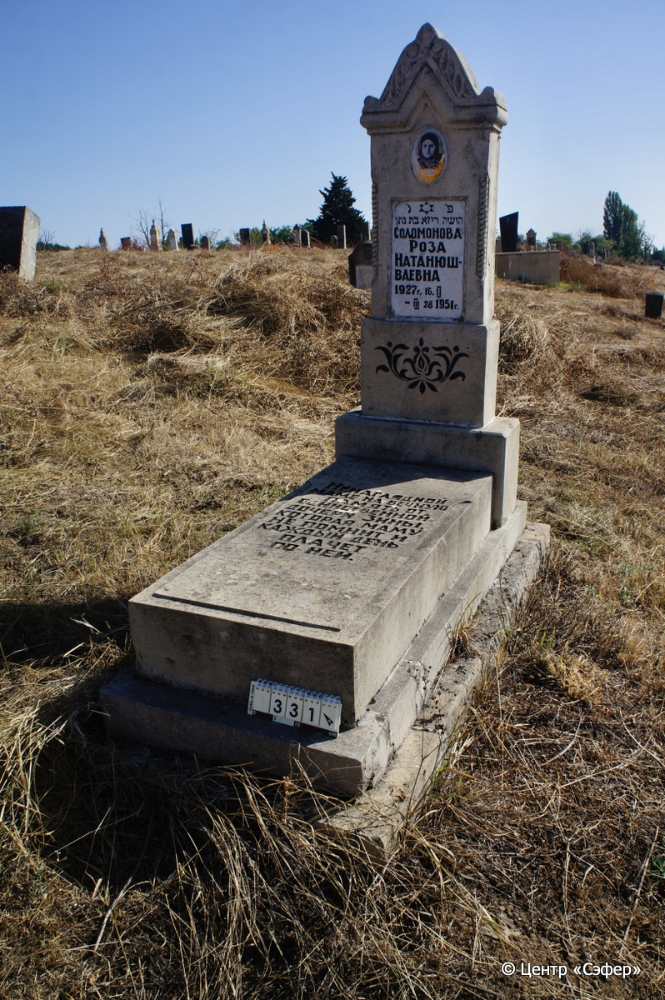

::: {style="font-size: 1em; margin-bottom: 1.2em"}
[Куба (центральное)](../cemeteries/QBA.html) > QBA0331
:::

```{r}
suppressPackageStartupMessages(library(tidyverse))
```


:::: {.columns}

::: {.column width="20%"}

```{r}
#| lightbox:
#|   group: photos






```
:::

::: {.column width="5%"}
:::

::: {.column width="74%"}

::: {.name-style}
СОЛОМОНОВА Роза, дочь Натана (Натан-Юшваевна)
:::

::: {style="font-size: 1.2em;"}
רוזא בת נתן
:::

:::: {.columns}
::: {.column width="5%"}
{width=1.3em}
:::

::: {.column style="width: 40%; padding-left: 0.2em;"}
16.02.1927 /  
:::

::: {.column width="5%"}
{width=1.3em}
:::

::: {.column style="width: 50%; padding-left: 0.2em;"}
28.03.1951 /  
:::

::::


::: {.panel-tabset}

#### Эпитафия

```{r}
tibble(`Оригинал` = "сверху
פ׳ נ׳
הושה ריזא בת נתן
СОЛОМОНОВА
РОЗА
НАТАНЮШ-
ВАЕВНА
1927 Г. 16. II
- III 28 1951 Г.

снизу
Ненаглядной
маме на вечную
память от
единственной
дочери Зины,
 которая маму
не помнит и 
каждый день
 плачет
 по ней.",
       `Перевод` = "
Здесь покоится
[женщина]* Роза, дочь Натана.
Соломонова
Роза
Натан-Юш-
ваевна
16.02.1927
– 28.02.1951

 
Ненаглядной
маме на вечную
память от
единственной
дочери Зины,
 которая маму
не помнит и 
каждый день
 плачет
 по ней.") |>
  mutate(`Оригинал` = str_split(`Оригинал`, "
"),
         `Перевод` = str_split(`Перевод`, "
")) |>
  unnest_longer(c(`Оригинал`, `Перевод`)) |> 
  mutate(id = 1:n()) |> 
  relocate(id, .before = Перевод) |> 
  rename(` ` = id) |> 
  knitr::kable(align = c("r", "c", "l"))
```

|||
|-|---|
|**Примечания**|Предположительно, ошибка резчика. Вероятно, имелось в виду слово אשה - женщина.|
|**Язык**      |иврит, русский    |
|**Метки**     |     |
: {tbl-colwidths="[25,75]"}

#### Памятник

|||
|-|---|
|**Тип памятника**   |L-образный                                                                         |
|**Материал**        |известняк (следы эрозии; мраморная табличка с текстом; керамический медальон с фотопортретом женщины)                                                     |
|**Размеры**         |157×60×25  --- стела; 20×54×117  --- плита; 20×82×176  --- основание                                                                        |
|**Тип декора**      |архитектурно-орнаментальный, растительный, традиционная символика                                                                        |
|**Элементы декора** |навершие с волютами с растительными мотивами; две витые полуколонны по граням с лицевой стороны; фотопортрет в медальоне с золотой окантовкой; звезда Давида в верхней части мраморной  таблички с  текстом; внизу стелы растительный орнамент, покрашенный черным (поздний?); надпись на плите покрашена черным цветом                                                                          |
|**Координаты**      |[41.37038371, 48.50753667](https://www.google.com/maps/place/41.37038371, 48.50753667)                    |
: {tbl-colwidths="[25,75]"}

#### Источник

|||
|-|---|
|**Место хранения**        |Архив полевых исследований Центра «Сэфер»     |
|**Контакты**              |students@sefer.ru    |
|**Ссылка**                |https://sfira.org        |
|**Исходный ID**           |  |
|**Условия использования** |[CC BY-NC 4.0](https://creativecommons.org/licenses/by-nc/4.0/deed.ru)     |
: {tbl-colwidths="[25,75]"}

:::

:::

::::

