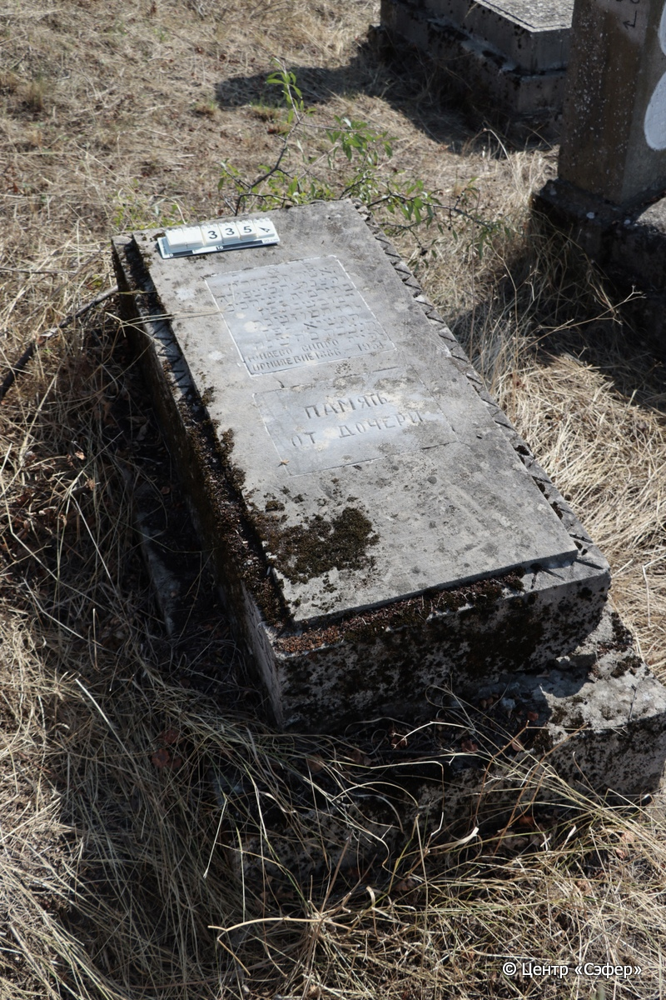
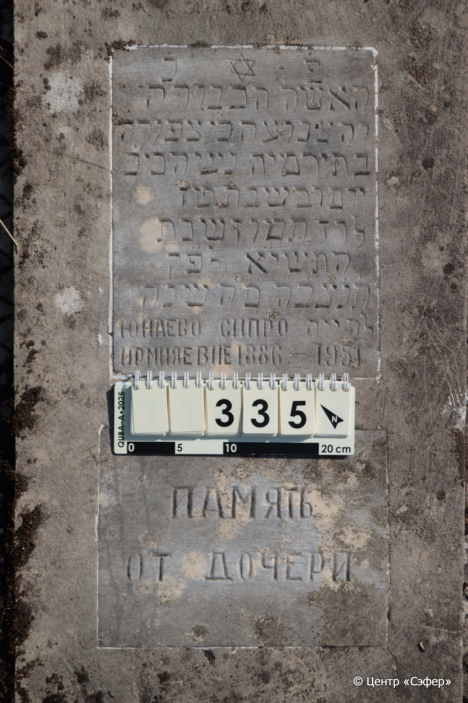

::: {style="font-size: 1em; margin-bottom: 1.2em"}
[Куба (центральное)](../cemeteries/QBA.html) > QBA0335
:::

```{r}
suppressPackageStartupMessages(library(tidyverse))
```


:::: {.columns}

::: {.column width="20%"}

```{r}
#| lightbox:
#|   group: photos




```
:::

::: {.column width="5%"}
:::

::: {.column width="74%"}

::: {.name-style}
ЮНАЕВА Ципора, дочь Йеремии (Сипро Ирмияевна)
:::

::: {style="font-size: 1.2em;"}
צפורה בת ירמיה
:::

:::: {.columns}
::: {.column width="5%"}
{width=1.3em}
:::

::: {.column style="width: 40%; padding-left: 0.2em;"}
-.-.1886 /  
:::

::: {.column width="5%"}
{width=1.3em}
:::

::: {.column style="width: 50%; padding-left: 0.2em;"}
-.-.1951 / 06.Ta.5711
:::

::::


::: {.panel-tabset}

#### Эпитафия

```{r}
tibble(`Оригинал` = "פ֗נ֗
האשה הכבודה
והצנועה מ֗ צפּורה
בת ירמיה נ״ע והמ״כ
יום ו֗ בשבת ט״ז
לרד׳ תמוז שנת
התשי״א לפ״ק
ת֗נ֗צ֗ב֗ה֗ ס״ה שנה
לחייה ЮНАЕВО СИПРО
ИРМИЯЕВНЕ 1886 - 1951
ПАМЯТЬ
ОТ ДОЧЕРИ",
       `Перевод` = "Здесь покоится
женщина уважаемая
и скромная, господа Ципора
дочь Йермии, скончалась и да упокоится во славе,
в пятницу, 16-го <числа>
месяца таммуз, год
5711 по малому исчислению.
Да будет душа её завязана в узле жизни. <На> 65 году 
своей жизни. ЮНАЕВО СИПРО
ИРМИЯЕВНЕ 1886 - 1951
ПАМЯТЬ
ОТ ДОЧЕРИ") |>
  mutate(`Оригинал` = str_split(`Оригинал`, "
"),
         `Перевод` = str_split(`Перевод`, "
")) |>
  unnest_longer(c(`Оригинал`, `Перевод`)) |> 
  mutate(id = 1:n()) |> 
  relocate(id, .before = Перевод) |> 
  rename(` ` = id) |> 
  knitr::kable(align = c("r", "c", "l"))
```

|||
|-|---|
|**Примечания**| |
|**Язык**      |иврит, русский    |
|**Метки**     |     |
: {tbl-colwidths="[25,75]"}

#### Памятник

|||
|-|---|
|**Тип памятника**   |плита/саркофаг                                                                         |
|**Материал**        |известняк, мрамор (следы эрозии; трещины; плиты у основания расходятся; две мраморных таблички с текстом)                                                     |
|**Размеры**         |27×57×123  --- плита; 41×75×155  --- основание                                                                        |
|**Тип декора**      |архитектурно-орнаментальный, традиционная символика                                                                        |
|**Элементы декора** |треугольный орнамент по краям плиты; звезда Давида на табличке                                                                          |
|**Координаты**      |[41.37029034, 48.50758592](https://www.google.com/maps/place/41.37029034, 48.50758592)                    |
: {tbl-colwidths="[25,75]"}

#### Источник

|||
|-|---|
|**Место хранения**        |Архив полевых исследований Центра «Сэфер»     |
|**Контакты**              |students@sefer.ru    |
|**Ссылка**                |https://sfira.org        |
|**Исходный ID**           |  |
|**Условия использования** |[CC BY-NC 4.0](https://creativecommons.org/licenses/by-nc/4.0/deed.ru)     |
: {tbl-colwidths="[25,75]"}

:::

:::

::::

