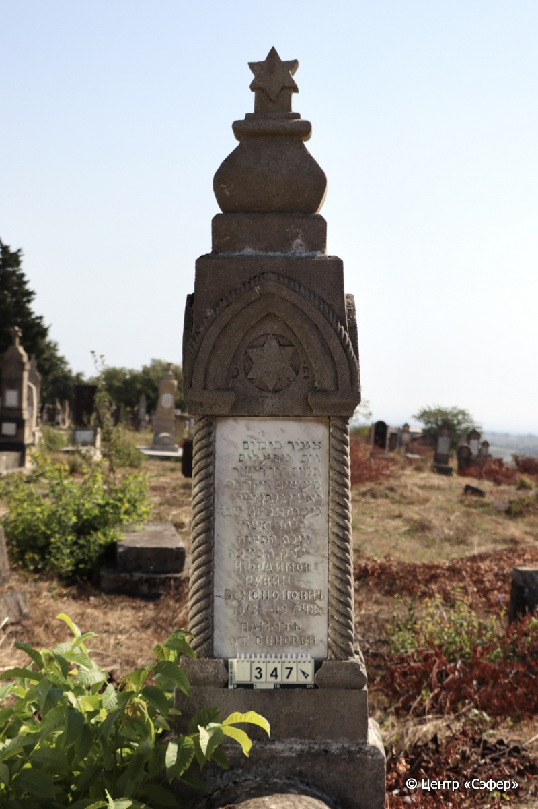
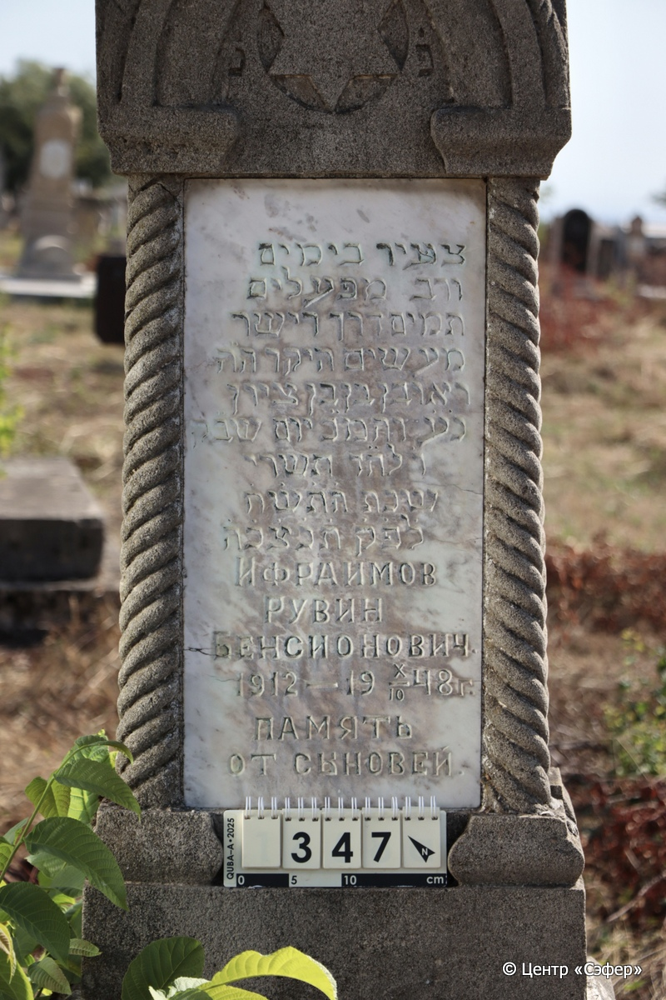
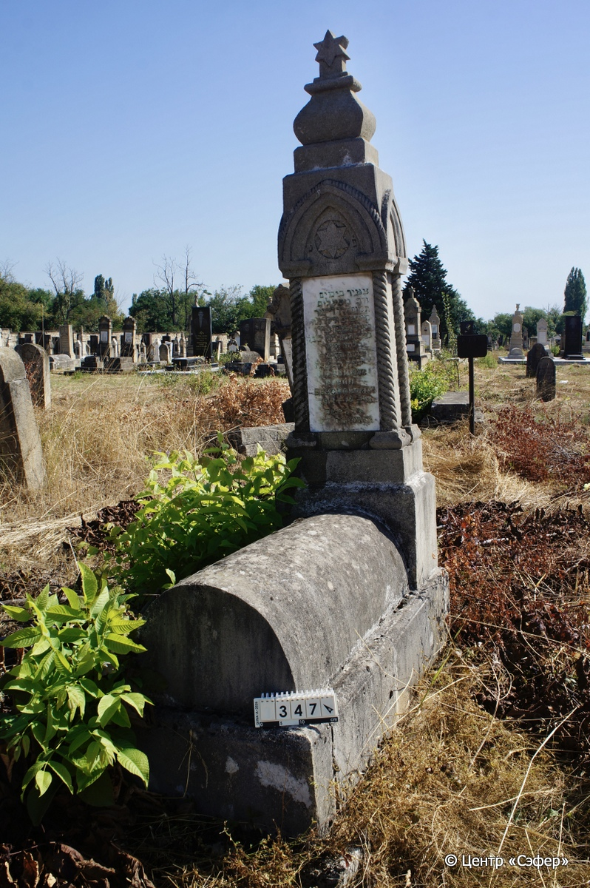

::: {style="font-size: 1em; margin-bottom: 1.2em"}
[Куба (центральное)](../cemeteries/QBA.html) > QBA0347
:::

```{r}
suppressPackageStartupMessages(library(tidyverse))
```


:::: {.columns}

::: {.column width="20%"}

```{r}
#| lightbox:
#|   group: photos





```
:::

::: {.column width="5%"}
:::

::: {.column width="74%"}

::: {.name-style}
ИФРАИМОВ Реувен, сын Бенциона (Рувин Бенсионович)
:::

::: {style="font-size: 1.2em;"}
ראובן בן בן ציון
:::

:::: {.columns}
::: {.column width="5%"}
{width=1.3em}
:::

::: {.column style="width: 40%; padding-left: 0.2em;"}
09.01.1912 /  
:::

::: {.column width="5%"}
{width=1.3em}
:::

::: {.column style="width: 50%; padding-left: 0.2em;"}
10.10.1948 / 6.Ti.5708
:::

::::


::: {.panel-tabset}

#### Эпитафия

```{r}
tibble(`Оригинал` = "פ׳נ׳
צעיר בימים
ורב מפעלים
תמים דרך וישר
מעשים היקר ה״ה
ראובן בן בן ציון
נ״ע והמ״כ יום שב״ק
ו֗ לח״ד תשרי
שנת ה֗ת֗ש֗ח֗
ל֗פ֗ק֗ ת֗נ֗צ֗ב֗ה֗
Ифраимов 
Рувин
Бенсионович
1912 - 19 X/10 48 г.
память
от сыновей",
       `Перевод` = "Здесь погребен
юный годами
но великий деяниями,
непорочный и прамодушный
в поступках, дорогой <человек>,
Реувен, сын Бен-Циона.
Да упокоится в раю и да упокоится во славе, день святого Шаббата
6-го тишрея
года 5708
по малому летосчислению. Да будет душа его завязана в узле жизни.
Ифраимов 
Рувин
Бенсионович
1912 - 19 X/10 48 г.
память
от сыновей") |>
  mutate(`Оригинал` = str_split(`Оригинал`, "
"),
         `Перевод` = str_split(`Перевод`, "
")) |>
  unnest_longer(c(`Оригинал`, `Перевод`)) |> 
  mutate(id = 1:n()) |> 
  relocate(id, .before = Перевод) |> 
  rename(` ` = id) |> 
  knitr::kable(align = c("r", "c", "l"))
```

|||
|-|---|
|**Примечания**| |
|**Язык**      |иврит, русский    |
|**Метки**     |     |
: {tbl-colwidths="[25,75]"}

#### Памятник

|||
|-|---|
|**Тип памятника**   |L-образный                                                                         |
|**Материал**        |известняк, мрамор (мраморная вставка для текста, следы эрозии, трещины)                                                     |
|**Размеры**         |216×57×35  --- стела; 35×50×110  --- плита; 43×80×179  --- основание                                                                        |
|**Тип декора**      |архитектурно-орнаментальный, растительный, традиционная символика                                                                        |
|**Элементы декора** |фигурное навершие со звездой Давида наверху, орнаментальные треугольные порталы с четырёх сторон, 4 витые полуколонны, звезда двила в круглой рамке в портале на лицевой части                                                                          |
|**Координаты**      |[41.37061847, 48.50741321](https://www.google.com/maps/place/41.37061847, 48.50741321)                    |
: {tbl-colwidths="[25,75]"}

#### Источник

|||
|-|---|
|**Место хранения**        |Архив полевых исследований Центра «Сэфер»     |
|**Контакты**              |students@sefer.ru    |
|**Ссылка**                |https://sfira.org        |
|**Исходный ID**           |  |
|**Условия использования** |[CC BY-NC 4.0](https://creativecommons.org/licenses/by-nc/4.0/deed.ru)     |
: {tbl-colwidths="[25,75]"}

:::

:::

::::

