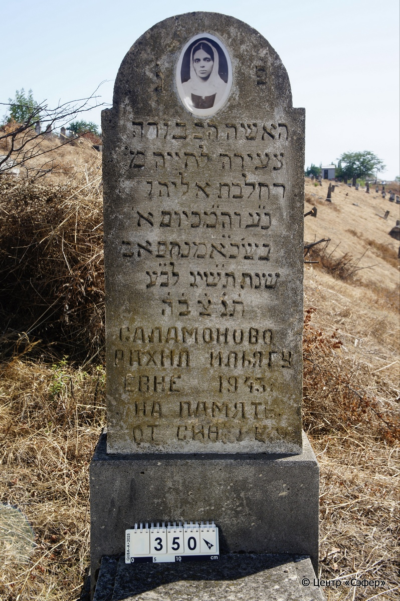
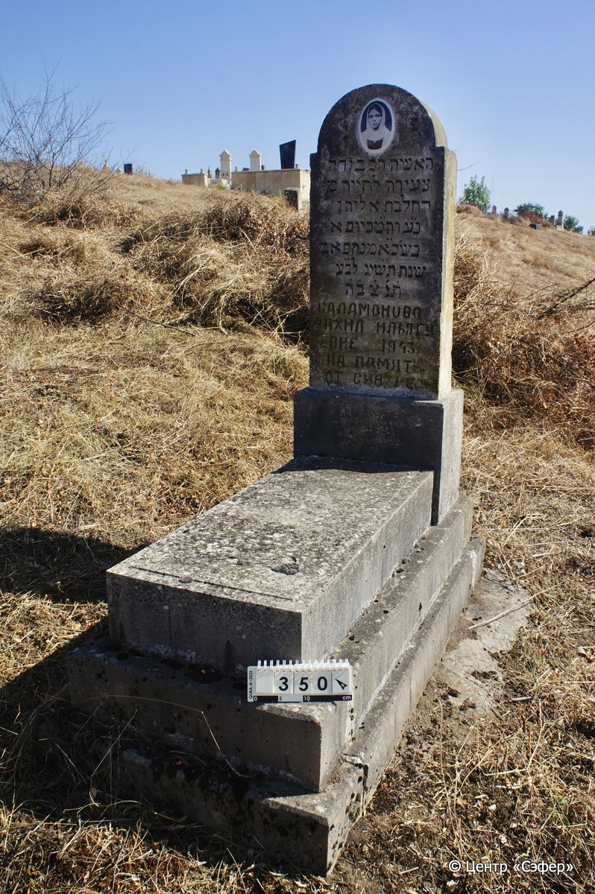

::: {style="font-size: 1em; margin-bottom: 1.2em"}
[Куба (центральное)](../cemeteries/QBA.html) > QBA0350
:::

```{r}
suppressPackageStartupMessages(library(tidyverse))
```


:::: {.columns}

::: {.column width="20%"}

```{r}
#| lightbox:
#|   group: photos




```
:::

::: {.column width="5%"}
:::

::: {.column width="74%"}

::: {.name-style}
САЛАМОНОВО Рахель, дочь Элиягу (Рахил Элиягуевна)
:::

::: {style="font-size: 1.2em;"}
רחל בת אליהו
:::

:::: {.columns}
::: {.column width="5%"}
{width=1.3em}
:::

::: {.column style="width: 40%; padding-left: 0.2em;"}
  /  
:::

::: {.column width="5%"}
{width=1.3em}
:::

::: {.column style="width: 50%; padding-left: 0.2em;"}
-.-.1943 / 21.Av.5613
:::

::::


::: {.panel-tabset}

#### Эпитафия

```{r}
tibble(`Оригинал` = "פ֗נ֗
האשה הכבודה
צעירה לחייה מ׳
רחל בת אליהו
נ״ע וה״מכ יום א׳
בש׳ כ״א מנחם אב
שנת ת״שיג לב״ע
ת֗נ֗צ֗ב֗ה֗
САЛАМОНОВО
РАХИЛ ИЛЬЯГУ
ЕВНЕ 1943.
НА ПАМЯТЬ
ОТ СИН[АВ]Е[Й]",
       `Перевод` = "Здесь покоится
уважаемая женщина,
<скончавшаяся> в молодом возрасте, госпожа
Рахиль, дочь Элиягу.
Да упокоится в раю и да упокоится во славе. В воскресенье,
21-го менахем-ава
года 5613 от сотворения мира.
Да будет душа её завязана в узле жизни.
САЛАМОНОВО
РАХИЛ ИЛЬЯГУ
ЕВНЕ 1943.
НА ПАМЯТЬ
ОТ СЫНОВЕЙ") |>
  mutate(`Оригинал` = str_split(`Оригинал`, "
"),
         `Перевод` = str_split(`Перевод`, "
")) |>
  unnest_longer(c(`Оригинал`, `Перевод`)) |> 
  mutate(id = 1:n()) |> 
  relocate(id, .before = Перевод) |> 
  rename(` ` = id) |> 
  knitr::kable(align = c("r", "c", "l"))
```

|||
|-|---|
|**Примечания**| |
|**Язык**      |иврит, русский    |
|**Метки**     |     |
: {tbl-colwidths="[25,75]"}

#### Памятник

|||
|-|---|
|**Тип памятника**   |L-образный                                                                         |
|**Материал**        |известняк (следы эрозии, сколы, керамический медальон с фотопортретом)                                                     |
|**Размеры**         |140×53×31  --- стела; 19×48×109  --- плита; 32×75×164  --- основание                                                                        |
|**Тип декора**      |архитектурно-орнаментальный                                                                        |
|**Элементы декора** |полукруглое завершение с плечиками и керамическим медальоном с фотопортретом                                                                          |
|**Координаты**      |[41.37029192, 48.50763344](https://www.google.com/maps/place/41.37029192, 48.50763344)                    |
: {tbl-colwidths="[25,75]"}

#### Источник

|||
|-|---|
|**Место хранения**        |Архив полевых исследований Центра «Сэфер»     |
|**Контакты**              |students@sefer.ru    |
|**Ссылка**                |https://sfira.org        |
|**Исходный ID**           |  |
|**Условия использования** |[CC BY-NC 4.0](https://creativecommons.org/licenses/by-nc/4.0/deed.ru)     |
: {tbl-colwidths="[25,75]"}

:::

:::

::::

