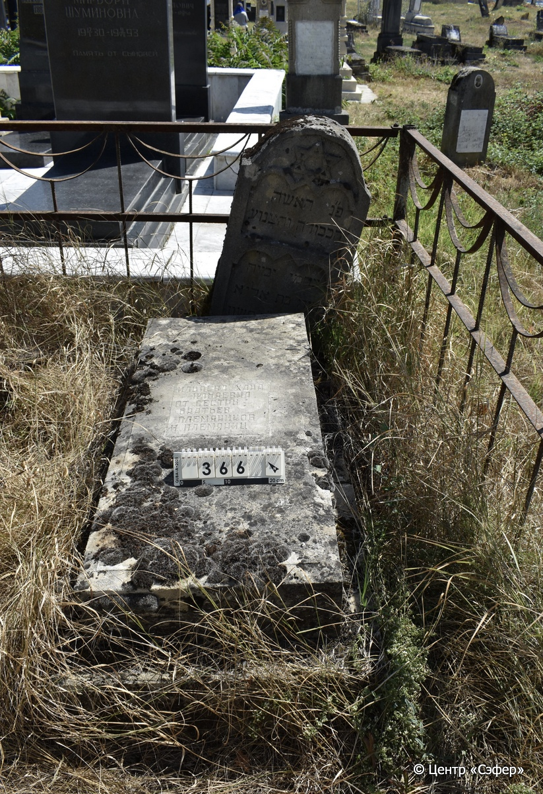
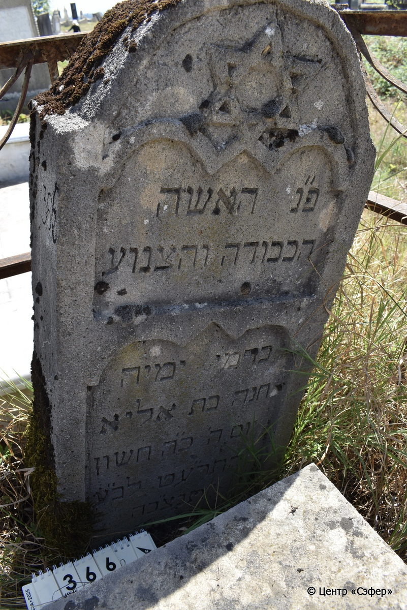
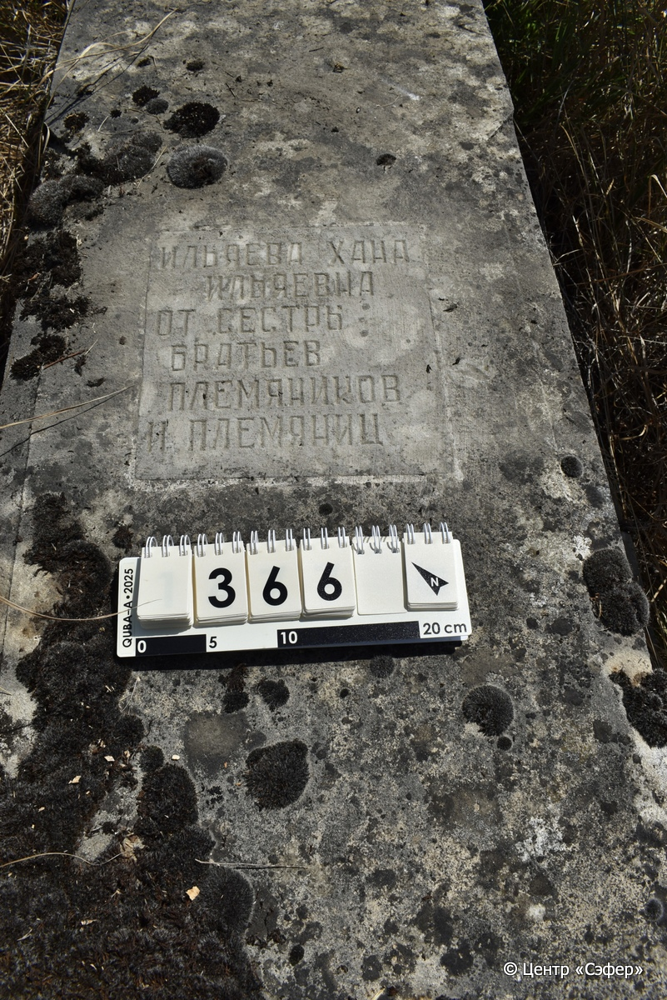

::: {style="font-size: 1em; margin-bottom: 1.2em"}
[Куба (центральное)](../cemeteries/QBA.html) > QBA0366
:::

```{r}
suppressPackageStartupMessages(library(tidyverse))
```


:::: {.columns}

::: {.column width="20%"}

```{r}
#| lightbox:
#|   group: photos





```
:::

::: {.column width="5%"}
:::

::: {.column width="74%"}

::: {.name-style}
ИЛЬЯЕВА Хана, дочь Илии (Ильяевна)
:::

::: {style="font-size: 1.2em;"}
חנה בת אליא
:::

:::: {.columns}
::: {.column width="5%"}
{width=1.3em}
:::

::: {.column style="width: 40%; padding-left: 0.2em;"}
  /  
:::

::: {.column width="5%"}
{width=1.3em}
:::

::: {.column style="width: 50%; padding-left: 0.2em;"}
31.10.1918* / 25.Ch.5679
:::

::::


::: {.panel-tabset}

#### Эпитафия

```{r}
tibble(`Оригинал` = "сверху
פ״נ האשה
הכבודה והצנוע
בדמי ימיה
חנה בת אליא
יום ה׳ כ״ה חשון
התר״עט לב״ע
תנצב״ה

снизу
ИЛЬЯЕВА ХАНА
ИЛЬЯЕВНА
ОТ СЕСТРЫ
БРАТЬЕВ
ПЛЕМЯНИКОВ
И ПЛЕМЯНИЦ",
       `Перевод` = "
Здесь погребена женщина
уважаемая и скромная,
ушедшая в расцвете лет,
Хана, дочь Илии.
<Скончалась> в четверг, 25 хешвана
5679 года от сотворения мира.
Да будет душа её завязана в узле жизни.


ИЛЬЯЕВА ХАНА
ИЛЬЯЕВНА
ОТ СЕСТРЫ
БРАТЬЕВ
ПЛЕМЯНИКОВ
И ПЛЕМЯНИЦ") |>
  mutate(`Оригинал` = str_split(`Оригинал`, "
"),
         `Перевод` = str_split(`Перевод`, "
")) |>
  unnest_longer(c(`Оригинал`, `Перевод`)) |> 
  mutate(id = 1:n()) |> 
  relocate(id, .before = Перевод) |> 
  rename(` ` = id) |> 
  knitr::kable(align = c("r", "c", "l"))
```

|||
|-|---|
|**Примечания**| |
|**Язык**      |иврит, русский    |
|**Метки**     |     |
: {tbl-colwidths="[25,75]"}

#### Памятник

|||
|-|---|
|**Тип памятника**   |L-образный                                                                         |
|**Материал**        |известняк, мрамор (следы эрозии, сколы, стела стоит отдельно от плиты с основанием на расстоянии 20 см, на плите мраморная вставка для текста, основание расходится по швам)                                                     |
|**Размеры**         |100×45×21  --- стела; 18×52×126  --- плита; 20×70×145  --- основание                                                                        |
|**Тип декора**      |архитектурно-орнаментальный, традиционная символика                                                                        |
|**Элементы декора** |стела имеет полукруглое завершение со звездой Давида в нише, две фигурные ниши для текста                                                                          |
|**Координаты**      |[41.37101894, 48.5074048](https://www.google.com/maps/place/41.37101894, 48.5074048)                    |
: {tbl-colwidths="[25,75]"}

#### Источник

|||
|-|---|
|**Место хранения**        |Архив полевых исследований Центра «Сэфер»     |
|**Контакты**              |students@sefer.ru    |
|**Ссылка**                |https://sfira.org        |
|**Исходный ID**           |  |
|**Условия использования** |[CC BY-NC 4.0](https://creativecommons.org/licenses/by-nc/4.0/deed.ru)     |
: {tbl-colwidths="[25,75]"}

:::

:::

::::

