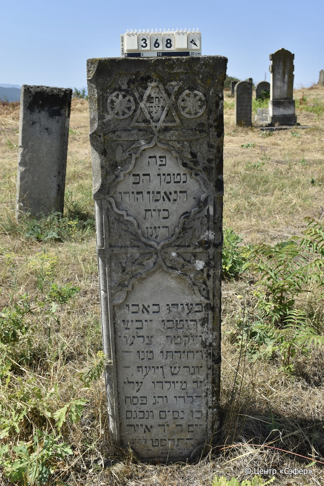
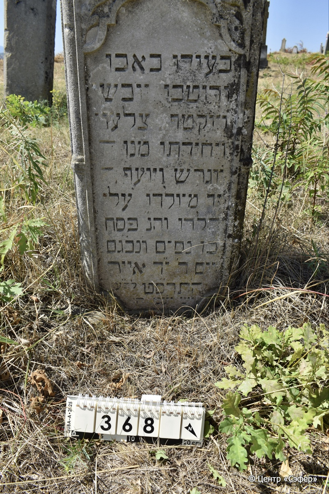

::: {style="font-size: 1em; margin-bottom: 1.2em"}
[Куба (центральное)](../cemeteries/QBA.html) > QBA0368
:::

```{r}
suppressPackageStartupMessages(library(tidyverse))
```


:::: {.columns}

::: {.column width="20%"}

```{r}
#| lightbox:
#|   group: photos




```
:::

::: {.column width="5%"}
:::

::: {.column width="74%"}

::: {.name-style}
Песах, сын Нисима
:::

::: {style="font-size: 1.2em;"}
פסח בן נסים
:::

:::: {.columns}
::: {.column width="5%"}
{width=1.3em}
:::

::: {.column style="width: 40%; padding-left: 0.2em;"}
  /  
:::

::: {.column width="5%"}
{width=1.3em}
:::

::: {.column style="width: 50%; padding-left: 0.2em;"}
24.04.1899* / 14.Iy.5659
:::

::::


::: {.panel-tabset}

#### Эпитафия

```{r}
tibble(`Оригинал` = "יח״ב
יע״מ
פה
נטמן הב׳
הנאמן הודו
כזית
רענן
בּעודו באבו
ורוטבו יובש
ויוקטף צלעו
ויחידתו מנו
יוגרש ויועף
זר מיולדו עלי
הלדו והנ״ פסח
בן נסים ונבג״ם
יום ד׳ י״ד אייר
ה׳תרס״ט לב״ע
י׳ש יע״מ ה״ו",
       `Перевод` = "Пусть торжествуют праведники во славе
и радуются на ложах своих.*
Здесь 
покоится юноша
праведный и верный господин,
живой 
и бодрый (когда жил),
при жизни он был в доме своего отца.
Он страдал, иссох,
и была отнята у него сторона (тело ослабло),
его уникальность была утеряна.
Его изгнали и отлучили,
чуждый для рождения его,
его рождение и Пасха…
Сын Нисима и … (возможно «נפטר בזקנה ובגיל מבוגר» — «скончался в старости»).
Скончался в среду, 14-го ияра,
в 5659 году от сотворения мира.
Он обретает покой! Те, кто идет прямым путем, отдохнут на своём ложе.**") |>
  mutate(`Оригинал` = str_split(`Оригинал`, "
"),
         `Перевод` = str_split(`Перевод`, "
")) |>
  unnest_longer(c(`Оригинал`, `Перевод`)) |> 
  mutate(id = 1:n()) |> 
  relocate(id, .before = Перевод) |> 
  rename(` ` = id) |> 
  knitr::kable(align = c("r", "c", "l"))
```

|||
|-|---|
|**Примечания**|*Цит. Пс 149:2
**Цит. Ис 57:2|
|**Язык**      |иврит    |
|**Метки**     |     |
: {tbl-colwidths="[25,75]"}

#### Памятник

|||
|-|---|
|**Тип памятника**   |стела                                                                         |
|**Материал**        |известняк (следы эрозии, скол)                                                     |
|**Размеры**         |145×42×19                                                                        |
|**Тип декора**      |архитектурно-орнаментальный, растительный, традиционная символика                                                                        |
|**Элементы декора** |две фигурные ниши для текста, обрамленные растительным орнаментом из листьев, наверху звезда Давида двух розеток, грани лицевой стороны фигурно оформлены                                                                          |
|**Координаты**      |[41.37090365, 48.50741542](https://www.google.com/maps/place/41.37090365, 48.50741542)                    |
: {tbl-colwidths="[25,75]"}

#### Источник

|||
|-|---|
|**Место хранения**        |Архив полевых исследований Центра «Сэфер»     |
|**Контакты**              |students@sefer.ru    |
|**Ссылка**                |https://sfira.org        |
|**Исходный ID**           |  |
|**Условия использования** |[CC BY-NC 4.0](https://creativecommons.org/licenses/by-nc/4.0/deed.ru)     |
: {tbl-colwidths="[25,75]"}

:::

:::

::::

