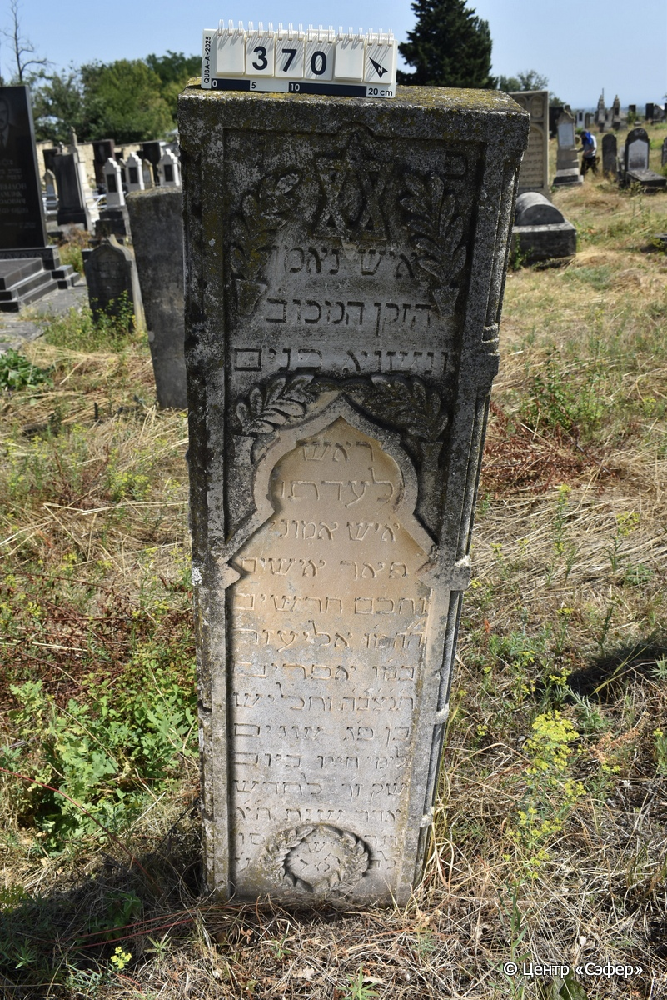
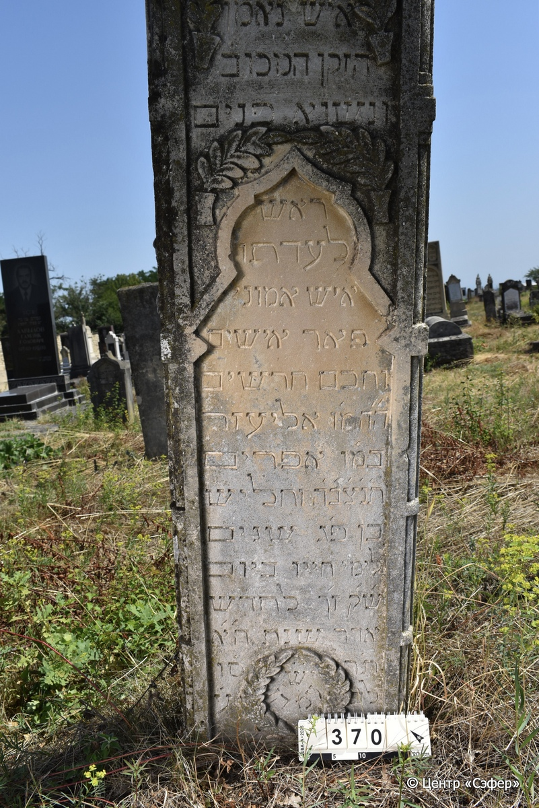
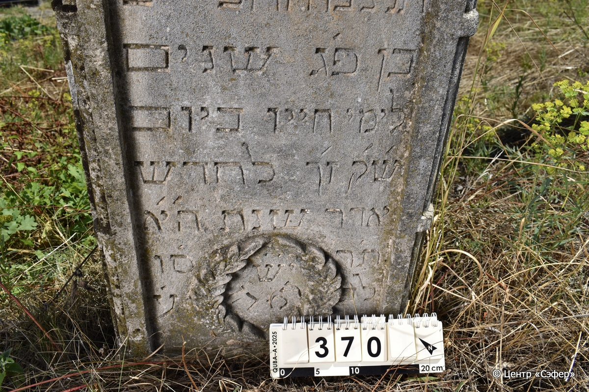

::: {style="font-size: 1em; margin-bottom: 1.2em"}
[Куба (центральное)](../cemeteries/QBA.html) > QBA0370
:::

```{r}
suppressPackageStartupMessages(library(tidyverse))
```


:::: {.columns}

::: {.column width="20%"}

```{r}
#| lightbox:
#|   group: photos





```
:::

::: {.column width="5%"}
:::

::: {.column width="74%"}

::: {.name-style}
Элиэзер, сын Эфраима
:::

::: {style="font-size: 1.2em;"}
אליעזר בן אפרים
:::

:::: {.columns}
::: {.column width="5%"}
{width=1.3em}
:::

::: {.column style="width: 40%; padding-left: 0.2em;"}
  /  
:::

::: {.column width="5%"}
{width=1.3em}
:::

::: {.column style="width: 50%; padding-left: 0.2em;"}
24.03.1906* / 27.Ad.5666
:::

::::


::: {.panel-tabset}

#### Эпитафия

```{r}
tibble(`Оригинал` = "פ׳ נ׳
איש נאמן
הזקן המכוב׳
ונשוא פנים
ראש לעדתו
איש אמוני׳
פּאר אישים
וחכם חרשים
ה״ה מ׳ו אליעזר
במ׳ו אפרים
ת׳נ׳צ׳ב׳ה׳ וחליש
בן פ׳ג שנים
ש״ק ז׳ך לחדש
אדר שנת ה״א
תרס״ו
לב״ע
יש עמ׳ הו׳",
       `Перевод` = "Здесь покоится
человек верный,
уважаемый старец,
почтенный,
глава своей общины,
человек набожный,
гордость среди людей
и мудрый среди учёных.
почтенный и уважаемый наш учитель Элиэзер
, сын Эфраима.
Да будет его душа связана в узле жизни. Скончался
в возрасте 83 лет
В святую Субботу, 27-го 
адара,
в 5666 году
от сотворения мира
Да пребудет с ним Господь.") |>
  mutate(`Оригинал` = str_split(`Оригинал`, "
"),
         `Перевод` = str_split(`Перевод`, "
")) |>
  unnest_longer(c(`Оригинал`, `Перевод`)) |> 
  mutate(id = 1:n()) |> 
  relocate(id, .before = Перевод) |> 
  rename(` ` = id) |> 
  knitr::kable(align = c("r", "c", "l"))
```

|||
|-|---|
|**Примечания**| |
|**Язык**      |иврит    |
|**Метки**     |пожилой(-ая), учёный, знаток Талмуда, глава общины (парнас)    |
: {tbl-colwidths="[25,75]"}

#### Памятник

|||
|-|---|
|**Тип памятника**   |стела                                                                         |
|**Материал**        |известняк (следы эрозии, сколы)                                                     |
|**Размеры**         |155×45×18                                                                        |
|**Тип декора**      |архитектурно-орнаментальный, растительный, традиционная символика                                                                        |
|**Элементы декора** |две фигурные ниши для текста, в верхней также звезда Давида и четыре ветви, окружающие текст, в нижней нише с текстом у основания - венок из листьев, фигурное оформлены края лицевой стороны                                                                          |
|**Координаты**      |[41.37084291, 48.50746562](https://www.google.com/maps/place/41.37084291, 48.50746562)                    |
: {tbl-colwidths="[25,75]"}

#### Источник

|||
|-|---|
|**Место хранения**        |Архив полевых исследований Центра «Сэфер»     |
|**Контакты**              |students@sefer.ru    |
|**Ссылка**                |https://sfira.org        |
|**Исходный ID**           |  |
|**Условия использования** |[CC BY-NC 4.0](https://creativecommons.org/licenses/by-nc/4.0/deed.ru)     |
: {tbl-colwidths="[25,75]"}

:::

:::

::::

