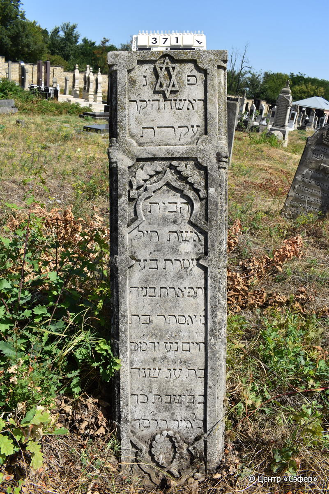
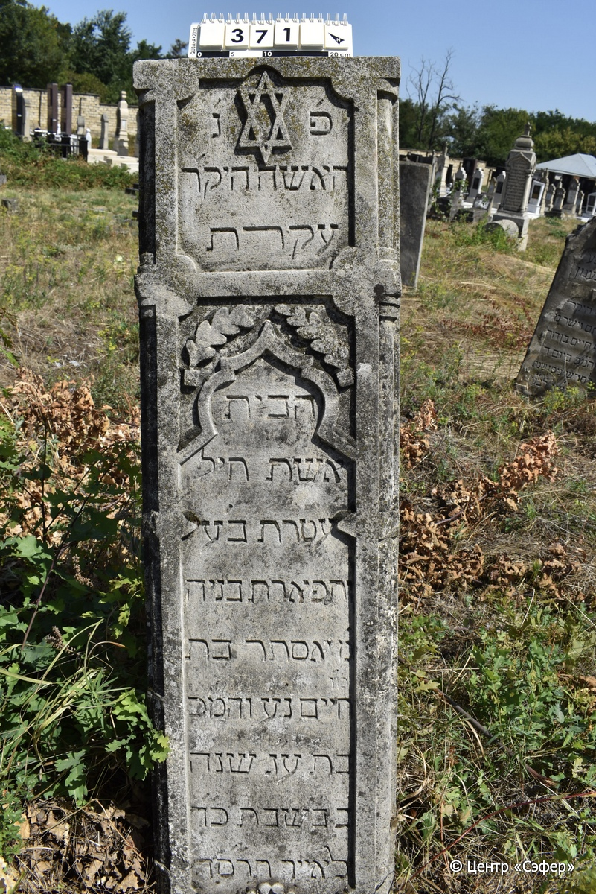

::: {style="font-size: 1em; margin-bottom: 1.2em"}
[Куба (центральное)](../cemeteries/QBA.html) > QBA0371
:::

```{r}
suppressPackageStartupMessages(library(tidyverse))
```


:::: {.columns}

::: {.column width="20%"}

```{r}
#| lightbox:
#|   group: photos




```
:::

::: {.column width="5%"}
:::

::: {.column width="74%"}

::: {.name-style}
Эстер, дочь Хаима
:::

::: {style="font-size: 1.2em;"}
אסתר בת חיים
:::

:::: {.columns}
::: {.column width="5%"}
{width=1.3em}
:::

::: {.column style="width: 40%; padding-left: 0.2em;"}
  /  
:::

::: {.column width="5%"}
{width=1.3em}
:::

::: {.column style="width: 50%; padding-left: 0.2em;"}
09.05.1904* / 24.Iy.5664
:::

::::


::: {.panel-tabset}

#### Эпитафия

```{r}
tibble(`Оригинал` = "פ׳ נ׳
האשה היקר׳
עקרת
הבית
אשת חיל
עטרת בע׳
ותפארת בניה
מ׳ אסתר בת
מ׳ו
חיים נ״ע והמ״כ
בת ע״ג שנה
ב׳ בשבת כ״ד
לאייר תרס״ד",
       `Перевод` = "Здесь погребена
дорогая женщина,
хозяйка
дома,
добродетельная жена,
венец мужа своего*
и отрада детей своих,
госпожа Эстер, дочь
учителя нашего
Хаима. Да упокоится в раю, и будет благословен её покой.
<Cкончалась> в возрасте 73 лет,
в понедельник, 24-го
ияра 5664 года.") |>
  mutate(`Оригинал` = str_split(`Оригинал`, "
"),
         `Перевод` = str_split(`Перевод`, "
")) |>
  unnest_longer(c(`Оригинал`, `Перевод`)) |> 
  mutate(id = 1:n()) |> 
  relocate(id, .before = Перевод) |> 
  rename(` ` = id) |> 
  knitr::kable(align = c("r", "c", "l"))
```

|||
|-|---|
|**Примечания**|*Цит. Притч 12:4|
|**Язык**      |иврит    |
|**Метки**     |     |
: {tbl-colwidths="[25,75]"}

#### Памятник

|||
|-|---|
|**Тип памятника**   |стела                                                                         |
|**Материал**        |известняк (следы эрозии)                                                     |
|**Размеры**         |155×40×19                                                                        |
|**Тип декора**      |архитектурно-орнаментальный, растительный, традиционная символика                                                                        |
|**Элементы декора** |две фигурные ниши для текста, одна из них украшена звездой Давида, между ними ветви, в основании венок, листья, фигурно оформленные края лицевой стороны                                                                          |
|**Координаты**      |[41.37082405, 48.5074462](https://www.google.com/maps/place/41.37082405, 48.5074462)                    |
: {tbl-colwidths="[25,75]"}

#### Источник

|||
|-|---|
|**Место хранения**        |Архив полевых исследований Центра «Сэфер»     |
|**Контакты**              |students@sefer.ru    |
|**Ссылка**                |https://sfira.org        |
|**Исходный ID**           |  |
|**Условия использования** |[CC BY-NC 4.0](https://creativecommons.org/licenses/by-nc/4.0/deed.ru)     |
: {tbl-colwidths="[25,75]"}

:::

:::

::::

