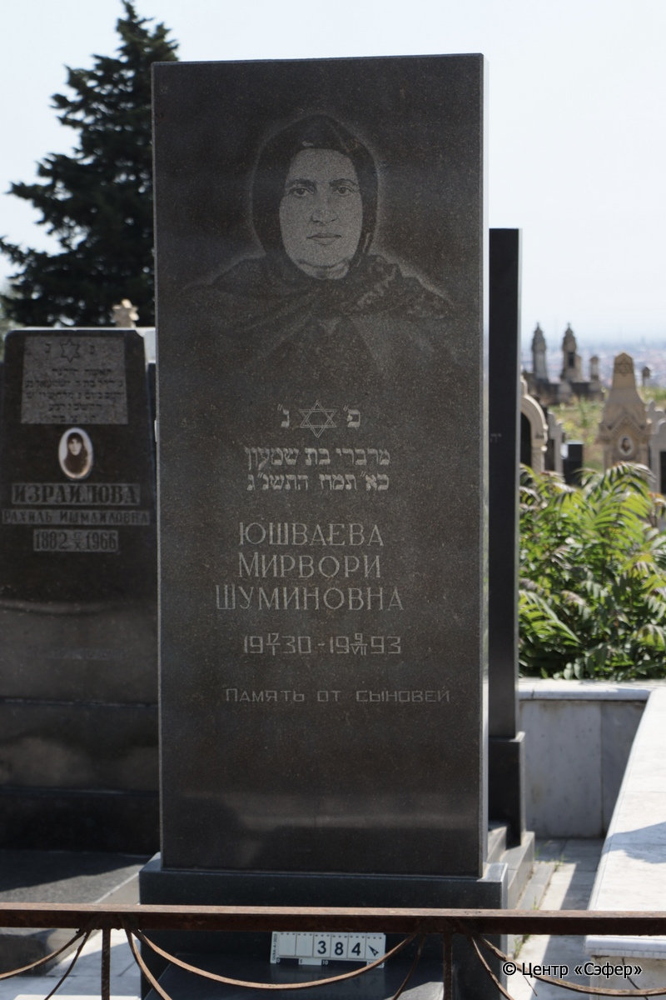
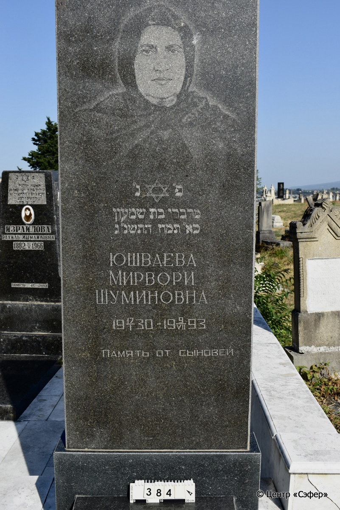
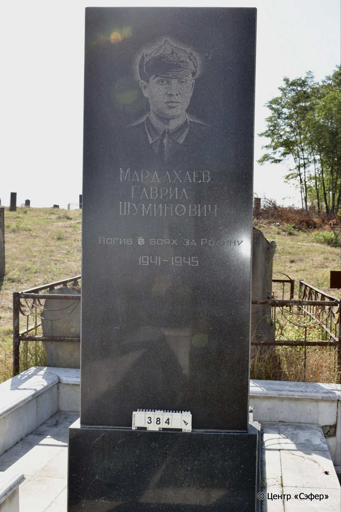

::: {style="font-size: 1em; margin-bottom: 1.2em"}
[Куба (центральное)](../cemeteries/QBA.html) > QBA0384
:::

```{r}
suppressPackageStartupMessages(library(tidyverse))
```


:::: {.columns}

::: {.column width="20%"}

```{r}
#| lightbox:
#|   group: photos





```
:::

::: {.column width="5%"}
:::

::: {.column width="74%"}

::: {.name-style}
ЮШВАЕВА Мирвори, дочь Шимона (Шуминовна)
:::

::: {style="font-size: 1.2em;"}
מרברי בת שמעון
:::

:::: {.columns}
::: {.column width="5%"}
{width=1.3em}
:::

::: {.column style="width: 40%; padding-left: 0.2em;"}
17.01.1930 /  
:::

::: {.column width="5%"}
{width=1.3em}
:::

::: {.column style="width: 50%; padding-left: 0.2em;"}
07.09.1993 / 21.Ta.5753
:::

::::

---

::: {.name-style}
МАРДАХАЕВ Гаврил Шуминович
:::

::: {style="font-size: 1.2em;"}

:::

:::: {.columns}
::: {.column width="5%"}
{width=1.3em}
:::

::: {.column style="width: 40%; padding-left: 0.2em;"}
-.-.1941 /  
:::

::: {.column width="5%"}
{width=1.3em}
:::

::: {.column style="width: 50%; padding-left: 0.2em;"}
-.-.1945 /  
:::

::::


::: {.panel-tabset}

#### Эпитафия

```{r}
tibble(`Оригинал` = "лицевая сторона
פ״ נ״
מרברי בת שמעון
כא״ תמוז התשנ״ג
Юшваева
Мирвори
Шуминовна
1930 17/I - 1993 9/VII
Память от сыновей

обратная сторона
Мардахаев
Гаврил
Шуминович
Погиб в боях за Родину
1941 - 1945",
       `Перевод` = "
Здесь покоится
Мирвори, дочь Шимона,
21 таммуза, 5753 года
Юшваева
Мирвори
Шуминовна
17.01.1930 – 09.07.1993
Память от сыновей

 
Мардахаев
Гаврил
Шуминович
Погиб в боях за Родину
1941 – 1945") |>
  mutate(`Оригинал` = str_split(`Оригинал`, "
"),
         `Перевод` = str_split(`Перевод`, "
")) |>
  unnest_longer(c(`Оригинал`, `Перевод`)) |> 
  mutate(id = 1:n()) |> 
  relocate(id, .before = Перевод) |> 
  rename(` ` = id) |> 
  knitr::kable(align = c("r", "c", "l"))
```

|||
|-|---|
|**Примечания**| |
|**Язык**      |иврит, русский    |
|**Метки**     |     |
: {tbl-colwidths="[25,75]"}

#### Памятник

|||
|-|---|
|**Тип памятника**   |L-образный                                                                         |
|**Материал**        |гранит (цементный раствор, основание немного деформировано)                                                     |
|**Размеры**         |220×80×19  --- стела; 10×62×130  --- плита; 17×84×168  --- основание                                                                        |
|**Тип декора**      |традиционная символика                                                                        |
|**Элементы декора** |звезда Давида, женский портрет на лицевой стороне, на обратной стороне портрет мужчины в буденовке с пятиконечной звездой с серпом и молотом                                                                          |
|**Координаты**      |[41.3710268, 48.50743286](https://www.google.com/maps/place/41.3710268, 48.50743286)                    |
: {tbl-colwidths="[25,75]"}

#### Источник

|||
|-|---|
|**Место хранения**        |Архив полевых исследований Центра «Сэфер»     |
|**Контакты**              |students@sefer.ru    |
|**Ссылка**                |https://sfira.org        |
|**Исходный ID**           |  |
|**Условия использования** |[CC BY-NC 4.0](https://creativecommons.org/licenses/by-nc/4.0/deed.ru)     |
: {tbl-colwidths="[25,75]"}

:::

:::

::::

