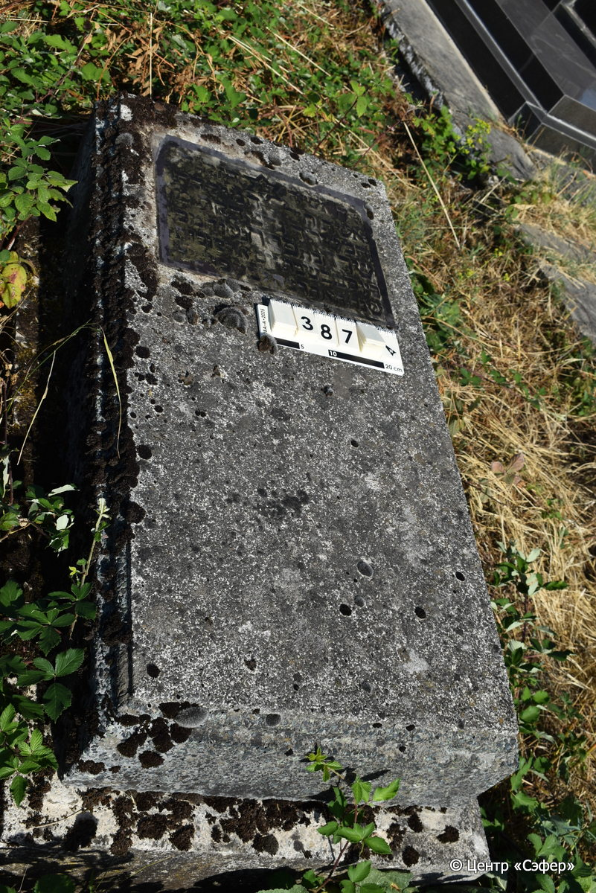
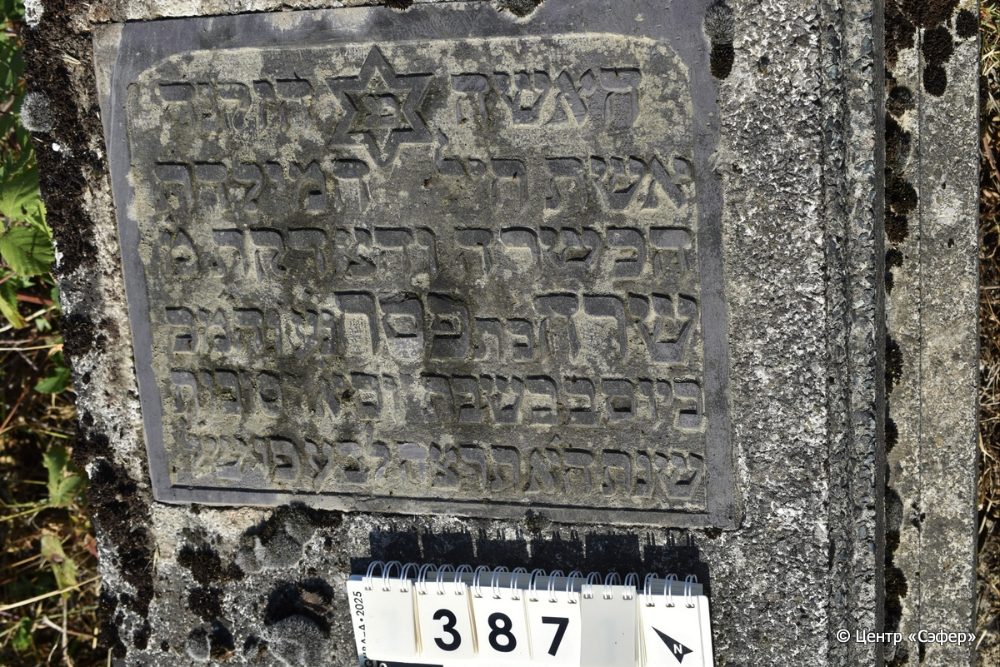

::: {style="font-size: 1em; margin-bottom: 1.2em"}
[Куба (центральное)](../cemeteries/QBA.html) > QBA0387
:::

```{r}
suppressPackageStartupMessages(library(tidyverse))
```


:::: {.columns}

::: {.column width="20%"}

```{r}
#| lightbox:
#|   group: photos




```
:::

::: {.column width="5%"}
:::

::: {.column width="74%"}

::: {.name-style}
Сара, дочь Песаха
:::

::: {style="font-size: 1.2em;"}
שרה בת פסח
:::

:::: {.columns}
::: {.column width="5%"}
{width=1.3em}
:::

::: {.column style="width: 40%; padding-left: 0.2em;"}
  /  
:::

::: {.column width="5%"}
{width=1.3em}
:::

::: {.column style="width: 50%; padding-left: 0.2em;"}
24.09.1934* / 15.Ti.5695
:::

::::


::: {.panel-tabset}

#### Эпитафия

```{r}
tibble(`Оригинал` = "האשה פ״נ הזקנה
אשת חיל המילדת
הכשרה והצדקת מ֗
שרה בת פסח נ׳ע וה״מכ
ביום ב֗ בשבת יום א֗ דסוכות
שנת ה׳א תרצ׳ה לב׳ע פ׳ו ש׳ל",
       `Перевод` = "Женщина здесь покоится пожилая,
доблестная жена, повитуха,
достойная и праведная, госпожа
Сара, дочь Песаха, да покоится в раю и да покоится во славе, 
в понедельник, 1-й день праздника Суккот,
год 5695 от сотворения мира...") |>
  mutate(`Оригинал` = str_split(`Оригинал`, "
"),
         `Перевод` = str_split(`Перевод`, "
")) |>
  unnest_longer(c(`Оригинал`, `Перевод`)) |> 
  mutate(id = 1:n()) |> 
  relocate(id, .before = Перевод) |> 
  rename(` ` = id) |> 
  knitr::kable(align = c("r", "c", "l"))
```

|||
|-|---|
|**Примечания**| |
|**Язык**      |иврит    |
|**Метки**     |     |
: {tbl-colwidths="[25,75]"}

#### Памятник

|||
|-|---|
|**Тип памятника**   |плита/саркофаг                                                                         |
|**Материал**        |мозаичный бетон, кирпич, другое (вставка с текстом из темного камня, предположительно, сланца, нижняя часть основания разрушена, остатки кирпичей и цементного раствора)                                                     |
|**Размеры**         |25×59×117  --- плита; 22×70×130  --- основание                                                                        |
|**Тип декора**      |традиционная символика                                                                        |
|**Элементы декора** |звезда Давида на вставке                                                                          |
|**Координаты**      |[41.37094026, 48.50747707](https://www.google.com/maps/place/41.37094026, 48.50747707)                    |
: {tbl-colwidths="[25,75]"}

#### Источник

|||
|-|---|
|**Место хранения**        |Архив полевых исследований Центра «Сэфер»     |
|**Контакты**              |students@sefer.ru    |
|**Ссылка**                |https://sfira.org        |
|**Исходный ID**           |  |
|**Условия использования** |[CC BY-NC 4.0](https://creativecommons.org/licenses/by-nc/4.0/deed.ru)     |
: {tbl-colwidths="[25,75]"}

:::

:::

::::

