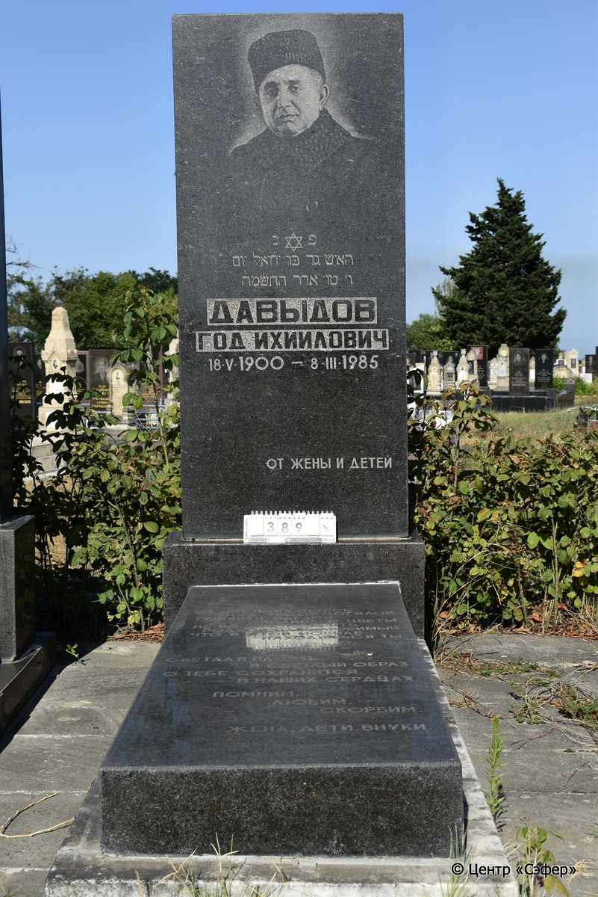
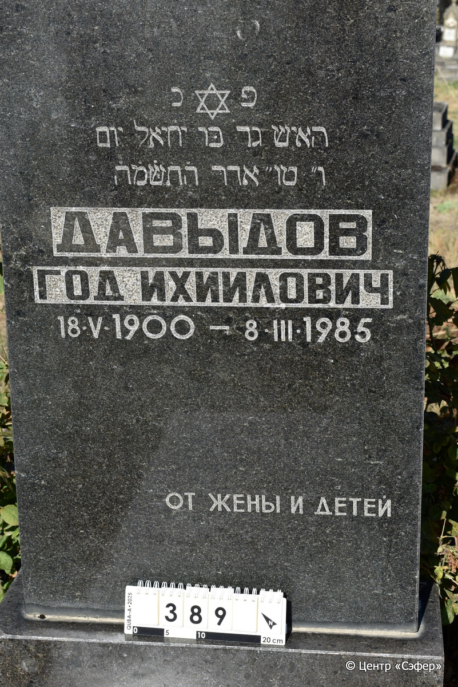

::: {style="font-size: 1em; margin-bottom: 1.2em"}
[Куба (центральное)](../cemeteries/QBA.html) > QBA0389
:::

```{r}
suppressPackageStartupMessages(library(tidyverse))
```


:::: {.columns}

::: {.column width="20%"}

```{r}
#| lightbox:
#|   group: photos




```
:::

::: {.column width="5%"}
:::

::: {.column width="74%"}

::: {.name-style}
ДАВЫДОВ Гад, сын Йехиэля (Год Ихиилович)
:::

::: {style="font-size: 1.2em;"}
גד בן יחיאל
:::

:::: {.columns}
::: {.column width="5%"}
{width=1.3em}
:::

::: {.column style="width: 40%; padding-left: 0.2em;"}
18.05.1900 /  
:::

::: {.column width="5%"}
{width=1.3em}
:::

::: {.column style="width: 50%; padding-left: 0.2em;"}
08.03.1985 / 15.Ad.5745
:::

::::


::: {.panel-tabset}

#### Эпитафия

```{r}
tibble(`Оригинал` = "сверху
פנ
האיש גד בּן יחיאל יום
ו״ טו״ אדר ה֗ת֗ש֗מ֗ה֗
ДАВЫДОВ
ГОД ИХИИЛОВИЧ
18 V 1900 - 8 III 1985
от жены и детей

снизу
стоим покланяясь
над твоей могилой
горячей слезой
поливаем цветы
не хочется верить
родной наш любимый
что в этой могиле
находишься ты
светлая память
и светлый образ
о тебе сохранится
в наших сердцах
помним
любим
скорбим.
жена, дети, внуки",
       `Перевод` = "
Здесь покоится 
человек, Гад, сын Йехиэля, 
в пятницу, 15-го адара, 5745 года.
ДАВЫДОВ
ГОД ИХИИЛОВИЧ
18 V 1900 - 8 III 1985
от жены и детей

 
стоим покланяясь
над твоей могилой
горячей слезой
поливаем цветы
не хочется верить
родной наш любимый
что в этой могиле
находишься ты
светлая память
и светлый образ
о тебе сохранится
в наших сердцах
помним
любим
скорбим.
жена, дети, внуки") |>
  mutate(`Оригинал` = str_split(`Оригинал`, "
"),
         `Перевод` = str_split(`Перевод`, "
")) |>
  unnest_longer(c(`Оригинал`, `Перевод`)) |> 
  mutate(id = 1:n()) |> 
  relocate(id, .before = Перевод) |> 
  rename(` ` = id) |> 
  knitr::kable(align = c("r", "c", "l"))
```

|||
|-|---|
|**Примечания**| |
|**Язык**      |иврит, русский    |
|**Метки**     |     |
: {tbl-colwidths="[25,75]"}

#### Памятник

|||
|-|---|
|**Тип памятника**   |L-образный                                                                         |
|**Материал**        |гранит, мрамор (мраморное основание, цементный раствор, сколы)                                                     |
|**Размеры**         |182×71×26  --- стела; 14×55×135  --- плита; 13×70×143  --- основание                                                                        |
|**Тип декора**      |растительный, традиционная символика                                                                        |
|**Элементы декора** |портрет, звезда Давида, две гвоздики на плите                                                                          |
|**Координаты**      |[41.37092699, 48.50752912](https://www.google.com/maps/place/41.37092699, 48.50752912)                    |
: {tbl-colwidths="[25,75]"}

#### Источник

|||
|-|---|
|**Место хранения**        |Архив полевых исследований Центра «Сэфер»     |
|**Контакты**              |students@sefer.ru    |
|**Ссылка**                |https://sfira.org        |
|**Исходный ID**           |  |
|**Условия использования** |[CC BY-NC 4.0](https://creativecommons.org/licenses/by-nc/4.0/deed.ru)     |
: {tbl-colwidths="[25,75]"}

:::

:::

::::

