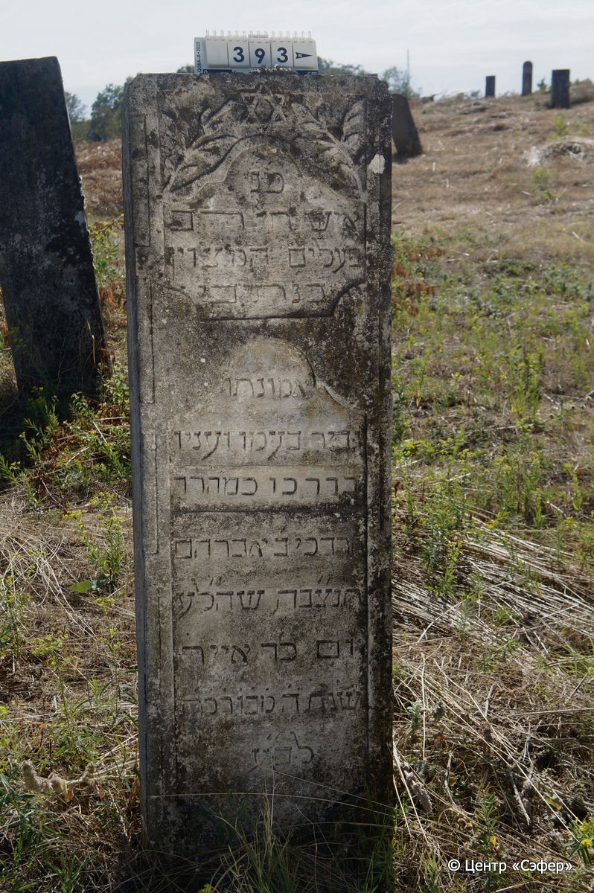

::: {style="font-size: 1em; margin-bottom: 1.2em"}
[Куба (центральное)](../cemeteries/QBA.html) > QBA0393
:::

```{r}
suppressPackageStartupMessages(library(tidyverse))
```


:::: {.columns}

::: {.column width="20%"}

```{r}
#| lightbox:
#|   group: photos



```
:::

::: {.column width="5%"}
:::

::: {.column width="74%"}

::: {.name-style}
Мордехай, сын Авраама
:::

::: {style="font-size: 1.2em;"}
מרדכי בן אברהם
:::

:::: {.columns}
::: {.column width="5%"}
{width=1.3em}
:::

::: {.column style="width: 40%; padding-left: 0.2em;"}
  /  
:::

::: {.column width="5%"}
{width=1.3em}
:::

::: {.column style="width: 50%; padding-left: 0.2em;"}
07.05.1983* / 24.Iy.5743
:::

::::


::: {.panel-tabset}

#### Эпитафия

```{r}
tibble(`Оригинал` = "פ׳נ
איש חי רב
פעלים המצוין
בנתיבי׳
אמונתו
גביר בעמו ועניו
בדרכו כמ״הרר
מרדכי ב׳ אברהם
תנ״צבה שה״לע
יום כ״ד אייר
שנת ה֗מ֗ב֗ו֗ר֗כ֗ת֗
לב״ע",
       `Перевод` = "Здесь покоится
человек, живший жизнью [духовной],
великий деяниями, отмеченный
на путях своих,
верный в вере своей,
щедрый к народу своему и скромный
в пути своём. Учитель наш, великий раввин
Мордехай, сын Авраама.
Да будет душа его завязана в узле жизни. Да будет память его благословенна.
24 ияра
5743 года
от сотворения мира") |>
  mutate(`Оригинал` = str_split(`Оригинал`, "
"),
         `Перевод` = str_split(`Перевод`, "
")) |>
  unnest_longer(c(`Оригинал`, `Перевод`)) |> 
  mutate(id = 1:n()) |> 
  relocate(id, .before = Перевод) |> 
  rename(` ` = id) |> 
  knitr::kable(align = c("r", "c", "l"))
```

|||
|-|---|
|**Примечания**| |
|**Язык**      |иврит    |
|**Метки**     |     |
: {tbl-colwidths="[25,75]"}

#### Памятник

|||
|-|---|
|**Тип памятника**   |стела                                                                         |
|**Материал**        |песчаник (сколы, следы эрозии)                                                     |
|**Размеры**         |145×45×20                                                                        |
|**Тип декора**      |архитектурно-орнаментальный, растительный, традиционная символика                                                                        |
|**Элементы декора** |две фигурные ниши для текста, вверху звезда Давида в окружении веток, края лицевой стороны фигурно оформлены                                                                          |
|**Координаты**      |[41.37086886, 48.50750558](https://www.google.com/maps/place/41.37086886, 48.50750558)                    |
: {tbl-colwidths="[25,75]"}

#### Источник

|||
|-|---|
|**Место хранения**        |Архив полевых исследований Центра «Сэфер»     |
|**Контакты**              |students@sefer.ru    |
|**Ссылка**                |https://sfira.org        |
|**Исходный ID**           |  |
|**Условия использования** |[CC BY-NC 4.0](https://creativecommons.org/licenses/by-nc/4.0/deed.ru)     |
: {tbl-colwidths="[25,75]"}

:::

:::

::::

