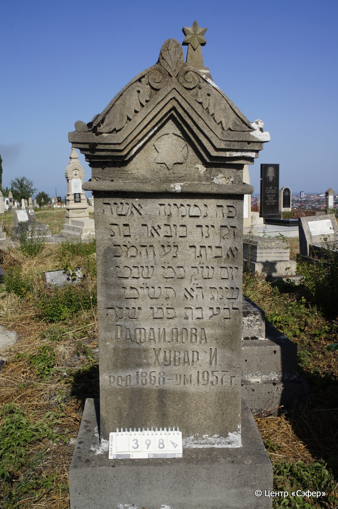

::: {style="font-size: 1em; margin-bottom: 1.2em"}
[Куба (центральное)](../cemeteries/QBA.html) > QBA0398
:::

```{r}
suppressPackageStartupMessages(library(tidyverse))
```


:::: {.columns}

::: {.column width="20%"}

```{r}
#| lightbox:
#|   group: photos



```
:::

::: {.column width="5%"}
:::

::: {.column width="74%"}

::: {.name-style}
РАФАИЛОВА Хувар, дочь Эвьятара
:::

::: {style="font-size: 1.2em;"}
כובאר בת אביתר
:::

:::: {.columns}
::: {.column width="5%"}
{width=1.3em}
:::

::: {.column style="width: 40%; padding-left: 0.2em;"}
-.-.1868 /  
:::

::: {.column width="5%"}
{width=1.3em}
:::

::: {.column style="width: 50%; padding-left: 0.2em;"}
-.-.1957 / 29.Sh.5719
:::

::::


::: {.panel-tabset}

#### Эпитафия

```{r}
tibble(`Оригинал` = "פה נטמנה אשה
זקינה כובאר בת
אביתר נ֗ע֗ והמ֗כ֗
יום ש״ק כ״ט שבט
שנת ה״א תש״יט
לב׳ע בת פ״ט שנה
Рафаилова
Хувар И.
род. 1868 - ум. 1957 г.",
       `Перевод` = "Здесь погребена женщина
пожилая, Хувар, дочь
Эвьятара, да упокоится в раю, и да благословен его покой,
день святой субботы, 29 швата
года 5719
от сотворения мира, в возрасте 89 лет.
Рафаилова
Хувар И.
родилась в 1868 г. - умерла в 1957 г.") |>
  mutate(`Оригинал` = str_split(`Оригинал`, "
"),
         `Перевод` = str_split(`Перевод`, "
")) |>
  unnest_longer(c(`Оригинал`, `Перевод`)) |> 
  mutate(id = 1:n()) |> 
  relocate(id, .before = Перевод) |> 
  rename(` ` = id) |> 
  knitr::kable(align = c("r", "c", "l"))
```

|||
|-|---|
|**Примечания**| |
|**Язык**      |иврит, русский    |
|**Метки**     |     |
: {tbl-colwidths="[25,75]"}

#### Памятник

|||
|-|---|
|**Тип памятника**   |L-образный                                                                         |
|**Материал**        |известняк (цементный раствор, трещины, блоки основания сдвинуты)                                                     |
|**Размеры**         |147×57×45  --- стела; 17×53×110  --- плита; 20×61×165  --- основание                                                                        |
|**Тип декора**      |архитектурно-орнаментальный, растительный, традиционная символика                                                                        |
|**Элементы декора** |треугольное завершение с волютами и растительными мотивами, ниже звезда Давида                                                                          |
|**Координаты**      |[41.37076506, 48.50761287](https://www.google.com/maps/place/41.37076506, 48.50761287)                    |
: {tbl-colwidths="[25,75]"}

#### Источник

|||
|-|---|
|**Место хранения**        |Архив полевых исследований Центра «Сэфер»     |
|**Контакты**              |students@sefer.ru    |
|**Ссылка**                |https://sfira.org        |
|**Исходный ID**           |  |
|**Условия использования** |[CC BY-NC 4.0](https://creativecommons.org/licenses/by-nc/4.0/deed.ru)     |
: {tbl-colwidths="[25,75]"}

:::

:::

::::

