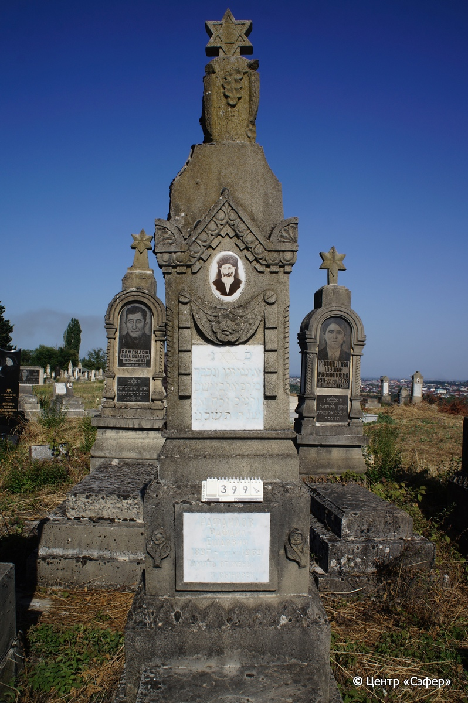
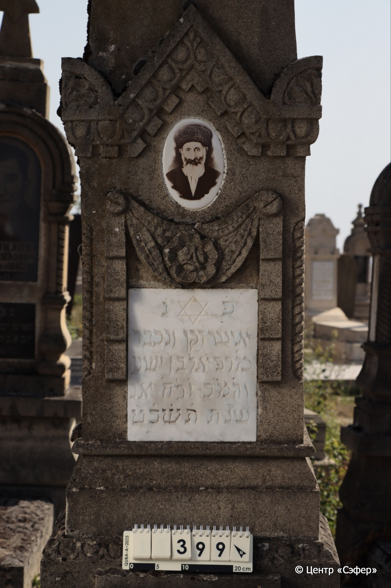
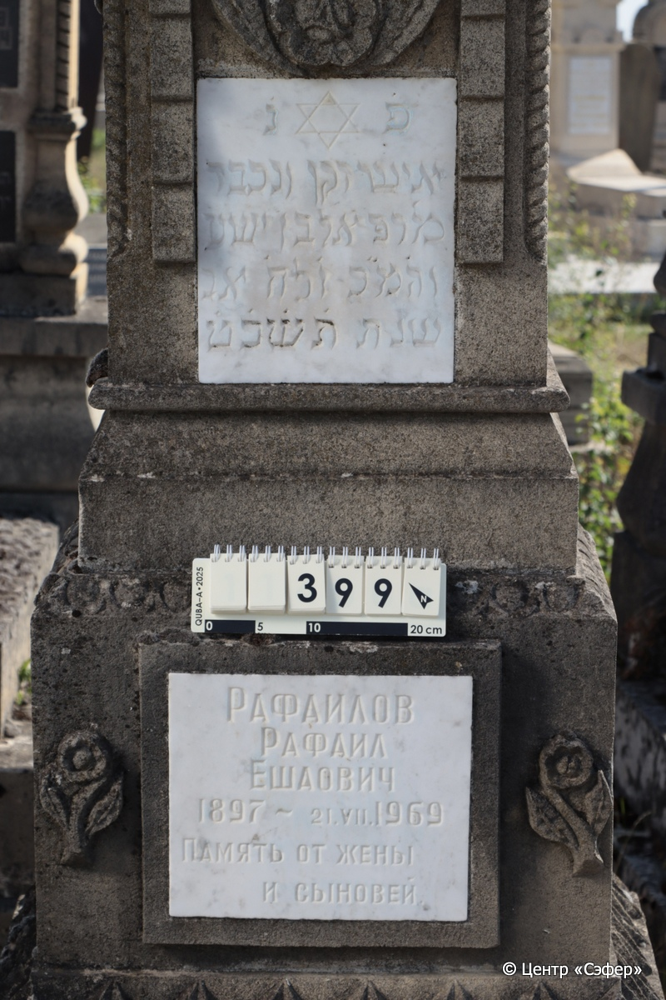
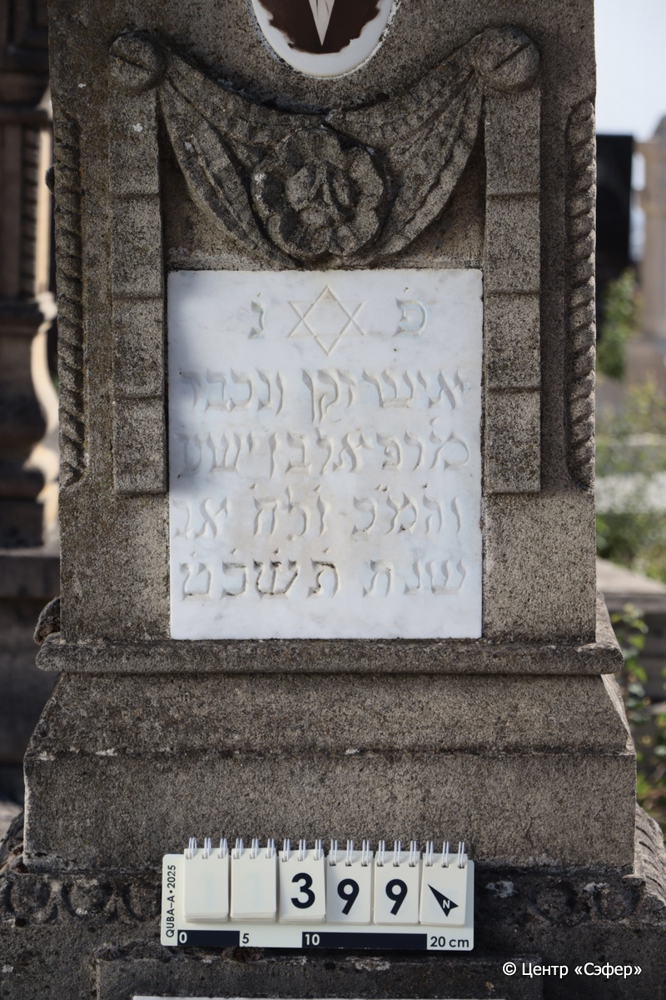
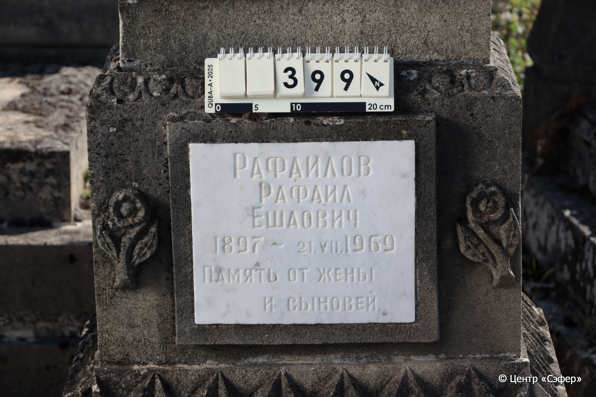
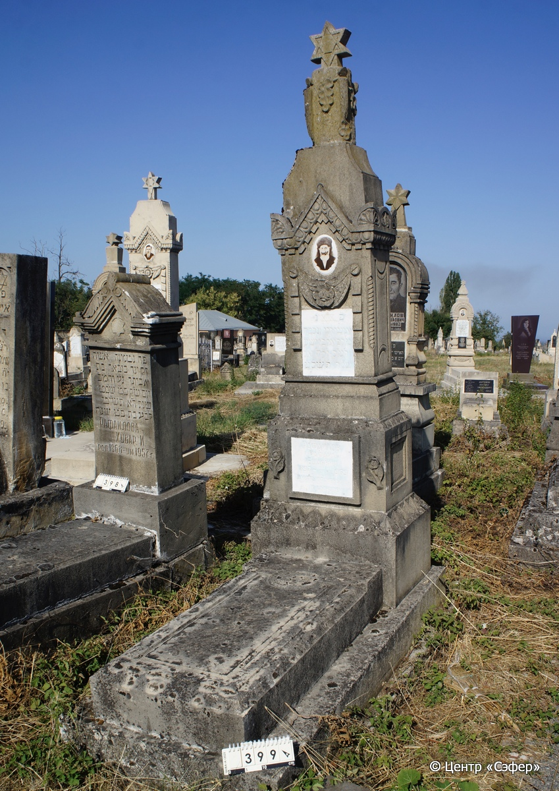

::: {style="font-size: 1em; margin-bottom: 1.2em"}
[Куба (центральное)](../cemeteries/QBA.html) > QBA0399
:::

```{r}
suppressPackageStartupMessages(library(tidyverse))
```


:::: {.columns}

::: {.column width="20%"}

```{r}
#| lightbox:
#|   group: photos








```
:::

::: {.column width="5%"}
:::

::: {.column width="74%"}

::: {.name-style}
РАФАИЛОВ Рафаэль, сын Йешуа (Рафаил Ешаович)
:::

::: {style="font-size: 1.2em;"}
רפאל בן ישע
:::

:::: {.columns}
::: {.column width="5%"}
{width=1.3em}
:::

::: {.column style="width: 40%; padding-left: 0.2em;"}
01.02.1897 /  
:::

::: {.column width="5%"}
{width=1.3em}
:::

::: {.column style="width: 50%; padding-left: 0.2em;"}
21.07.1969 / 6.Av.5729
:::

::::


::: {.panel-tabset}

#### Эпитафия

```{r}
tibble(`Оригинал` = "פ֗נ֗
איש זקן ונכבד
מ׳ רפאל בן ישע
וה֗מ״כ ו֗ לח׳ אב
שנת ת֗ש֗כ֗ט֗
Рафаилов
Рафаил
Ешаович
1897 - 21.VII.1969
Память от жены
и сыновей",
       `Перевод` = "Здесь покоится
Человек старый и уважаемый,
господин Рафаэль, сын Йешуа,
и да упокоится во славе, 6 ава
5729 года.
Рафаилов
Рафаил
Ешаович
1897 - 21.VII.1969
Память от жены
и сыновей") |>
  mutate(`Оригинал` = str_split(`Оригинал`, "
"),
         `Перевод` = str_split(`Перевод`, "
")) |>
  unnest_longer(c(`Оригинал`, `Перевод`)) |> 
  mutate(id = 1:n()) |> 
  relocate(id, .before = Перевод) |> 
  rename(` ` = id) |> 
  knitr::kable(align = c("r", "c", "l"))
```

|||
|-|---|
|**Примечания**| |
|**Язык**      |иврит, русский    |
|**Метки**     |     |
: {tbl-colwidths="[25,75]"}

#### Памятник

|||
|-|---|
|**Тип памятника**   |L-образный                                                                         |
|**Материал**        |известняк, мрамор (две мраморные вставки, керамический медальон с фото)                                                     |
|**Размеры**         |261×72×53  --- стела; 19×60×124  --- плита; 28×90×200  --- основание                                                                        |
|**Тип декора**      |архитектурно-орнаментальный, растительный, традиционная символика                                                                        |
|**Элементы декора** |навершие выполнено в виде фрагмента ствола дерева со срубленными ветками и дубовыми листьями со звездой Давида, орнаментальный пояс с пальметками, фотопортрет на медальоне, гирлянда из лент с цветком, звезда Давида на вставке, витые полуколонны, фигурные рамки по всем сторонам стелы кроме лицевой, два орнаментальных пояса, с двух сторон от нижней вставки с текстом - два цветка, на плите звезда Давида в круглой нише, фигурная рамка                                                                          |
|**Координаты**      |[41.37075457, 48.50761603](https://www.google.com/maps/place/41.37075457, 48.50761603)                    |
: {tbl-colwidths="[25,75]"}

#### Источник

|||
|-|---|
|**Место хранения**        |Архив полевых исследований Центра «Сэфер»     |
|**Контакты**              |students@sefer.ru    |
|**Ссылка**                |https://sfira.org        |
|**Исходный ID**           |  |
|**Условия использования** |[CC BY-NC 4.0](https://creativecommons.org/licenses/by-nc/4.0/deed.ru)     |
: {tbl-colwidths="[25,75]"}

:::

:::

::::

