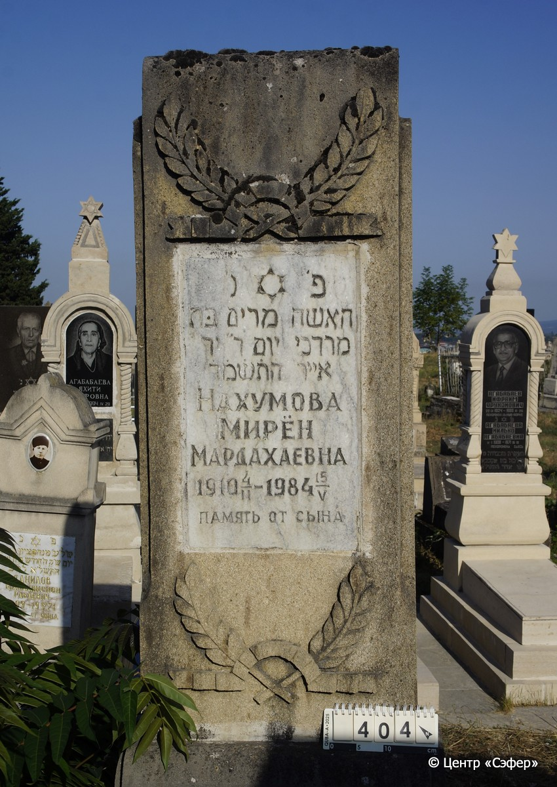

::: {style="font-size: 1em; margin-bottom: 1.2em"}
[Куба (центральное)](../cemeteries/QBA.html) > QBA0404
:::

```{r}
suppressPackageStartupMessages(library(tidyverse))
```


:::: {.columns}

::: {.column width="20%"}

```{r}
#| lightbox:
#|   group: photos



```
:::

::: {.column width="5%"}
:::

::: {.column width="74%"}

::: {.name-style}
НАХУМОВА Мариам, дочь Мордехая (Мирён Мардахаевна)
:::

::: {style="font-size: 1.2em;"}
מרים בת מרדכי
:::

:::: {.columns}
::: {.column width="5%"}
{width=1.3em}
:::

::: {.column style="width: 40%; padding-left: 0.2em;"}
04.02.1910 /  
:::

::: {.column width="5%"}
{width=1.3em}
:::

::: {.column style="width: 50%; padding-left: 0.2em;"}
15.05.1984 / 14.Iy.5744
:::

::::


::: {.panel-tabset}

#### Эпитафия

```{r}
tibble(`Оригинал` = "פ׳נ׳
האשה מרים בּת
מרדכי יום ד׳ י״ד
אייר ה֗ת֗ש֗מ֗ד֗
Нахумова
Мирён
Мардахаевна
1910 4/II - 1984 15/V
память от сына",
       `Перевод` = "Здесь покоится
жещина, Мариам дочь
Модехая, в среду, 14
ияра 5744 года.
Нахумова
Мирён
Мардахаевна
4.02.1910 – 15.05.1984
память от сына") |>
  mutate(`Оригинал` = str_split(`Оригинал`, "
"),
         `Перевод` = str_split(`Перевод`, "
")) |>
  unnest_longer(c(`Оригинал`, `Перевод`)) |> 
  mutate(id = 1:n()) |> 
  relocate(id, .before = Перевод) |> 
  rename(` ` = id) |> 
  knitr::kable(align = c("r", "c", "l"))
```

|||
|-|---|
|**Примечания**| |
|**Язык**      |иврит, русский    |
|**Метки**     |     |
: {tbl-colwidths="[25,75]"}

#### Памятник

|||
|-|---|
|**Тип памятника**   |L-образный                                                                         |
|**Материал**        |известняк (цементный раствор, мраморная вставка для текста, следы эрозии, трещины, следы ремонта)                                                     |
|**Размеры**         |168×62×31  --- стела; 16×51×121  --- плита; 34×81×184  --- основание                                                                        |
|**Тип декора**      |архитектурно-орнаментальный, растительный, традиционная символика                                                                        |
|**Элементы декора** |звезда Давида на мраморной вставке, две гирлянды из ленты и двумя колосьями в верхней части и в основании.                                                                          |
|**Координаты**      |[41.37104078, 48.50751236](https://www.google.com/maps/place/41.37104078, 48.50751236)                    |
: {tbl-colwidths="[25,75]"}

#### Источник

|||
|-|---|
|**Место хранения**        |Архив полевых исследований Центра «Сэфер»     |
|**Контакты**              |students@sefer.ru    |
|**Ссылка**                |https://sfira.org        |
|**Исходный ID**           |  |
|**Условия использования** |[CC BY-NC 4.0](https://creativecommons.org/licenses/by-nc/4.0/deed.ru)     |
: {tbl-colwidths="[25,75]"}

:::

:::

::::

