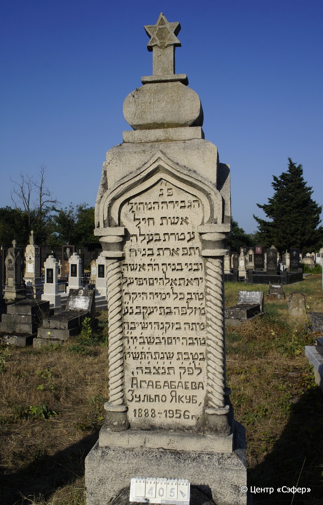
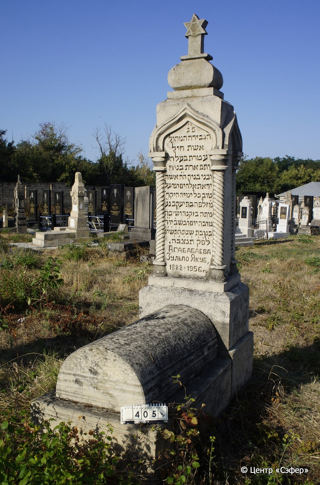

::: {style="font-size: 1em; margin-bottom: 1.2em"}
[Куба (центральное)](../cemeteries/QBA.html) > QBA0405
:::

```{r}
suppressPackageStartupMessages(library(tidyverse))
```


:::: {.columns}

::: {.column width="20%"}

```{r}
#| lightbox:
#|   group: photos




```
:::

::: {.column width="5%"}
:::

::: {.column width="74%"}

::: {.name-style}
АГАБАБАЕВА Зилпо, дочь Яакова (Зульпо)
:::

::: {style="font-size: 1.2em;"}
זלפה בת יעקב
:::

:::: {.columns}
::: {.column width="5%"}
{width=1.3em}
:::

::: {.column style="width: 40%; padding-left: 0.2em;"}
-.-.1888 /  
:::

::: {.column width="5%"}
{width=1.3em}
:::

::: {.column style="width: 50%; padding-left: 0.2em;"}
-.-.1956 / 10.Te.5717
:::

::::


::: {.panel-tabset}

#### Эпитафия

```{r}
tibble(`Оригинал` = "פ׳נ׳
הגבירה המהול׳
אשת חיל
עטרת בעלה
ותפראת בניה
ובני בניה ה״ה א֗שה
יראת אלהים ופועל
טוב כל ימיה היקר׳
מ׳ זלפה בת יעקב נ״ע
מתה בזקנה ושיבה
טובה יום ו׳ בשב׳ יו״ד
בטבת שנת ה֗ת֗ש֗י֗ז֗
ל֗פ֗ק֗ ת֗נ֗צ֗ב֗ה֗.
Агабабаева
Зульпо Якуб,
1888-1956 г.",
       `Перевод` = "Здесь покоится
почтенная госпожа,
женщина добродетельная,
венец для мужа своего
и гордость для сыновей
и внуков своих, уважаемая и почтенная женщина.
Боящаяся Бога и творившая добрые дела
все свои дни.
Госпожа Зильпо, дочь Яакова, да упокоится в раю.
Скончалась в старости и преклонных годах
в пятницу, 10-го тевета,
в 5717 году по малому летоисчислению
Да будет её душа связана в узле жизни.
Агабабаева
Зульпо Якуб,
1888-1956") |>
  mutate(`Оригинал` = str_split(`Оригинал`, "
"),
         `Перевод` = str_split(`Перевод`, "
")) |>
  unnest_longer(c(`Оригинал`, `Перевод`)) |> 
  mutate(id = 1:n()) |> 
  relocate(id, .before = Перевод) |> 
  rename(` ` = id) |> 
  knitr::kable(align = c("r", "c", "l"))
```

|||
|-|---|
|**Примечания**| |
|**Язык**      |иврит, русский    |
|**Метки**     |     |
: {tbl-colwidths="[25,75]"}

#### Памятник

|||
|-|---|
|**Тип памятника**   |L-образный                                                                         |
|**Материал**        |известняк (следы эрозии, цементный раствор, трещины)                                                     |
|**Размеры**         |210×63×44  --- Стелы; 31×50×100  --- Саркофаг; 33×70×160  --- основание                                                                        |
|**Тип декора**      |архитектурно-орнаментальный, традиционная символика                                                                        |
|**Элементы декора** |архитектурное навершение, увенчанное звездой Давида, стрельчатые арки на витых колоннах со всех сторон.                                                                          |
|**Координаты**      |[41.37090012, 48.50758372](https://www.google.com/maps/place/41.37090012, 48.50758372)                    |
: {tbl-colwidths="[25,75]"}

#### Источник

|||
|-|---|
|**Место хранения**        |Архив полевых исследований Центра «Сэфер»     |
|**Контакты**              |students@sefer.ru    |
|**Ссылка**                |https://sfira.org        |
|**Исходный ID**           |  |
|**Условия использования** |[CC BY-NC 4.0](https://creativecommons.org/licenses/by-nc/4.0/deed.ru)     |
: {tbl-colwidths="[25,75]"}

:::

:::

::::

