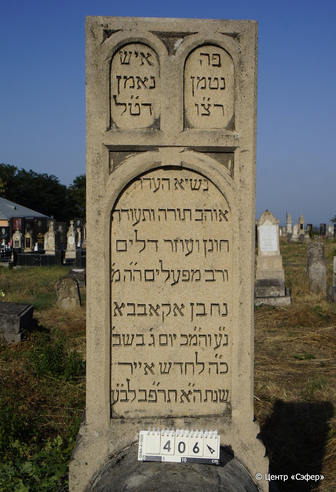
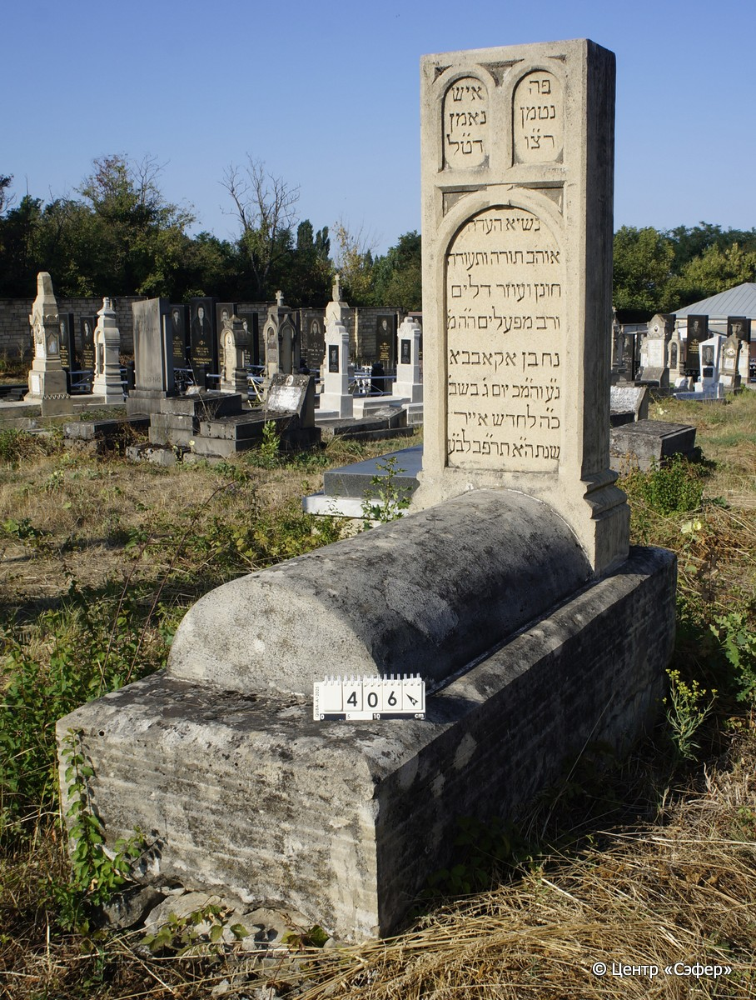

::: {style="font-size: 1em; margin-bottom: 1.2em"}
[Куба (центральное)](../cemeteries/QBA.html) > QBA0406
:::

```{r}
suppressPackageStartupMessages(library(tidyverse))
```


:::: {.columns}

::: {.column width="20%"}

```{r}
#| lightbox:
#|   group: photos




```
:::

::: {.column width="5%"}
:::

::: {.column width="74%"}

::: {.name-style}
АГАБАБА Нахман
:::

::: {style="font-size: 1.2em;"}
אקאבבא נחמן
:::

:::: {.columns}
::: {.column width="5%"}
{width=1.3em}
:::

::: {.column style="width: 40%; padding-left: 0.2em;"}
  /  
:::

::: {.column width="5%"}
{width=1.3em}
:::

::: {.column style="width: 50%; padding-left: 0.2em;"}
23.05.1922* / 25.Iy.5682
:::

::::


::: {.panel-tabset}

#### Эпитафия

```{r}
tibble(`Оригинал` = "справа
פה 
נטמן
רצ״ו

слева
איש
נאמן
דט״ל

по центру
נשיא העדה
אוהב תורה ותעודה
חונן ועוזר דלים
ורב מפעלים ה״ה מ׳
נחמן אקאבבא
נ״ע והמ״כ יום ג׳ בשב׳
כ״ה לחדש אייר
שנת ה״א תר״פב לב״ע",
       `Перевод` = "
Здесь 
погребён
стремящийся к правде и милости

 
Человек
верный,
желавший добра народу своему,

 
Глава общины,
любящий Тору и наставление,
щедрый и помогающий бедным, 
руководитель многих дел, дорогое и увадаемый гоподин 
Нахман Агабаба.
Да упокоится в раю, и будет благословен его покой. <Cкончался> во вторник,
25 ияра,
год 5682 от сотворения мира.") |>
  mutate(`Оригинал` = str_split(`Оригинал`, "
"),
         `Перевод` = str_split(`Перевод`, "
")) |>
  unnest_longer(c(`Оригинал`, `Перевод`)) |> 
  mutate(id = 1:n()) |> 
  relocate(id, .before = Перевод) |> 
  rename(` ` = id) |> 
  knitr::kable(align = c("r", "c", "l"))
```

|||
|-|---|
|**Примечания**| |
|**Язык**      |иврит    |
|**Метки**     |глава общины (парнас)    |
: {tbl-colwidths="[25,75]"}

#### Памятник

|||
|-|---|
|**Тип памятника**   |L-образный                                                                         |
|**Материал**        |известняк (цементный раствор, следы эрозии, нижняя часть основания разрушается)                                                     |
|**Размеры**         |144×58×31  --- стела; 24×54×115  --- Саркофаг; 59×73×192  --- основание                                                                        |
|**Тип декора**      |архитектурно-орнаментальный                                                                        |
|**Элементы декора** |три фигурные ниши для текста                                                                          |
|**Координаты**      |[41.37087323, 48.50760356](https://www.google.com/maps/place/41.37087323, 48.50760356)                    |
: {tbl-colwidths="[25,75]"}

#### Источник

|||
|-|---|
|**Место хранения**        |Архив полевых исследований Центра «Сэфер»     |
|**Контакты**              |students@sefer.ru    |
|**Ссылка**                |https://sfira.org        |
|**Исходный ID**           |  |
|**Условия использования** |[CC BY-NC 4.0](https://creativecommons.org/licenses/by-nc/4.0/deed.ru)     |
: {tbl-colwidths="[25,75]"}

:::

:::

::::

