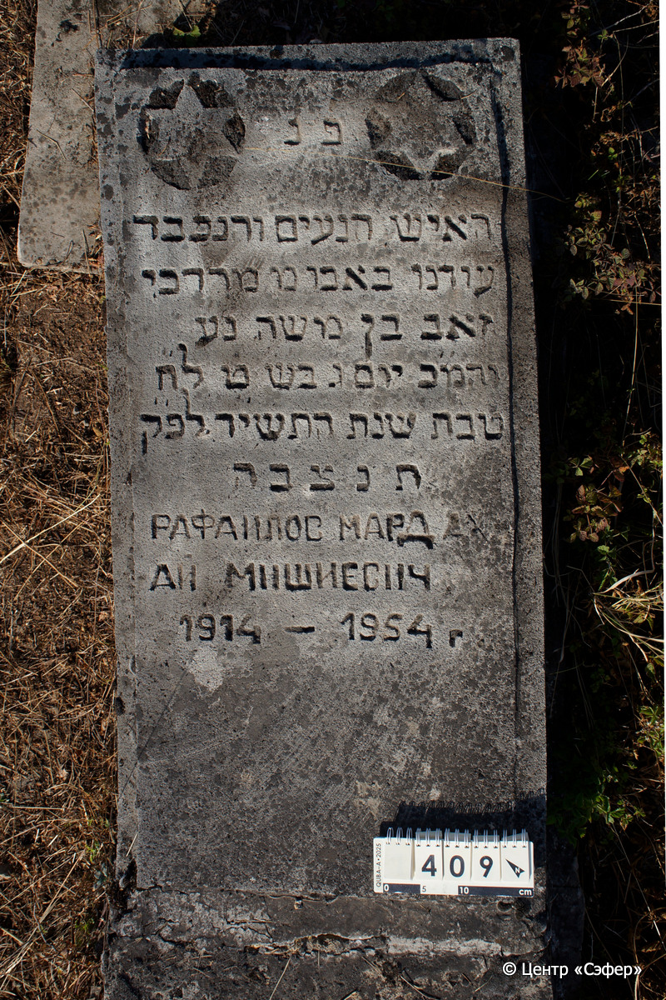
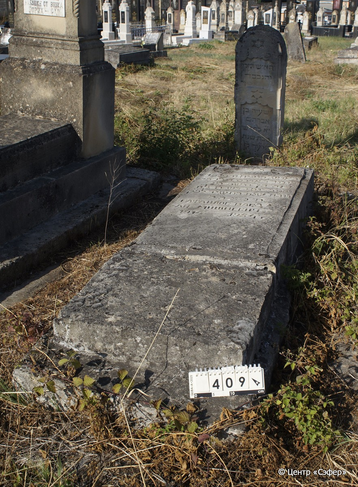

::: {style="font-size: 1em; margin-bottom: 1.2em"}
[Куба (центральное)](../cemeteries/QBA.html) > QBA0409
:::

```{r}
suppressPackageStartupMessages(library(tidyverse))
```


:::: {.columns}

::: {.column width="20%"}

```{r}
#| lightbox:
#|   group: photos




```
:::

::: {.column width="5%"}
:::

::: {.column width="74%"}

::: {.name-style}
РАФАИЛОВ Мордехай-Зеэв [Мардах], сын Моше (Мишиевич)
:::

::: {style="font-size: 1.2em;"}
מרדכי זאב בן משה
:::

:::: {.columns}
::: {.column width="5%"}
{width=1.3em}
:::

::: {.column style="width: 40%; padding-left: 0.2em;"}
-.-.1914 /  
:::

::: {.column width="5%"}
{width=1.3em}
:::

::: {.column style="width: 50%; padding-left: 0.2em;"}
-.-.1954 / 09.Te.5714
:::

::::


::: {.panel-tabset}

#### Эпитафия

```{r}
tibble(`Оригинал` = "פ׳נ׳
האישה הנעים והנכבד
עודנו באבו מ׳ מרדכי
זאב בן משה נ׳ע
והמ׳כ יום ג׳ בש׳ ט׳ לח״
טבת שנת התשיד לפ׳ק׳
תנצבה 
РАФАИЛОВ МАРДАХ
АЙ МИШИЕВИЧ
1914 - 1954 Г.",
       `Перевод` = "Здесь покоится
Человек приятный и уважаемый,
в расцвете лет, господин Мордехай
Зеэв, сын Моше, да упокоится в раю,
и благословен его покой. <Скончался> во вторник, 9 <числа> месяца
тевет, год 5714 по малому летоисчислению.
Да будет его душа завязана в узле жизни.
РАФАИЛОВ МАРДАХ
АЙ МИШИЕВИЧ
1914 г. – 1954 г.") |>
  mutate(`Оригинал` = str_split(`Оригинал`, "
"),
         `Перевод` = str_split(`Перевод`, "
")) |>
  unnest_longer(c(`Оригинал`, `Перевод`)) |> 
  mutate(id = 1:n()) |> 
  relocate(id, .before = Перевод) |> 
  rename(` ` = id) |> 
  knitr::kable(align = c("r", "c", "l"))
```

|||
|-|---|
|**Примечания**| |
|**Язык**      |иврит, русский    |
|**Метки**     |     |
: {tbl-colwidths="[25,75]"}

#### Памятник

|||
|-|---|
|**Тип памятника**   |плита/саркофаг                                                                         |
|**Материал**        |известняк (следы эрозии, цементный раствор, трещины)                                                     |
|**Размеры**         |23×60×170  --- плита; 10×72×190  --- основание                                                                        |
|**Тип декора**      |традиционная символика                                                                        |
|**Элементы декора** |две звезды Давида в круглых нишах                                                                          |
|**Координаты**      |[41.370833, 48.50761726](https://www.google.com/maps/place/41.370833, 48.50761726)                    |
: {tbl-colwidths="[25,75]"}

#### Источник

|||
|-|---|
|**Место хранения**        |Архив полевых исследований Центра «Сэфер»     |
|**Контакты**              |students@sefer.ru    |
|**Ссылка**                |https://sfira.org        |
|**Исходный ID**           |  |
|**Условия использования** |[CC BY-NC 4.0](https://creativecommons.org/licenses/by-nc/4.0/deed.ru)     |
: {tbl-colwidths="[25,75]"}

:::

:::

::::

