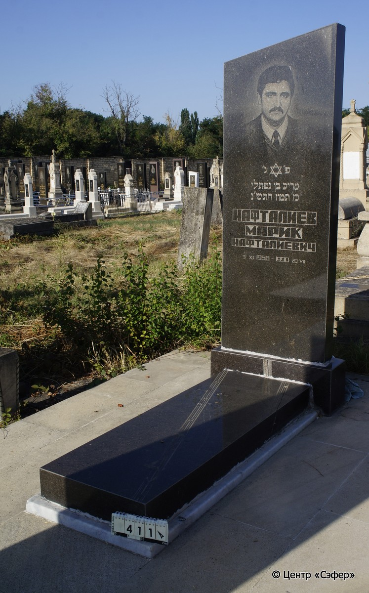
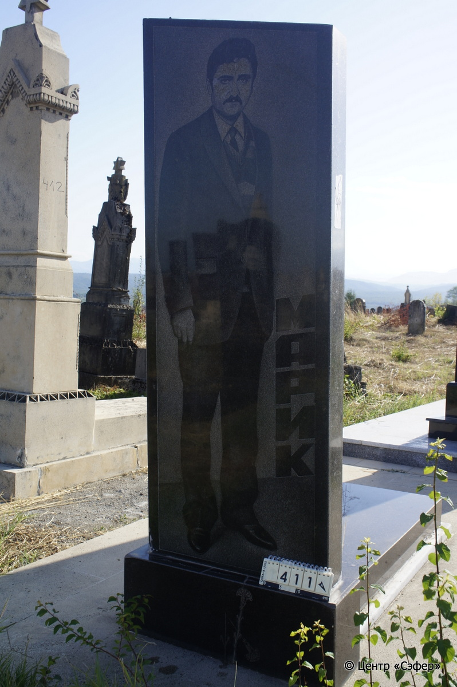

::: {style="font-size: 1em; margin-bottom: 1.2em"}
[Куба (центральное)](../cemeteries/QBA.html) > QBA0411
:::

```{r}
suppressPackageStartupMessages(library(tidyverse))
```


:::: {.columns}

::: {.column width="20%"}

```{r}
#| lightbox:
#|   group: photos




```
:::

::: {.column width="1.5em"}
:::

::: {.column width="74%"}

::: {.custom-frame}
::: {.name-ru-style}
**НАФТАЛИЕВ Марик, сын Нафтали (Нафталиевич)**
:::

::: {.name-he-style}
מריכּ בן נפתלי
:::

:::: {.columns .date-panel style="display: flex; align-items: center; margin-top: 0.8em;"}
::: {.column .text-center style="width: fit-content; flex: 0 0 auto;"}
{width=1.5em .nolightbox}
:::

::: {.column style="flex: 0 0 auto; width: fit-content; padding-left: 0.8em; padding-right: 3.5em;"}
03.11.1956 

[--]{style="color: #929292"}
:::

::: {.column .text-center style="width: fit-content; flex: 0 0 auto;"}
{width=1.5em .nolightbox}
:::

::: {.column style="flex: 0 0 auto; width: fit-content; padding-left: 0.8em;"}
20.07.1990 

[27.Ta.5703]{style="color: #929292"}
:::

::::

:::

::: {.panel-tabset}

#### Эпитафия

```{r}
tibble(`Оригинал` = "лицевая сторона
פ״נ״
מריכּ בן נפתלי
כז׳ תמוז התש״ג
НАФТАЛИЕВ
МАРИК
НАФТАЛИЕВИЧ
3 XI 1956 - 1990 20 VII

обратная сторона
МАРИК",
       `Перевод` = "_FR_
Здесь покоится
Марик, сын Нафтали
27-е таммуза 5703 год
НАФТАЛИЕВ
МАРИК
НАФТАЛИЕВИЧ
03.11.1956 – 20.07.1990

_RV_
МАРИК") |>
  mutate(`Оригинал` = str_split(`Оригинал`, "
"),
         `Перевод` = str_split(`Перевод`, "
")) |>
  unnest_longer(c(`Оригинал`, `Перевод`)) |> 
  mutate(id = 1:n()) |> 
  relocate(id, .before = Перевод) |> 
  rename(` ` = id) |> 
  knitr::kable(align = c("r", "c", "l"))
```

---

::: {.list-table .striped .custom-table .borderless header-rows=0 aligns="l,l" tbl-colwidths="[21,79]"}
- - Примечания
  -  

- - Язык
  - иврит, русский

- - Метки
  -  
:::

#### Памятник

::: {.list-table .striped .custom-table .borderless header-rows=0 aligns="l,l" tbl-colwidths="[21,79]"}
- - Тип памятника
  - L-образный

- - Материал
  - гранит, лабрадорит, мрамор (цементный раствор, трещины и сколы, мраморное основание)

- - Размеры
  - 189×70×21  --- стела; 12×50×133  --- плита; 3×59×137  --- основание

- - Тип декора
  - архитектурно-орнаментальный, растительный, традиционная символика, портретный

- - Элементы декора
  - стела со скошенным верхним краем, на лицевой стороне – портрет и звезда Давида, на обратной стороне – портрет в полный рост. На плите орнаментальная лента с двумя гвоздиками.

- - Координаты
  - 41.37080845, 48.50764327 [[]{style="vertical-align: middle;"} Смотреть на карте](https://www.google.com/maps/place/41.37080845, 48.50764327){.btn .btn-outline-info role="button"}
:::

#### Источник

::: {.list-table .striped .custom-table .borderless header-rows=0 aligns="l,l" tbl-colwidths="[21,79]"}
- - Место хранения
  - Архив полевых исследований Центра «Сэфер»

- - Контакты
  - students@sefer.ru

- - Ссылка
  - [https://sfira.org](https://sfira.org)

- - Исходный ID
  -  

- - Условия использования
  - [CC BY-NC 4.0](https://creativecommons.org/licenses/by-nc/4.0/deed.ru)
:::

:::

:::

::::

