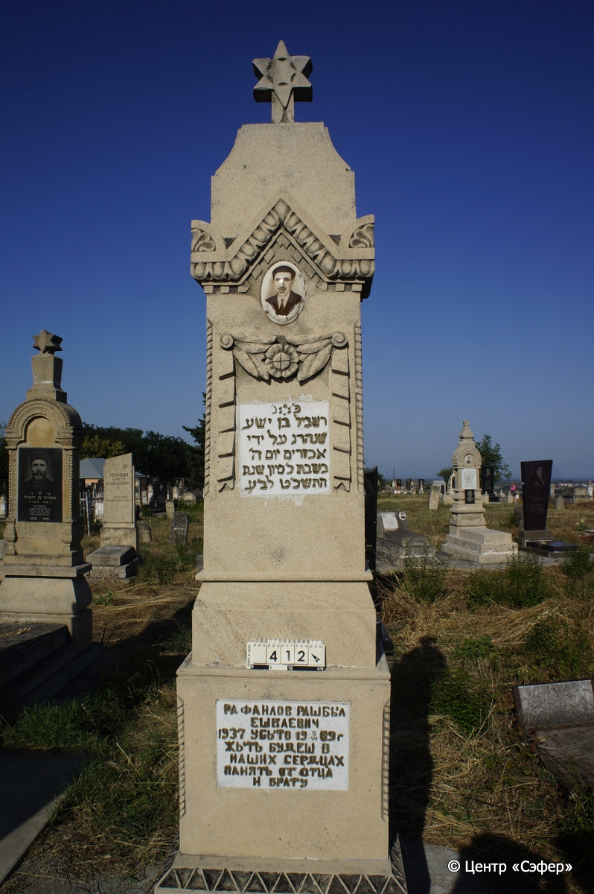
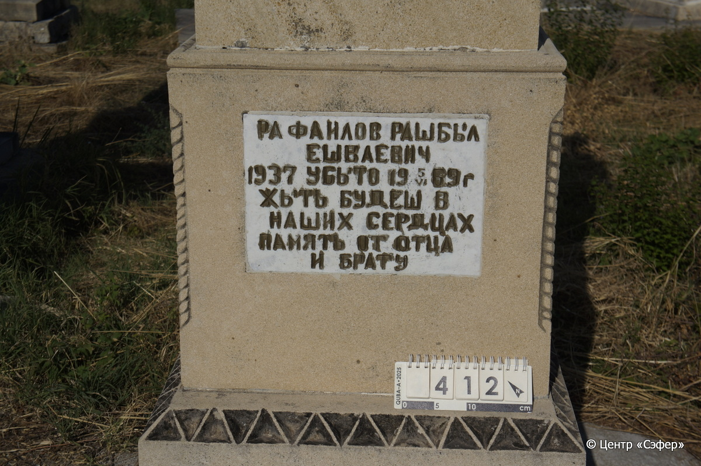
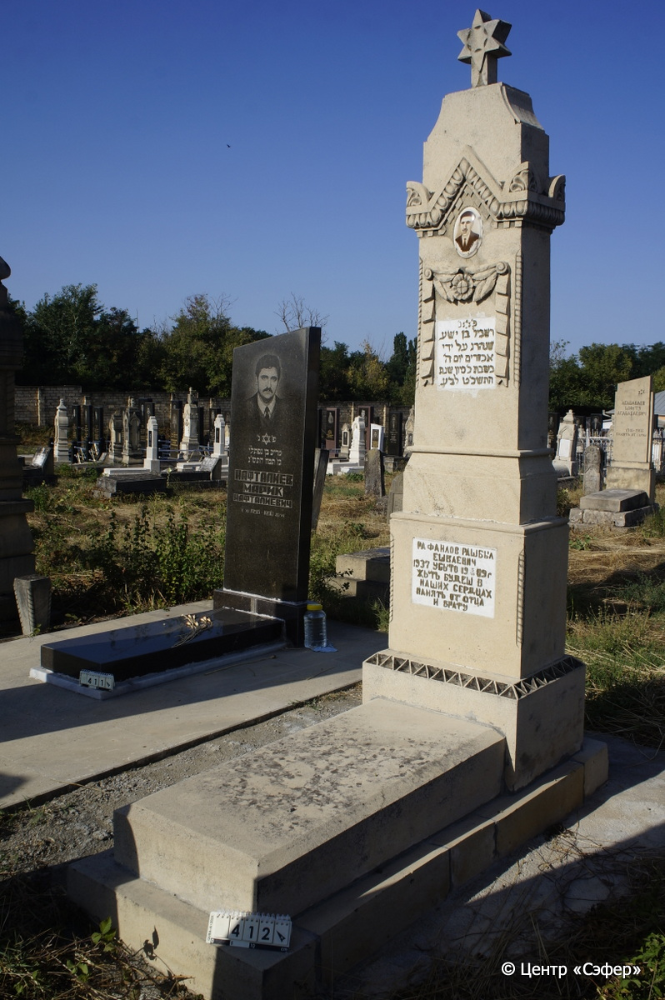

::: {style="font-size: 1em; margin-bottom: 1.2em"}
[Куба (центральное)](../cemeteries/QBA.html) > QBA0412
:::

```{r}
suppressPackageStartupMessages(library(tidyverse))
```


:::: {.columns}

::: {.column width="20%"}

```{r}
#| lightbox:
#|   group: photos





```
:::

::: {.column width="5%"}
:::

::: {.column width="74%"}

::: {.name-style}
РАФАИЛОВ Рашбил, сын Иши (Ешваевич)
:::

::: {style="font-size: 1.2em;"}
רשביל בן ישע
:::

:::: {.columns}
::: {.column width="5%"}
{width=1.3em}
:::

::: {.column style="width: 40%; padding-left: 0.2em;"}
-.-.1937 /  
:::

::: {.column width="5%"}
{width=1.3em}
:::

::: {.column style="width: 50%; padding-left: 0.2em;"}
05.06.1969 / 20.Si.5729
:::

::::


::: {.panel-tabset}

#### Эпитафия

```{r}
tibble(`Оригинал` = "сверху
פ׳נ׳
רשביל בן ישע
שנהרג על ידי
אכזרים יום ה׳
בשבת כ׳ סיון שנת
התשכ׳ט לב׳ע

снизу
РАФАИЛОВ РАШБЫЛ
ЕШВАЕВИЧ
1937 УБЫТО 19 5/VI 69 Г.
ЖЫТЬ БУДЕШ В
НАШИХ СЕРДЦАХ
ПАМЯТЬ ОТ ОТЦА
И БРАТУ",
       `Перевод` = "
Здесь покоится
Рашбыл, сын Иши,
который был убит руками
жестоких. В четверг,
20-го сивана
года 5729 от сотворения мира.

 
РАФАИЛОВ РАШБЫЛ
ЕШВАЕВИЧ
<Родился в> 1937 г., убит 5.06.1969 г.
ЖИТЬ БУДЕШЬ В
НАШИХ СЕРДЦАХ
ПАМЯТЬ ОТ ОТЦА
И БРАТУ") |>
  mutate(`Оригинал` = str_split(`Оригинал`, "
"),
         `Перевод` = str_split(`Перевод`, "
")) |>
  unnest_longer(c(`Оригинал`, `Перевод`)) |> 
  mutate(id = 1:n()) |> 
  relocate(id, .before = Перевод) |> 
  rename(` ` = id) |> 
  knitr::kable(align = c("r", "c", "l"))
```

|||
|-|---|
|**Примечания**| |
|**Язык**      |иврит, русский    |
|**Метки**     |     |
: {tbl-colwidths="[25,75]"}

#### Памятник

|||
|-|---|
|**Тип памятника**   |                                                                          |
|**Материал**        |известняк, мрамор (цементный раствор, две мраморные вставки для текста, керамический медальон для портрета, цементный раствор)                                                     |
|**Размеры**         |270×68×53  --- стела; 21×60×120  --- плита; 17×80×197  --- основание                                                                        |
|**Тип декора**      |архитектурно-орнаментальный, растительный, традиционная символика                                                                        |
|**Элементы декора** |архитектурное завершение со звездой Давида, орнаментальный пояс с пальметками, портрет на керамическом медальоне с рельефом листьев, гирлянда из лент с листьями и цветком, витые грани с двух сторон от текстовых вставок. На верхней – звезда Давида. У основания пояс с геометрическим орнаментом.                                                                          |
|**Координаты**      |[41.37078809, 48.50764359](https://www.google.com/maps/place/41.37078809, 48.50764359)                    |
: {tbl-colwidths="[25,75]"}

#### Источник

|||
|-|---|
|**Место хранения**        |Архив полевых исследований Центра «Сэфер»     |
|**Контакты**              |students@sefer.ru    |
|**Ссылка**                |https://sfira.org        |
|**Исходный ID**           |  |
|**Условия использования** |[CC BY-NC 4.0](https://creativecommons.org/licenses/by-nc/4.0/deed.ru)     |
: {tbl-colwidths="[25,75]"}

:::

:::

::::

