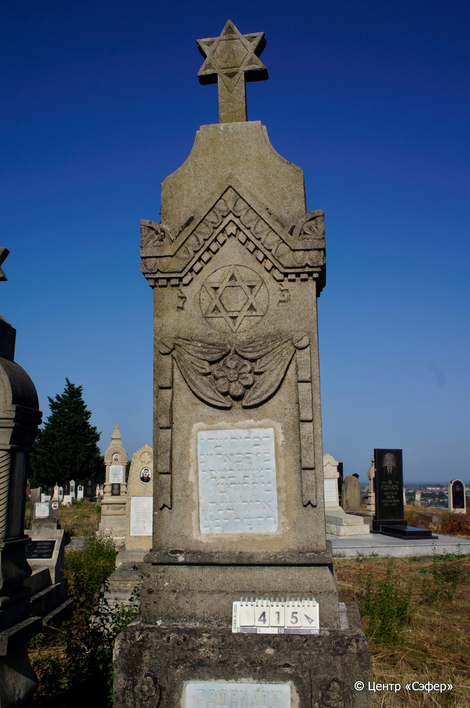
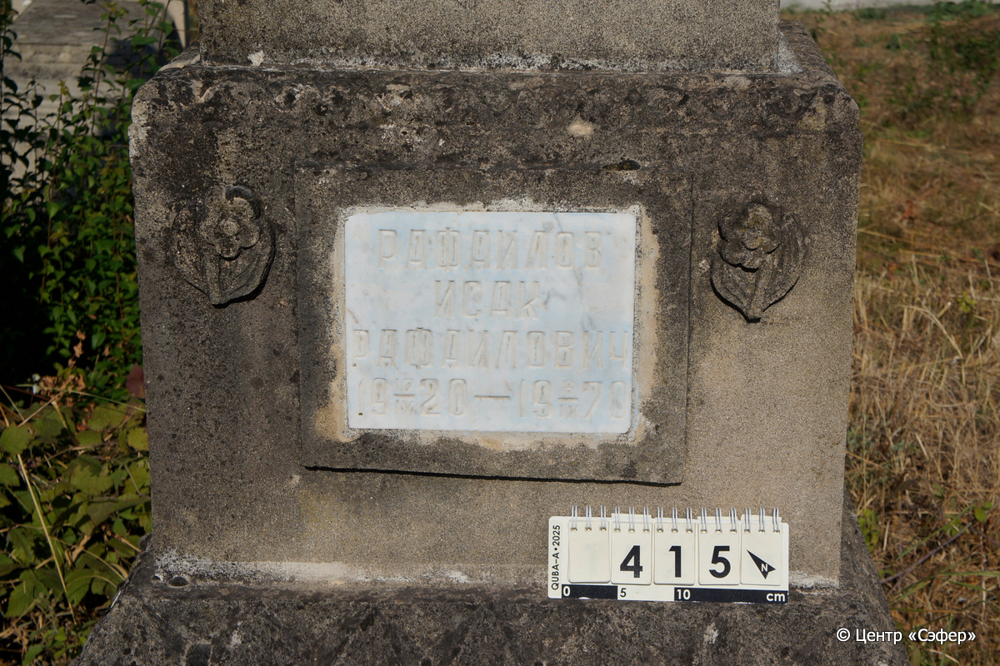
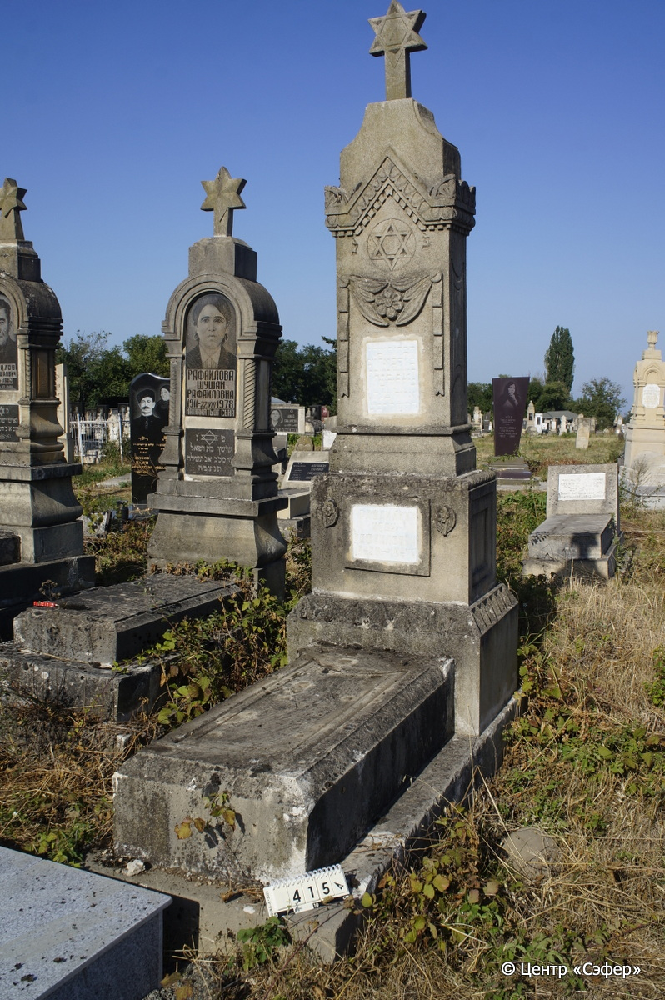

::: {style="font-size: 1em; margin-bottom: 1.2em"}
[Куба (центральное)](../cemeteries/QBA.html) > QBA0415
:::

```{r}
suppressPackageStartupMessages(library(tidyverse))
```


:::: {.columns}

::: {.column width="20%"}

```{r}
#| lightbox:
#|   group: photos





```
:::

::: {.column width="5%"}
:::

::: {.column width="74%"}

::: {.name-style}
РАФАИЛОВ Ицхак, сын Рафаэля (Исак Рафаилович)
:::

::: {style="font-size: 1.2em;"}
יצחק בן רפאל
:::

:::: {.columns}
::: {.column width="5%"}
{width=1.3em}
:::

::: {.column style="width: 40%; padding-left: 0.2em;"}
17.09.1920 /  
:::

::: {.column width="5%"}
{width=1.3em}
:::

::: {.column style="width: 50%; padding-left: 0.2em;"}
17.09.1970 / 16.El.5730
:::

::::


::: {.panel-tabset}

#### Эпитафия

```{r}
tibble(`Оригинал` = "פ׳נ׳
הבחור יצחק
בן רפאל יום
חמישי בשבת
ט׳ז חודש
אלול שנת
התש׳ל לב׳ע
РАФАИЛОВ
ИСАК
РАФАИЛОВИЧ
19 17/IX 20 - 19 6/IX 70",
       `Перевод` = "Здесь покоится
юноша Ицхак
сын Рафаэля, 
в четверг,
16 <числа> месяца
элула,
5730 год от сотворения мира.
РАФАИЛОВ
ИСАК
РАФАИЛОВИЧ
17.09.1920 – 6.09.1970") |>
  mutate(`Оригинал` = str_split(`Оригинал`, "
"),
         `Перевод` = str_split(`Перевод`, "
")) |>
  unnest_longer(c(`Оригинал`, `Перевод`)) |> 
  mutate(id = 1:n()) |> 
  relocate(id, .before = Перевод) |> 
  rename(` ` = id) |> 
  knitr::kable(align = c("r", "c", "l"))
```

|||
|-|---|
|**Примечания**| |
|**Язык**      |иврит, русский    |
|**Метки**     |     |
: {tbl-colwidths="[25,75]"}

#### Памятник

|||
|-|---|
|**Тип памятника**   |                                                                          |
|**Материал**        |известняк, мрамор (две мраморные вставки для текста, следы эрозии, цементный раствор, сколы)                                                     |
|**Размеры**         |260×76×59  --- стела; 28×56×121  --- плита; 16×80×200  --- основание                                                                        |
|**Тип декора**      |архитектурно-орнаментальный, растительный, традиционная символика                                                                        |
|**Элементы декора** |архитектурное навершие, увенчанное звездой Давида, орнаментальный пояс с пальметками, звезда Давида в круглой нише, гирлянда из лент с листьями и цветком, два цветка по сторонам от нижней  текстовой вставке. У основания пояс с геометрическим орнаментом. На плите звезда Давида и фигурная рама.                                                                          |
|**Координаты**      |[41.37073727, 48.50764441](https://www.google.com/maps/place/41.37073727, 48.50764441)                    |
: {tbl-colwidths="[25,75]"}

#### Источник

|||
|-|---|
|**Место хранения**        |Архив полевых исследований Центра «Сэфер»     |
|**Контакты**              |students@sefer.ru    |
|**Ссылка**                |https://sfira.org        |
|**Исходный ID**           |  |
|**Условия использования** |[CC BY-NC 4.0](https://creativecommons.org/licenses/by-nc/4.0/deed.ru)     |
: {tbl-colwidths="[25,75]"}

:::

:::

::::

