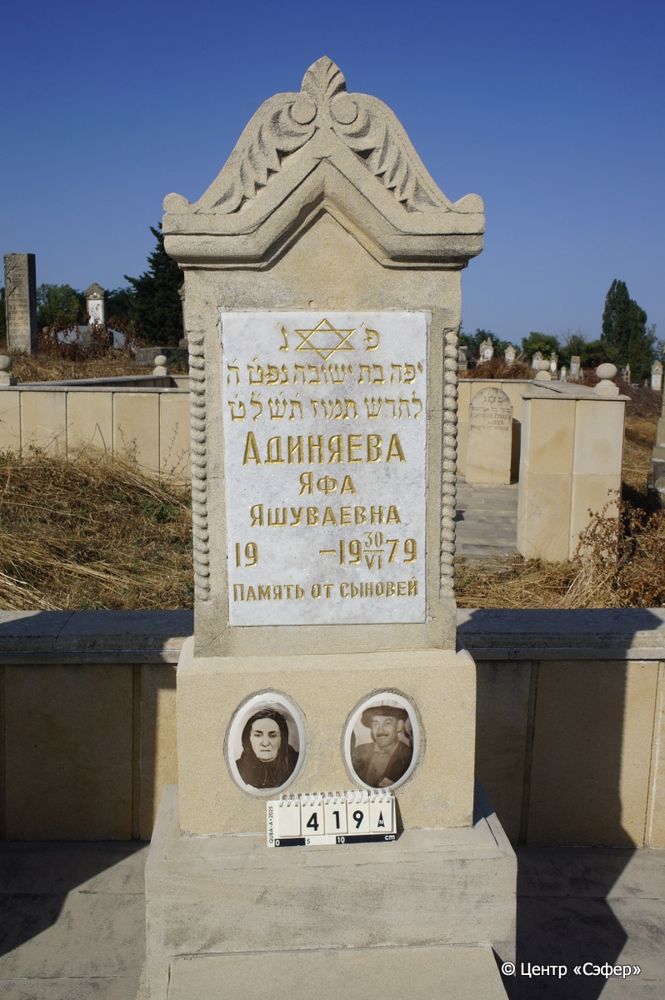
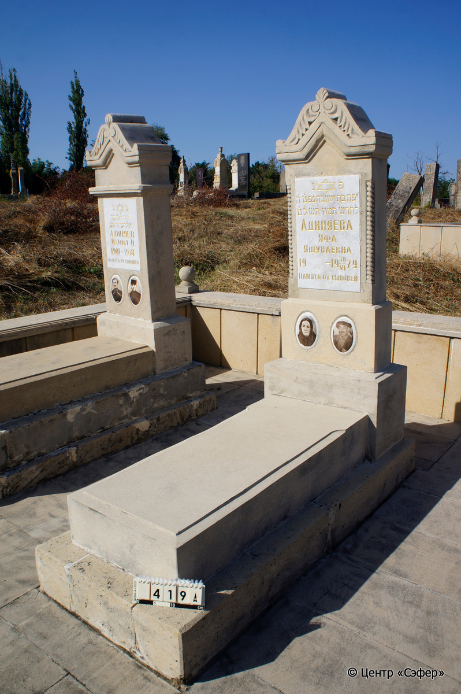

::: {style="font-size: 1em; margin-bottom: 1.2em"}
[Куба (центральное)](../cemeteries/QBA.html) > QBA0419
:::

```{r}
suppressPackageStartupMessages(library(tidyverse))
```


:::: {.columns}

::: {.column width="20%"}

```{r}
#| lightbox:
#|   group: photos



knitr::include_graphics("../images/QBA0419_3.JPG")

```
:::

::: {.column width="5%"}
:::

::: {.column width="74%"}

::: {.name-style}
АДИНЯЕВА Яфа, дочь Йешуве (Яшуваевна)
:::

::: {style="font-size: 1.2em;"}
יפה בת ישובה
:::

:::: {.columns}
::: {.column width="5%"}
{width=1.3em}
:::

::: {.column style="width: 40%; padding-left: 0.2em;"}
  /  
:::

::: {.column width="5%"}
{width=1.3em}
:::

::: {.column style="width: 50%; padding-left: 0.2em;"}
30.06.1979 / 06.Ta.5739
:::

::::


::: {.panel-tabset}

#### Эпитафия

```{r}
tibble(`Оригинал` = "פ׳נ׳
יפה בת ישובה נפט׳ ה׳
לחדש תמוז ת׳ש׳ל׳ט׳
Адиняева
Яфа
Яшуваевна
19 - 19 30/VI 79
Память от сыновей",
       `Перевод` = "Здесь покоится
Яфа, дочь Йешувы, скончалась 5 <числа>
месяца таммуза, 5739.
Адиняева
Яфа
Яшуваевна
19... - 30.06.1979
Память от сыновей") |>
  mutate(`Оригинал` = str_split(`Оригинал`, "
"),
         `Перевод` = str_split(`Перевод`, "
")) |>
  unnest_longer(c(`Оригинал`, `Перевод`)) |> 
  mutate(id = 1:n()) |> 
  relocate(id, .before = Перевод) |> 
  rename(` ` = id) |> 
  knitr::kable(align = c("r", "c", "l"))
```

|||
|-|---|
|**Примечания**| |
|**Язык**      |иврит, русский    |
|**Метки**     |     |
: {tbl-colwidths="[25,75]"}

#### Памятник

|||
|-|---|
|**Тип памятника**   |                                                                          |
|**Материал**        |известняк, ракушечник, металл (мраморная вставка для текста, буквы прокрашены золотой краской, два керамических медальона с фото-портретами на лицевой стороне и один такой же медальон с портретом на обратной стороне. Сколы, цементный раствор.)                                                     |
|**Размеры**         |162×60×34  --- стела; 22×60×120  --- плита; 19×70×169  --- основание                                                                        |
|**Тип декора**      |архитектурно-орнаментальный, растительный, традиционная символика                                                                        |
|**Элементы декора** |архитектурное завершение с волютами и листьями, звезда Давида на текстовой вставке, два медальона с портретами на лицевой стороне и один медальон с портретом на обратной стороне, витые шнуры по лицевым граням.                                                                          |
|**Координаты**      |[41.3705431, 48.50779751](https://www.google.com/maps/place/41.3705431, 48.50779751)                    |
: {tbl-colwidths="[25,75]"}

#### Источник

|||
|-|---|
|**Место хранения**        |Архив полевых исследований Центра «Сэфер»     |
|**Контакты**              |students@sefer.ru    |
|**Ссылка**                |https://sfira.org        |
|**Исходный ID**           |  |
|**Условия использования** |[CC BY-NC 4.0](https://creativecommons.org/licenses/by-nc/4.0/deed.ru)     |
: {tbl-colwidths="[25,75]"}

:::

:::

::::

