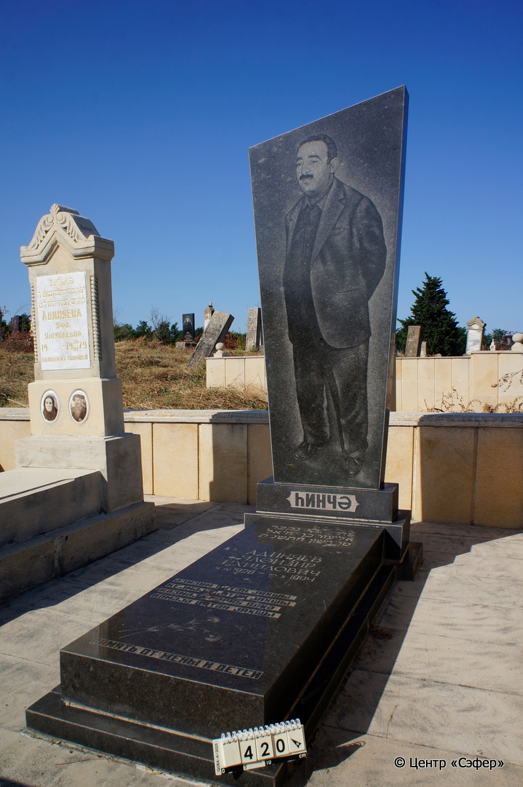
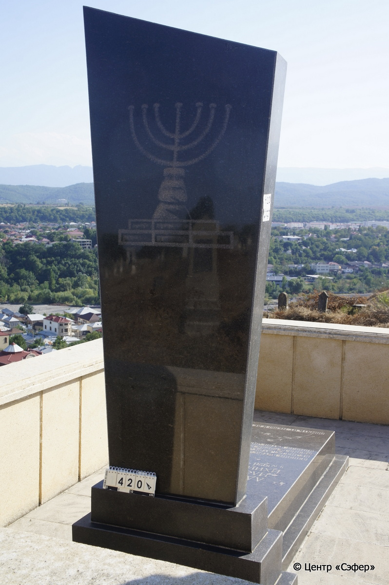
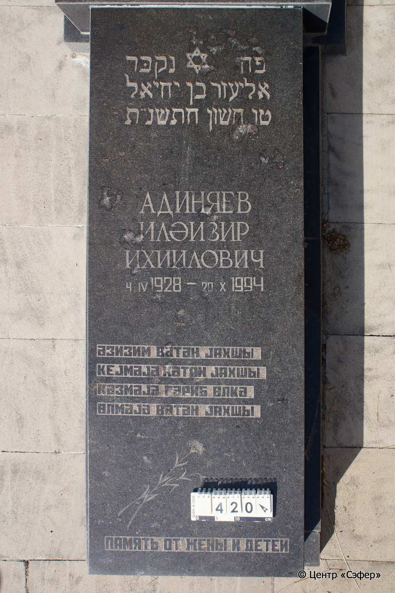

::: {style="font-size: 1em; margin-bottom: 1.2em"}
[Куба (центральное)](../cemeteries/QBA.html) > QBA0420
:::

```{r}
suppressPackageStartupMessages(library(tidyverse))
```


:::: {.columns}

::: {.column width="20%"}

```{r}
#| lightbox:
#|   group: photos





```
:::

::: {.column width="5%"}
:::

::: {.column width="74%"}

::: {.name-style}
АДИНЯЕВ Элиэзер, сын Йехиэля (Илəизир Ихиилович)
:::

::: {style="font-size: 1.2em;"}
אליעזר בן יחיאל
:::

:::: {.columns}
::: {.column width="5%"}
{width=1.3em}
:::

::: {.column style="width: 40%; padding-left: 0.2em;"}
04.04.1928 /  
:::

::: {.column width="5%"}
{width=1.3em}
:::

::: {.column style="width: 50%; padding-left: 0.2em;"}
20.10.1994 / 15.Ch.5755
:::

::::


::: {.panel-tabset}

#### Эпитафия

```{r}
tibble(`Оригинал` = "сверху
hинчə

снизу
פה נקבּר
אליעזר בן יחיאל
טו חשון חתשנ״ת
Адиняев
Илəизир
Ихиилович
4 IV 1928 - 20 X 1994
əзизим вəтəн jахшы
kеjмəjə kəтан jахшы
кəзмəjə гəриб øлкə
øлмəjə вəтəн jахшы",
       `Перевод` = "
Хинче

 
Здесь похоронен
Элиэзер бен Йехиэль,
15 хешвана [5755] года.
Адиняев
Илəизир
Ихиилович
4.04.1928 – 20.10.1994
Милая моя родина хороша,
и носить кятан хорошо,
но странствовать по чужой стране —
лучше умереть, чем жить не на родине.") |>
  mutate(`Оригинал` = str_split(`Оригинал`, "
"),
         `Перевод` = str_split(`Перевод`, "
")) |>
  unnest_longer(c(`Оригинал`, `Перевод`)) |> 
  mutate(id = 1:n()) |> 
  relocate(id, .before = Перевод) |> 
  rename(` ` = id) |> 
  knitr::kable(align = c("r", "c", "l"))
```

|||
|-|---|
|**Примечания**|Год в еврейской эпитафии записан с ошибками. Должно быть – התשנה.|
|**Язык**      |иврит, русский, азербайджанский    |
|**Метки**     |     |
: {tbl-colwidths="[25,75]"}

#### Памятник

|||
|-|---|
|**Тип памятника**   |L-образный                                                                         |
|**Материал**        |гранит (цементный раствор, сколы)                                                     |
|**Размеры**         |206×73×28  --- стела; 15×57×146  --- плита; 7×85×185  --- основание                                                                        |
|**Тип декора**      |архитектурно-орнаментальный, растительный, традиционная символика                                                                        |
|**Элементы декора** |стела со скошенным краем, портрет в полный рост на лицевой стороне, семисвечник на обратной стороне. На плите звезда Давида, текст, изображение двух гвоздик, стебель одной из них сломан.                                                                          |
|**Координаты**      |[41.3705348, 48.50780974](https://www.google.com/maps/place/41.3705348, 48.50780974)                    |
: {tbl-colwidths="[25,75]"}

#### Источник

|||
|-|---|
|**Место хранения**        |Архив полевых исследований Центра «Сэфер»     |
|**Контакты**              |students@sefer.ru    |
|**Ссылка**                |https://sfira.org        |
|**Исходный ID**           |  |
|**Условия использования** |[CC BY-NC 4.0](https://creativecommons.org/licenses/by-nc/4.0/deed.ru)     |
: {tbl-colwidths="[25,75]"}

:::

:::

::::

