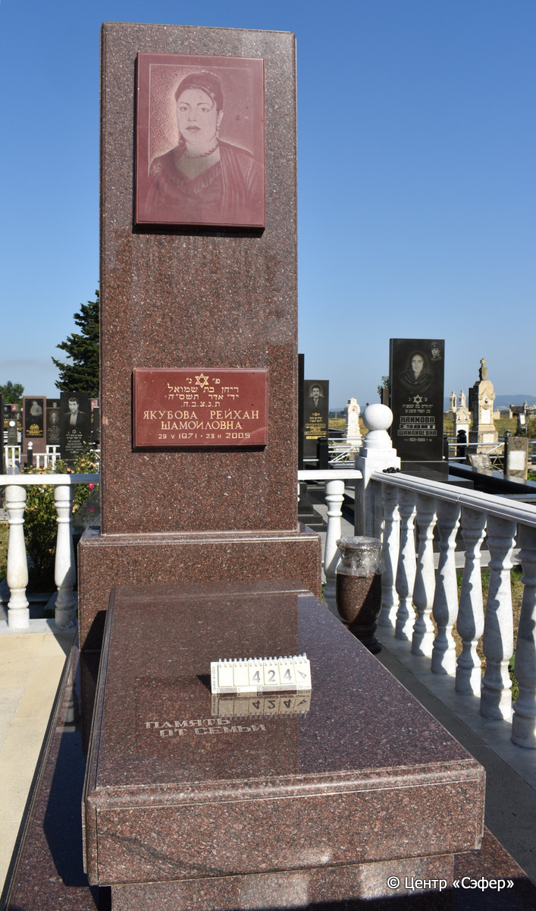
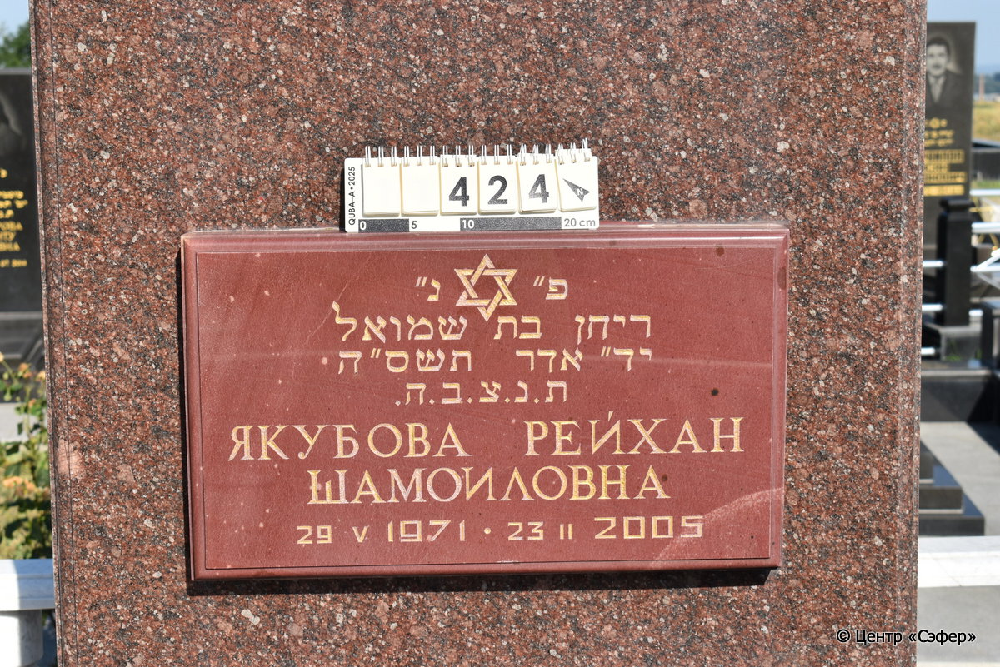

::: {style="font-size: 1em; margin-bottom: 1.2em"}
[Куба (центральное)](../cemeteries/QBA.html) > QBA0424
:::

```{r}
suppressPackageStartupMessages(library(tidyverse))
```


:::: {.columns}

::: {.column width="20%"}

```{r}
#| lightbox:
#|   group: photos




```
:::

::: {.column width="5%"}
:::

::: {.column width="74%"}

::: {.name-style}
ЯКУБОВА Рейхан, дочь Шмуэля (Шамоиловна)
:::

::: {style="font-size: 1.2em;"}
ריחן בת שמואל
:::

:::: {.columns}
::: {.column width="5%"}
{width=1.3em}
:::

::: {.column style="width: 40%; padding-left: 0.2em;"}
29.05.1971 /  
:::

::: {.column width="5%"}
{width=1.3em}
:::

::: {.column style="width: 50%; padding-left: 0.2em;"}
23.02.2005 / 13.Ad.5765
:::

::::


::: {.panel-tabset}

#### Эпитафия

```{r}
tibble(`Оригинал` = "сверху
פ״ נ״
ריחן בת שמואל
יד״ אדר תשס״ה
ת.נ.צ.ב.ה.
Якубова Рейхан
Шамоиловна
29. V 1971 - 23 II 2005

снизу
память от семьи",
       `Перевод` = "
Здесь покоится
Рейхан, дочь Шмуэля,
13 адара, 5765 год,
да будет ее душа завязана в узле жизни
Якубова Рейхан
Шамоиловна
29.05.1971 - 23.02.2005

 
память от семьи") |>
  mutate(`Оригинал` = str_split(`Оригинал`, "
"),
         `Перевод` = str_split(`Перевод`, "
")) |>
  unnest_longer(c(`Оригинал`, `Перевод`)) |> 
  mutate(id = 1:n()) |> 
  relocate(id, .before = Перевод) |> 
  rename(` ` = id) |> 
  knitr::kable(align = c("r", "c", "l"))
```

|||
|-|---|
|**Примечания**| |
|**Язык**      |иврит, русский    |
|**Метки**     |     |
: {tbl-colwidths="[25,75]"}

#### Памятник

|||
|-|---|
|**Тип памятника**   |                                                                          |
|**Материал**        |гранит (памятник из красного камня, две пластины из красного камня для текста и портрета прикреплены к лицевой стороне стелы, ваза из красного гранита справа от памятника, цементный раствор)                                                     |
|**Размеры**         |275×105×39  --- стела; 36×77×170  --- плита; 14×117×280  --- основание                                                                        |
|**Тип декора**      |традиционная символика                                                                        |
|**Элементы декора** |звезда Давида на пластине с текстом                                                                          |
|**Координаты**      |[41.37111932, 48.5075788](https://www.google.com/maps/place/41.37111932, 48.5075788)                    |
: {tbl-colwidths="[25,75]"}

#### Источник

|||
|-|---|
|**Место хранения**        |Архив полевых исследований Центра «Сэфер»     |
|**Контакты**              |students@sefer.ru    |
|**Ссылка**                |https://sfira.org        |
|**Исходный ID**           |  |
|**Условия использования** |[CC BY-NC 4.0](https://creativecommons.org/licenses/by-nc/4.0/deed.ru)     |
: {tbl-colwidths="[25,75]"}

:::

:::

::::

